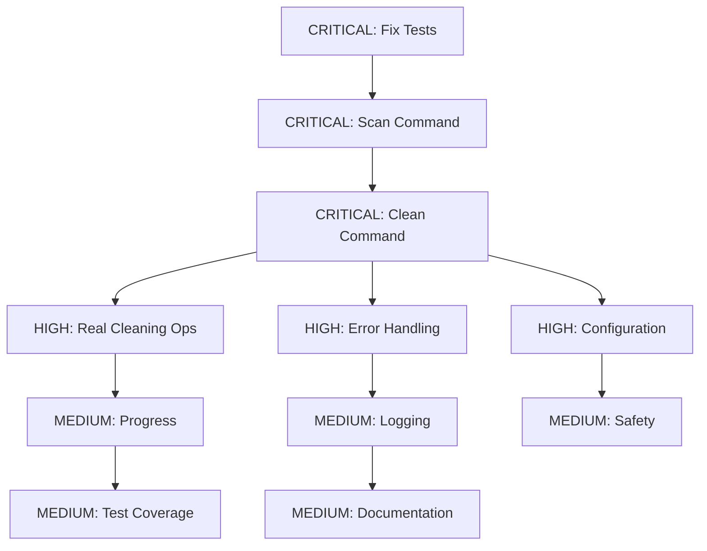

# CRITICAL EXECUTION PLAN - Clean Wizard CLI Tool

**Generated:** 2025-11-08 22:00:00
**Goal:** Fix critical issues and deliver working system

## PARETO ANALYSIS

### 1% Tasks (51% of Value) - CRITICAL PATH

| Priority | Task                            | Impact   | Effort | Value Ratio |
| -------- | ------------------------------- | -------- | ------ | ----------- |
| 1        | Fix test timeout issues         | CRITICAL | 15min  | ⭐⭐⭐⭐⭐  |
| 2        | Make scan command functional    | CRITICAL | 25min  | ⭐⭐⭐⭐⭐  |
| 3        | Enable clean command operations | CRITICAL | 30min  | ⭐⭐⭐⭐⭐  |

### 4% Tasks (64% of Value) - HIGH IMPACT

| Priority | Task                                  | Impact | Effort | Value Ratio |
| -------- | ------------------------------------- | ------ | ------ | ----------- |
| 4        | Implement real cleaning operations    | HIGH   | 30min  | ⭐⭐⭐⭐    |
| 5        | Add centralized error handling        | HIGH   | 20min  | ⭐⭐⭐⭐    |
| 6        | Create robust configuration system    | HIGH   | 25min  | ⭐⭐⭐⭐    |
| 7        | Add progress reporting for operations | HIGH   | 20min  | ⭐⭐⭐⭐    |

### 20% Tasks (80% of Value) - MEDIUM IMPACT

| Priority | Task                                                | Impact | Effort | Value Ratio |
| -------- | --------------------------------------------------- | ------ | ------ | ----------- |
| 8        | Add context cancellation to scanner                 | MEDIUM | 15min  | ⭐⭐⭐      |
| 9        | Implement safety features (backup, protected paths) | MEDIUM | 25min  | ⭐⭐⭐      |
| 10       | Add comprehensive structured logging                | MEDIUM | 20min  | ⭐⭐⭐      |
| 11       | Create comprehensive test coverage                  | MEDIUM | 30min  | ⭐⭐⭐      |
| 12       | Add CLI help and documentation                      | MEDIUM | 20min  | ⭐⭐⭐      |

## EXECUTION GRAPH

## DETAILED TASK BREAKDOWN

### CRITICAL PATH (1% tasks)

#### Task 1: Fix Test Timeout Issues (15min)

- [x] Create mock scanner implementation
- [x] Implement dependency injection for scanner
- [x] Rewrite scan tests to use mocks
- [ ] Verify all tests pass
- [ ] Add test performance benchmarks

#### Task 2: Make Scan Command Functional (25min)

- [ ] Fix scanner factory global state issues
- [ ] Add context cancellation support
- [ ] Implement proper error handling
- [ ] Add scan progress reporting
- [ ] Test with real system components

#### Task 3: Enable Clean Command Operations (30min)

- [ ] Implement cleaner interface
- [ ] Create concrete cleaner implementations
- [ ] Add operation safety checks
- [ ] Implement backup functionality
- [ ] Add operation progress tracking

### HIGH IMPACT (4% tasks)

#### Task 4: Implement Real Cleaning Operations (30min)

- [ ] Nix store cleaner implementation
- [ ] Homebrew cleaner implementation
- [ ] Package cache cleaner implementation
- [ ] Docker cleaner implementation
- [ ] Temp files cleaner implementation

#### Task 5: Add Centralized Error Handling (20min)

- [ ] Create custom error types package
- [ ] Implement error wrapping utilities
- [ ] Add context preservation
- [ ] Update all error handling sites
- [ ] Add error recovery mechanisms

#### Task 6: Create Robust Configuration System (25min)

- [ ] Enhance viper configuration
- [ ] Add input validation
- [ ] Implement profile management
- [ ] Add configuration migration
- [ ] Create configuration documentation

#### Task 7: Add Progress Reporting (20min)

- [ ] Add progress bar library integration
- [ ] Implement scan progress tracking
- [ ] Add clean operation progress
- [ ] Create progress reporting interface
- [ ] Test progress accuracy

### MEDIUM IMPACT (20% tasks)

#### Task 8: Add Context Cancellation (15min)

- [ ] Enhance scanner with context support
- [ ] Add cancellation to file operations
- [ ] Implement graceful shutdown
- [ ] Add timeout protection
- [ ] Test cancellation scenarios

#### Task 9: Implement Safety Features (25min)

- [ ] Add protected path validation
- [ ] Implement backup system
- [ ] Add dry-run verification
- [ ] Create rollback mechanism
- [ ] Add safety check logging

#### Task 10: Add Comprehensive Logging (20min)

- [ ] Integrate structured logging library
- [ ] Add context-aware logging
- [ ] Implement log levels
- [ ] Add audit logging
- [ ] Create logging configuration

#### Task 11: Create Test Coverage (30min)

- [ ] Add unit tests for all components
- [ ] Create integration tests
- [ ] Add property-based tests
- [ ] Implement BDD scenarios
- [ ] Add test coverage reporting

#### Task 12: Add CLI Help & Documentation (20min)

- [ ] Improve command help text
- [ ] Add usage examples
- [ ] Create user documentation
- [ ] Add troubleshooting guide
- [ ] Implement shell completion

## NEXT STEPS

1. Execute CRITICAL PATH tasks first
2. Verify each task completion with tests
3. Commit and document progress
4. Move to HIGH IMPACT tasks
5. Complete MEDIUM IMPACT tasks for 80% value

## SUCCESS METRICS

- [ ] All tests pass within 2 seconds
- [ ] Scan command completes in <30 seconds
- [ ] Clean command executes successfully
- [ ] No crashes or panics
- [ ] User can clean system effectively
