# 🚀 EXECUTION GRAPH - ARCHITECTURE EXCELLENCE PLAN
**Date**: 2025-11-09_15-45  
**Format**: Mermaid.js Execution Flow

---

## 📈 OVERALL EXECUTION STRATEGY


## 🎯 PHASE 1 DETAILED FLOW (Critical Path)

```mermaid
graph TD
    START1[Phase 1 Start] --> T1[Task 1: Fix BDD CLI Output]
    T1 --> T1_CHECK{Tests Pass?}
    T1_CHECK -->|No| T1_RETRY[Retry CLI Fix]
    T1_RETRY --> T1
    T1_CHECK -->|Yes| T2[Task 2: Business Logic Methods]
    
    T2 --> T2_VALIDATE{Methods Added?}
    T2_VALIDATE -->|No| T2_RETRY[Add Missing Methods]
    T2_RETRY --> T2
    T2_VALIDATE -->|Yes| T3[Task 3: Strong Strategy Types]
    
    T3 --> T3_CHECK{String Eliminated?}
    T3_CHECK -->|No| T3_RETRY[Replace String Usage]
    T3_RETRY --> T3
    T3_CHECK -->|Yes| T4[Task 4: Unified Validation]
    
    T4 --> T4_VALIDATE{All Result[T]?}
    T4_VALIDATE -->|No| T4_RETRY[Convert More Types]
    T4_RETRY --> T4
    T4_VALIDATE -->|Yes| T5[Task 5: Domain Invariants]
    
    T5 --> T5_CHECK{Impossible States Gone?}
    T5_CHECK -->|No| T5_RETRY[Add More Invariants]
    T5_RETRY --> T5
    T5_CHECK -->|Yes| T6[Task 6: Centralized Errors]
    
    T6 --> T6_VALIDATE{Branded Errors?}
    T6_VALIDATE -->|No| T6_RETRY[Add Error Types]
    T6_RETRY --> T6
    T6_VALIDATE -->|Yes| T7[Task 7: Performance Benchmarks]
    
    T7 --> T7_BENCH[Add Benchmark Tests]
    T7_BENCH --> T7_MEASURE[Measure Overhead]
    T7_MEASURE --> T7_CHECK{<100ns?}
    T7_CHECK -->|No| T7_OPTIMIZE[Optimize Conversions]
    T7_OPTIMIZE --> T7_BENCH
    T7_CHECK -->|Yes| T8[Task 8: End-to-End Integration]
    
    T8 --> T8_TEST[Complete Workflow Test]
    T8_TEST --> T8_CHECK{All Integration Pass?}
    T8_CHECK -->|No| T8_DEBUG[Debug Integration Issues]
    T8_DEBUG --> T8_TEST
    T8_CHECK -->|Yes| PHASE1_COMPLETE[Phase 1 Complete]
    
    PHASE1_COMPLETE --> PHASE2_START[Phase 2 Start]
```

## 🏗️ PHASE 2 DETAILED FLOW (Architecture Excellence)


## 🚀 PHASE 3 DETAILED FLOW (System Excellence)


## 🎯 CRITICAL DECISION POINTS


## 📊 PROGRESS TRACKING METRICS

```mermaid
graph LR
    PROGRESS[Progress Tracking]
    
    PROGRESS --> PHASE1_METRICS[Phase 1 Metrics]
    PHASE1_METRICS --> TYPE_SAFETY[Type Safety: 0% → 80%]
    PHASE1_METRICS --> BDD_PASS[BDD Pass Rate: 75% → 100%]
    PHASE1_METRICS --> PERF[Performance: <100ns measured]
    
    PROGRESS --> PHASE2_METRICS[Phase 2 Metrics]
    PHASE2_METRICS --> ARCHITECTURE[Architecture Score: 30% → 85%]
    PHASE2_METRICS --> EXTENSIBILITY[Plugin System: Operational]
    PHASE2_METRICS --> MAINTAINABILITY[Maintainability: Single Source]
    
    PROGRESS --> PHASE3_METRICS[Phase 3 Metrics]
    PHASE3_METRICS --> PRODUCTION[Production Readiness: 40% → 95%]
    PHASE3_METRICS --> OBSERVABILITY[Observability: Active]
    PHASE3_METRICS --> AUTOMATION[CI/CD: Enhanced]
```



---

## 🚀 EXECUTION COMMAND

**PRIMARY FLOW**: Follow critical path through Phase 1 → Phase 2 → Phase 3

**SUCCESS CRITERION**: Each phase complete with all validation checks passing before proceeding to next phase.

**RISK MITIGATION**: Any failure in critical path requires immediate resolution before continuing.

---

*Execution Graph Complete: Visual flow for all 25 tasks*
*Next Action: Execute Phase 1 Task 1 - Fix BDD CLI Output Mismatch*
*Timer: 15 minutes per task, with validation checkpoints*