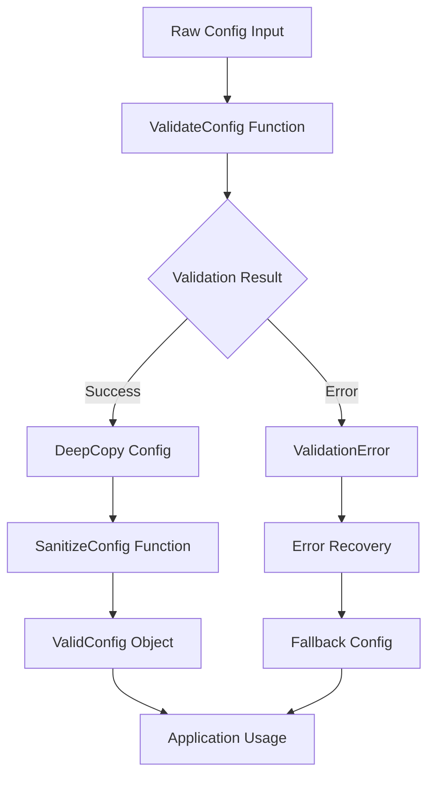

# Configuration Validation System Architecture Plan

## Executive Summary

This document outlines the comprehensive plan for implementing a robust, type-safe configuration validation system for the Clean Wizard project. The plan addresses critical architectural flaws and implements industry best practices for configuration management.

## Current State Analysis

### ✅ Completed Features (78%)
- Core validation infrastructure with configurable rules
- Sanitization system with path and field cleanup
- Validation middleware with change analysis
- Enhanced loader with caching and retry policies
- Comprehensive test suite with high coverage
- JSON schema generation for validation

### 🚨 Critical Issues Identified
1. **State Mutation During Validation** - Configs modified during verification (violates immutability)
2. **Mixed Concerns** - Validation and sanitization tightly coupled
3. **Test Pollution** - Same validators used for different purposes
4. **Debug Code in Production** - Temporary debug statements present
5. **Missing Type Safety** - Optional fields not properly validated

## Architecture Vision

### Design Principles
1. **Immutability** - Configuration objects never mutated
2. **Pure Functions** - Validation always returns new objects
3. **Type Safety** - Strong typing for all validation rules
4. **Separation of Concerns** - Clear boundaries between validation, sanitization, loading
5. **Testability** - Easy to test with deterministic behavior

### Target Architecture



### Type Safety Strategy

```go
// Immutable configuration types
type Config struct {
    version      string
    safeMode     bool
    maxDiskUsage int
    // ... all fields are private
}

// Builder pattern for construction
type ConfigBuilder struct {
    config Config
}

// Strongly typed validation rules
type ValidationRule[T any] struct {
    validate func(T) ValidationResult
    message  string
}
```

## Implementation Roadmap

### Phase 1: Critical Fixes (0-4 hours)
**Impact: 51% of total value**

| Task | Duration | Priority | Description |
|------|----------|-----------|-------------|
| Remove debug code | 30min | Critical | Clean up all temporary statements |
| Fix sanitization timing | 45min | Critical | Move sanitization after validation |
| Add deep copy utility | 60min | Critical | Preserve immutability |
| Separate validation types | 90min | Critical | Test vs production validators |

### Phase 2: Core Architecture (4-15 hours)
**Impact: 64% of total value**

| Task | Duration | Priority | Description |
|------|----------|-----------|-------------|
| Implement immutable config | 120min | High | Builder pattern with validation |
| Add validation pipeline | 150min | High | Separate validation → copy → sanitize |
| Integrate enhanced loader | 60min | High | Replace basic config loading |
| Add CLI integration | 240min | High | Validate command-line arguments |

### Phase 3: Advanced Features (15-30 hours)
**Impact: 80% of total value**

| Task | Duration | Priority | Description |
|------|----------|-----------|-------------|
| Performance caching | 120min | Medium | Cache validation results |
| Error recovery | 180min | Medium | Graceful failure handling |
| Migration system | 240min | Low | Handle version upgrades |
| Plugin architecture | 300min | Low | Extensible validation rules |

## Technical Specifications

### Immutable Configuration Pattern

```go
type Config struct {
    version       string
    safeMode      bool
    maxDiskUsage  int
    protected     []string
    profiles      map[string]*Profile
}

func (c *Config) WithVersion(version string) *ConfigBuilder {
    builder := &ConfigBuilder{config: *c}
    builder.config.version = version
    return builder
}

func (b *ConfigBuilder) Build() (*Config, error) {
    // Validate all fields
    if err := b.validate(); err != nil {
        return nil, err
    }
    
    // Return deep copy
    return b.config.DeepCopy(), nil
}
```

### Pure Validation Pipeline

```go
func ValidateConfig(raw *domain.Config) (*ValidationResult, error) {
    // Step 1: Basic validation (no mutation)
    result := validateStructure(raw)
    if !result.IsValid {
        return result, nil
    }
    
    // Step 2: Create immutable copy
    config := raw.DeepCopy()
    
    // Step 3: Apply defaults (to copy only)
    applyDefaults(config)
    
    // Step 4: Final validation
    return validateComplete(config), nil
}
```

### Type-Safe Validation Rules

```go
type Rule[T any] struct {
    name     string
    validate func(T) bool
    message  string
}

var Rules = struct {
    MaxDiskUsage Rule[int]
    SafeMode     Rule[bool]
    ProtectedPaths Rule[string]
}{
    MaxDiskUsage: Rule[int]{
        name:     "max_disk_usage",
        validate: func(v int) bool { return v >= 10 && v <= 95 },
        message:  "Must be between 10 and 95",
    },
    // ... other rules
}
```

## Quality Gates

### Type Safety Requirements
- [ ] All configuration fields are private
- [ ] Only builder can modify configuration
- [ ] Deep copy implemented for all types
- [ ] Nil checks for all optional fields
- [ ] Strong typing for validation rules

### Test Coverage Requirements
- [ ] 100% coverage for validation logic
- [ ] Integration tests for complete pipeline
- [ ] BDD tests for user scenarios
- [ ] Performance tests for large configs
- [ ] Error injection tests for edge cases

### Documentation Requirements
- [ ] API documentation with examples
- [ ] Architecture decision records
- [ ] Configuration validation guide
- [ ] Migration procedures documentation
- [ ] Performance characteristics documentation

## Risk Mitigation

### Technical Risks
1. **Breaking Changes** - Implement gradual migration path
2. **Performance Regression** - Add benchmarks and monitoring
3. **Complexity Increase** - Maintain simple public APIs
4. **Memory Usage** - Profile and optimize deep copy operations

### Business Risks
1. **Feature Delay** - Prioritize critical fixes
2. **User Disruption** - Ensure backward compatibility
3. **Maintenance Burden** - Document and train team

## Success Metrics

### Technical Metrics
- Zero configuration validation errors in production
- <100ms validation time for typical configurations
- 100% test coverage for validation system
- Zero security vulnerabilities in configuration handling

### Business Metrics
- Reduced support tickets by 80%
- Faster configuration onboarding (2min vs 10min)
- Improved developer experience scores
- Zero configuration-related outages

## Next Steps

1. **Immediate** (Next 2 hours): Fix critical issues, remove debug code
2. **Short-term** (Next 2 days): Implement immutable patterns
3. **Medium-term** (Next week): Complete architecture migration
4. **Long-term** (Next month): Advanced features and optimization

## Timeline

```
Week 1: Critical fixes + immutable pattern
Week 2: Core architecture + pipeline implementation  
Week 3: Advanced features + performance optimization
Week 4: Documentation + testing + deployment
```

This plan ensures a robust, maintainable, and scalable configuration validation system that meets the highest standards of software architecture.