# COMPREHENSIVE GITHUB ISSUES EXECUTION PLAN

## 🎯 EXECUTION OVERVIEW

**Date**: November 10, 2025  
**Priority**: HIGH - Critical user experience improvements  
**Scope**: 4 open GitHub issues covering BDD infrastructure, profile management, interactive configuration, and migration system

This plan addresses the complete resolution of all open GitHub Issues in strategic order, ensuring maximum user value and architectural integrity.

---

## 📋 ISSUE ANALYSIS & STRATEGIC ORDERING

### **Current Open Issues**

1. **Issue #20** 🎨 FEATURE: Profile management commands (HIGH)
2. **Issue #19** 🔧 MAINTENANCE: Configuration migration system (MEDIUM)
3. **Issue #18** 🎨 ENHANCEMENT: Interactive configuration generation (MEDIUM)
4. **Issue #17** 🔧 TECHNICAL: Clean up BDD test infrastructure (LOW)

### **Strategic Execution Order**

```
1. Issue #17 → Critical Infrastructure Foundation
2. Issue #20 → Core User Experience
3. Issue #18 → Advanced User Experience
4. Issue #19 → System Maintenance & Future-Proofing
```

**Rationale**: Start with stable foundation → Core functionality → Advanced features → System resilience

---

## 🚀 PHASE 1: CRITICAL INFRASTRUCTURE (Issue #17)

### **Problem Statement**

Minor technical cleanup needed for BDD testing framework to ensure clean CI/CD execution.

### **Technical Issues Identified**

- ❌ Import Cleanup: Remove unused imports in scan.go
- ❌ Field Name Optimization: Fix ScanResult field usage
- ❌ Build Warnings: Resolve minor build-time warnings
- ❌ BDD Test Mismatches: Test expectations don't match actual output
- ❌ CI/CD Integration: Ensure clean automated test runs

### **Implementation Tasks**

#### **Task 1.1: Fix Scan Logic in scan.go**

```bash
# BEFORE (lines 142-143):
fmt.Printf("   • Current generation: %d\n", result.TotalItems-4) // TODO: Fix this logic
fmt.Printf("   • Cleanable generations: %d\n", 4) // TODO: Fix this logic

# AFTER (proper calculation):
currentCount := 0
for _, gen := range generations {
    if gen.Current {
        currentCount++
    }
}
cleanableCount := len(generations) - currentCount
fmt.Printf("   • Current generation: %d\n", currentCount)
fmt.Printf("   • Cleanable generations: %d\n", cleanableCount)
```

#### **Task 1.2: Remove Unused Imports**

```bash
# Remove unused "strings" import from clean.go (now in util.go)
# Ensure all imports are properly utilized
```

#### **Task 1.3: Fix BDD Test Expectations**

```bash
# Update nix_test.go expectations:
# FROM: "✅ Cleanup completed!"
# TO: "✅ Cleanup completed successfully" (matches actual output)
```

#### **Task 1.4: Add Completion Messages**

```bash
# Add "✅ Scan completed!" message to scan.go displayScanResults()
# Ensures BDD tests have proper completion detection
```

### **Acceptance Criteria**

- [x] BDD tests run without build warnings
- [x] CI/CD execution is clean
- [x] All imports are properly utilized
- [x] Field names match domain types
- [x] Scan logic correctly calculates current/cleanable generations
- [x] BDD test expectations match actual output

---

## 🎯 PHASE 2: CORE USER EXPERIENCE (Issue #20)

### **Problem Statement**

Users need CLI commands for profile management to work with multiple cleanup profiles effectively.

### **Current State Analysis**

- ✅ Profile-based configuration working
- ✅ Multiple profiles can be defined in config files
- ✅ Daily profile is used by default
- ❌ No CLI commands for profile operations
- ❌ No way to list available profiles
- ❌ No profile selection beyond default

### **Feature Requirements**

#### **Requirement 2.1: Profile Listing Command**

```bash
clean-wizard profile list
```

**Expected Output:**

```
📋 Available Profiles:
   ✅ daily    - Daily cleanup operations (5 operations)
   ✅ weekly   - Weekly deep cleanup (12 operations)
   ❌ monthly  - Monthly maintenance (disabled)
```

#### **Requirement 2.2: Profile Selection Command**

```bash
clean-wizard profile select weekly
```

**Expected Features:**

- Profile validation and existence checking
- Current selection display
- Graceful error handling for missing profiles

#### **Requirement 2.3: Profile Information Command**

```bash
clean-wizard profile info daily
```

**Expected Output:**

```
📋 Profile: daily
Description: Daily cleanup operations
Status: ✅ Enabled
Operations (5):
   • nix-generations     - LOW risk, enabled
   • temp-files         - MEDIUM risk, enabled
   • package-caches     - LOW risk, enabled
   • log-rotation      - LOW risk, enabled
   • browser-cache     - MEDIUM risk, enabled
```

#### **Requirement 2.4: Enhanced --profile Flag Support**

```bash
clean-wizard scan --profile weekly
clean-wizard clean --profile daily --dry-run
```

### **Implementation Architecture**

#### **New Command Structure**

```
cmd/clean-wizard/commands/
├── profile.go          # NEW: Profile management commands
├── profile_list.go     # NEW: Profile listing
├── profile_select.go    # NEW: Profile selection
├── profile_info.go      # NEW: Profile information
└── util.go            # EXISTING: Shared utilities
```

#### **Core Data Flow**


#### **Profile Manager Interface**

```go
type ProfileManager interface {
    ListProfiles(ctx context.Context) ([]*ProfileInfo, error)
    SelectProfile(ctx context.Context, name string) error
    GetProfileInfo(ctx context.Context, name string) (*ProfileDetail, error)
    GetSelectedProfile(ctx context.Context) (string, error)
}

type ProfileInfo struct {
    Name        string
    Description string
    Enabled     bool
    OperationCount int
    RiskLevel   domain.RiskLevel
}

type ProfileDetail struct {
    ProfileInfo
    Operations []domain.CleanupOperation
}
```

### **Implementation Tasks**

#### **Task 2.1: Create Profile Command Structure**

```bash
# Create profile command group
# Implement subcommands: list, select, info
# Add proper help and usage text
```

#### **Task 2.2: Implement Profile Listing**

```bash
# Load all profiles from configuration
# Calculate operation counts and risk levels
# Format output with status indicators
```

#### **Task 2.3: Implement Profile Selection**

```bash
# Validate profile existence
# Update configuration or runtime state
# Provide user feedback on selection
```

#### **Task 2.4: Implement Profile Information**

```bash
# Load detailed profile information
# Display operation details with risk levels
# Show settings and configuration
```

#### **Task 2.5: Enhance Main Commands**

```bash
# Add --profile flag to scan and clean commands
# Load profile-specific configurations
# Apply profile settings to operations
```

#### **Task 2.6: Update Configuration System**

```bash
# Add current profile tracking
# Support for profile selection persistence
# Profile validation and error handling
```

### **Acceptance Criteria**

- [ ] `clean-wizard profile list` shows all available profiles with status
- [ ] `clean-wizard profile select <name>` changes active profile with validation
- [ ] `clean-wizard profile info <name>` displays detailed profile information
- [ ] `--profile` flag works with scan and clean commands
- [ ] Error handling works for missing/invalid profiles
- [ ] Help system updated with profile command documentation
- [ ] Configuration loading respects profile selection

---

## 🎨 PHASE 3: ADVANCED USER EXPERIENCE (Issue #18)

### **Problem Statement**

Users need interactive configuration generation for better user experience and customization.

### **Current State Analysis**

- ✅ Template generation working with 4 template types
- ✅ Configuration files can be generated instantly
- ✅ CLI integration working
- ❌ Static template generation only
- ❌ No user input prompts for customization

### **Feature Requirements**

#### **Requirement 3.1: Interactive Prompts System**

```bash
clean-wizard generate --interactive
```

**Prompt Sequence:**

1. **Safe Mode Confirmation**

   ```
   🛡️  Enable Safe Mode? (default: yes)
   > [Y/n]
   ```

2. **Protected Paths Customization**

   ```
   📁 Protected System Paths (comma-separated, press Enter for defaults):
   > /System,/Library,/Applications,/usr,/etc,/var

   🏠 Add custom protected paths? (optional)
   > /Users/larsartmann/Documents,/Users/larsartmann/Projects
   ```

3. **Disk Usage Threshold**

   ```
   💾 Maximum disk usage percentage (1-100, default: 50):
   > 75
   ```

4. **Profile Configuration**

   ```
   📋 Configure cleanup profiles:

   Daily profile? (recommended) [Y/n]
   Weekly profile? [y/N]
   Monthly profile? [y/N]

   Daily profile operations:
   ✅ nix-generations (LOW risk)
   ✅ temp-files (MEDIUM risk)
   ❌ package-caches (HIGH risk) - Enable? [y/N]
   ```

#### **Requirement 3.2: Real-time Validation**

```bash
# Input validation during generation:
- Path existence checking
- Disk usage range validation (1-100)
- Profile conflict detection
- Operation risk level warnings
```

#### **Requirement 3.3: Configuration Preview & Confirmation**

```bash
📋 Configuration Preview:

version: "1.0.0"
safe_mode: true
max_disk_usage: 75
protected:
  - "/System"
  - "/Library"
  - "/Applications"
  - "/Users/larsartmann/Documents"
profiles:
  daily:
    name: "daily"
    description: "Daily cleanup operations"
    enabled: true
    operations: [3 operations enabled]

✅ Save this configuration? [Y/n]
📁 Location: ./clean-wizard.yaml
```

### **Implementation Architecture**

#### **Interactive System Components**

```go
type InteractiveGenerator interface {
    RunInteractiveSetup(ctx context.Context) (*domain.Config, error)
    PromptSafeMode() (bool, error)
    PromptProtectedPaths() ([]string, error)
    PromptDiskUsage() (int, error)
    PromptProfiles() (map[string]*domain.Profile, error)
    PreviewConfig(*domain.Config) error
    ConfirmSave() (bool, string, error)
}

type PromptValidator interface {
    ValidatePath(path string) error
    ValidateDiskUsage(percentage int) error
    ValidateProfileName(name string, existing map[string]*domain.Profile) error
    ValidateOperationSettings(settings map[string]any) error
}
```

#### **User Experience Flow**


### **Implementation Tasks**

#### **Task 3.1: Create Interactive Prompt System**

```bash
# Implement terminal UI for prompts
# Add input validation and error handling
# Support for default values and suggestions
```

#### **Task 3.2: Implement Real-time Validation**

```bash
# Path existence checking
# Disk usage range validation
# Profile conflict detection
# Operation compatibility checking
```

#### **Task 3.3: Create Configuration Preview**

```bash
# YAML formatting for preview
# Highlight important settings
# Show operation summary with risk levels
```

#### **Task 3.4: Add Help and Guidance**

```bash
# Context-sensitive help for each prompt
# Risk level explanations
# Recommended settings based on system analysis
```

#### **Task 3.5: Integration with Existing CLI**

```bash
# Add --interactive flag to generate command
# Maintain backward compatibility with template generation
# Update help documentation
```

### **Acceptance Criteria**

- [ ] Interactive prompts work for all configuration fields
- [ ] Real-time validation during input
- [ ] Users can customize protected paths and profiles
- [ ] Generated configuration is validated before saving
- [ ] Back/forward navigation available
- [ ] Help text available for each option
- [ ] Configuration preview shows all settings clearly
- [ ] Save confirmation prevents accidental overwrites

---

## 🔧 PHASE 4: SYSTEM MAINTENANCE (Issue #19)

### **Problem Statement**

Need configuration migration system to handle format changes gracefully and provide backwards compatibility.

### **Current State Analysis**

- ✅ Configuration loading working with YAML
- ✅ Validation system implemented
- ✅ Template generation working
- ❌ No migration system for format changes
- ❌ No backwards compatibility handling
- ❌ No version tracking for configurations

### **Feature Requirements**

#### **Requirement 4.1: Configuration Versioning**

```yaml
version: "1.2.0"  # NEW: Configuration format version
safe_mode: true
max_disk_usage: 50
# ... rest of configuration
```

#### **Requirement 4.2: Migration Engine**

```go
type MigrationEngine interface {
    DetectVersion(config *domain.Config) (string, error)
    NeedsMigration(from, to string) bool
    ExecuteMigration(config *domain.Config, from, to string) error
    GetAvailableMigrations() []Migration
}

type Migration interface {
    FromVersion() string
    ToVersion() string
    Description() string
    Migrate(*domain.Config) error
}
```

#### **Requirement 4.3: User Experience**

```bash
# Migration notification:
📦 Configuration format update available: v1.0.0 → v1.2.0
🔄 Changes: Enhanced profile structure, new validation levels
💾 Backup will be created at: clean-wizard.yaml.backup.20251110

⚠️  Proceed with migration? [Y/n]
```

### **Migration Examples**

#### **Migration 1.0.0 → 1.1.0: Protected Path Format Changes**

```yaml
# BEFORE (v1.0.0):
protected:
  - "/System"
  - "/Library"
  - "/Applications"

# AFTER (v1.1.0):
protected:
  system_paths:
    - "/System"
    - "/Library"
  user_paths:
    - "/Applications"
  categories: ["system", "user"]
```

#### **Migration 1.1.0 → 1.2.0: Profile Structure Updates**

```yaml
# BEFORE (v1.1.0):
profiles:
  daily:
    name: "daily"
    operations:
      - name: "nix-generations"
        enabled: true
        risk: "LOW"

# AFTER (v1.2.0):
profiles:
  daily:
    name: "daily"
    description: "Daily cleanup operations"
    enabled: true
    operations:
      - name: "nix-generations"
        description: "Clean old Nix package generations"
        risk_level: "LOW"  # NEW: Standardized risk_level field
        enabled: true
        settings:
          keep_count: 3
          dry_run_by_default: false
```

#### **Migration 1.2.0 → 1.3.0: Validation System Changes**

```yaml
# NEW: validation_levels section
validation:
  level: "comprehensive"  # none, basic, comprehensive, strict
  custom_rules:
    - name: "protect_recent_files"
      enabled: true
      days_threshold: 7
```

### **Implementation Architecture**

#### **Migration System Components**


#### **Migration Registry**

```go
type MigrationRegistry struct {
    migrations map[string][]Migration  // from_version -> []migrations
}

func (r *MigrationRegistry) RegisterMigration(migration Migration) {
    from := migration.FromVersion()
    r.migrations[from] = append(r.migrations[from], migration)
}

func (r *MigrationRegistry) GetMigrationPath(from, to string) ([]Migration, error) {
    // Build migration graph and find shortest path
    // Return ordered list of migrations
}
```

### **Implementation Tasks**

#### **Task 4.1: Add Version Tracking**

```bash
# Add version field to Config struct
# Update YAML serialization
# Add version detection logic
```

#### **Task 4.2: Implement Migration Engine**

```bash
# Create migration interface and registry
# Implement migration graph resolution
# Add execution framework with rollback
```

#### **Task 4.3: Create Specific Migrations**

```bash
# Migration v1.0.0 → v1.1.0: Protected paths restructure
# Migration v1.1.0 → v1.2.0: Profile field standardization
# Migration v1.2.0 → v1.3.0: Validation system integration
```

#### **Task 4.4: Backup and Restore System**

```bash
# Automatic backup creation before migration
# Timestamp-based backup filenames
# Restore functionality for failed migrations
```

#### **Task 4.5: User Notification System**

```bash
# Migration availability detection
# Clear description of changes
# User confirmation prompts
# Progress reporting during migration
```

#### **Task 4.6: Migration Validation**

```bash
# Pre-migration validation checks
# Post-migration configuration validation
# Rollback triggers for invalid configurations
```

### **Acceptance Criteria**

- [ ] Configuration version detection works automatically
- [ ] Migration between versions is seamless
- [ ] Backups are created before migration
- [ ] Rollback capability is available
- [ ] User notifications are clear and actionable
- [ ] Migration validation prevents corruption
- [ ] Backwards compatibility is maintained
- [ ] Migration history is tracked

---

## 📊 EXECUTION GRAPH

```mermaid
graph TD
    A[Start: All Issues Open] --> B[Phase 1: Issue #17 BDD Infrastructure]

    B --> B1[Fix scan.go logic]
    B1 --> B2[Remove unused imports]
    B2 --> B3[Fix BDD test expectations]
    B3 --> B4[Add completion messages]
    B4 --> B5[✅ BDD tests pass cleanly]

    B5 --> C[Phase 2: Issue #20 Profile Management]

    C --> C1[Create profile command structure]
    C1 --> C2[Implement profile listing]
    C2 --> C3[Implement profile selection]
    C3 --> C4[Implement profile info]
    C4 --> C5[Add --profile flag support]
    C5 --> C6[✅ Profile management complete]

    C6 --> D[Phase 3: Issue #18 Interactive Config]

    D --> D1[Create interactive prompt system]
    D1 --> D2[Implement real-time validation]
    D2 --> D3[Create configuration preview]
    D3 --> D4[Add help and guidance]
    D4 --> D5[Integrate with existing CLI]
    D5 --> D6[✅ Interactive generation complete]

    D6 --> E[Phase 4: Issue #19 Migration System]

    E --> E1[Add configuration versioning]
    E1 --> E2[Implement migration engine]
    E2 --> E3[Create specific migrations]
    E3 --> E4[Add backup/restore system]
    E4 --> E5[Create user notifications]
    E5 --> E6[Add migration validation]
    E6 --> E7[✅ Migration system complete]

    E7 --> F[Final Integration & Testing]

    F --> F1[Integration testing all phases]
    F1 --> F2[Documentation updates]
    F2 --> F3[Performance validation]
    F3 --> F4[✅ All issues resolved]

    F4 --> G[Success: Production Ready]

    style A fill:#ff9999
    style G fill:#99ff99
    style B fill:#ffdd99
    style C fill:#ffdd99
    style D fill:#ffdd99
    style E fill:#ffdd99
    style F fill:#ddff99
```



---

## 🎯 SUCCESS METRICS

### **Technical Metrics**

- [ ] 100% BDD test pass rate (currently failing on minor issues)
- [ ] Zero build warnings or errors
- [ ] <100ms command execution time for profile operations
- [ ] 100% backward compatibility maintained
- [ ] Zero data loss during migrations

### **User Experience Metrics**

- [ ] Profile management reduces configuration editing by 80%
- [ ] Interactive setup reduces onboarding time from 10min → 2min
- [ ] Migration system prevents 100% of configuration corruption
- [ ] CLI help coverage for all new commands

### **Code Quality Metrics**

- [ ] Test coverage ≥ 90% for all new features
- [ ] Zero TODO items left in code
- [ ] All new code follows established patterns
- [ ] Comprehensive error handling with user-friendly messages

---

## 🚦 RISK MITIGATION

### **Technical Risks**

- **Risk**: Breaking existing configurations
- **Mitigation**: Comprehensive migration system with automatic backups
- **Recovery**: Rollback capability and validation

### **User Experience Risks**

- **Risk**: Complex interactive prompts
- **Mitigation**: Smart defaults, clear help text, progressive disclosure
- **Recovery**: Template generation fallback option

### **Development Risks**

- **Risk**: Scope creep or delays
- **Mitigation**: Clear phase boundaries, incremental delivery
- **Recovery**: MVP delivery with enhancements in subsequent releases

---

## 📅 IMPLEMENTATION TIMELINE

### **Phase 1 (Issue #17)**: 2-4 hours

- Day 1: Complete BDD infrastructure fixes ✅
- Testing and validation

### **Phase 2 (Issue #20)**: 8-12 hours

- Day 1-2: Profile command structure and listing
- Day 2-3: Profile selection and info commands
- Day 3: Integration and testing

### **Phase 3 (Issue #18)**: 12-16 hours

- Day 4-5: Interactive prompt system
- Day 6: Real-time validation and preview
- Day 7: Integration and polish

### **Phase 4 (Issue #19)**: 10-14 hours

- Day 8-9: Migration engine and versioning
- Day 10: Specific migrations and backup system
- Day 11: Testing and documentation

### **Total Estimated Effort**: 32-46 hours over 2 weeks

---

## 🏁 EXECUTION PREREQUISITES

### **Before Starting**

- [x] Git repository is clean
- [x] All existing tests pass
- [x] Development environment ready
- [x] Dependencies up to date

### **During Execution**

- Commit after each major milestone
- Run full test suite before phase transitions
- Update documentation as features are implemented
- Maintain backward compatibility at all times

---

## 📝 NOTES & DECISIONS

### **Architecture Decisions**

1. **Profile Management**: CLI-first approach with optional file-based configuration
2. **Interactive System**: Progressive disclosure with smart defaults
3. **Migration Engine**: Graph-based path resolution for complex version jumps
4. **Error Handling**: User-friendly messages with technical details in verbose mode

### **Design Principles Applied**

- **User Experience**: Reduce cognitive load, provide clear guidance
- **Safety First**: Automatic backups, validation, rollback capability
- **Performance**: Minimal overhead for common operations
- **Extensibility**: Easy addition of new profile types and migrations

### **Technical Trade-offs**

- **Complexity vs. Flexibility**: Migration system adds complexity but enables long-term maintainability
- **Interactivity vs. Scriptability**: Interactive mode helps beginners, templates preserve automation
- **Safety vs. Convenience**: Automatic migrations safe but may require user confirmation

---

_Last Updated: November 10, 2025_  
_Execution Priority: CRITICAL - All issues must be resolved for production readiness_  
_Architecture Standard: EXCELLENCE - Zero compromise on code quality and user experience_
