# 🚀 ARCHITECTURAL EXCELLENCE EXECUTION GRAPH
**Interactive Execution Roadmap with Critical Path Analysis**

```mermaid
graph TD
    %% Phase 1: Critical Fixes (1% Effort → 51% Value)
    A[Start: Current State<br/>67% Production Ready] --> B[Task 1: Fix TestConfigSanitizer<br/>5min → Critical]
    B --> C[Task 2: Fix ValidationMiddleware<br/>10min → Critical]
    
    %% Phase 2: High-Impact Deduplication (4% Effort → 64% Value)
    C --> D[Task 3-8: Validation Test Cleanup<br/>15min → High Impact]
    D --> E[Task 9-12: Middleware Deduplication<br/>15min → High Impact]
    
    %% Phase 3: Type Safety (15% Effort → 75% Value)
    E --> F[Task 13-15: Strong Typing<br/>45min → Critical]
    
    %% Phase 4: Remaining Deduplication (20% Effort → 80% Value)
    F --> G[Task 16-18: Operation Validation<br/>45min → Important]
    G --> H[Task 19-22: Integration Framework<br/>30min → Important]
    H --> I[Task 23-28: Final Cleanup<br/>30min → Important]
    
    %% Phase 5: Excellence (25% Effort → 85% Value)
    I --> J[Task 29-32: Documentation<br/>30min → Valuable]
    J --> K[Task 33-36: Performance<br/>30min → Valuable]
    K --> L[Task 37-40: Security<br/>30min → Critical]
    
    %% Phase 6: Production Ready (20% Effort → 100% Value)
    L --> M[Task 41-45: Final Validation<br/>15min → Essential]
    M --> N[100% Production Ready<br/>Enterprise Excellence]
    
    %% Critical Path Highlighting
    classDef critical fill:#ff6b6b,stroke:#c92a2a,color:#fff
    classDef highImpact fill:#f59f00,stroke:#e67700,color:#fff
    classDef important fill:#20c997,stroke:#099268,color:#fff
    classDef valuable fill:#339af0,stroke:#1864ab,color:#fff
    classDef essential fill:#845ef7,stroke:#5f3dc4,color:#fff
    
    class B,C critical
    class D,E,F highImpact
    class G,H,I important
    class J,K valuable
    class L essential
    class M,N critical
```



---

## 🎯 EXECUTION TIMELINE & IMPACT CURVE


---

## 🚨 CRITICAL SUCCESS FACTORS

### **Immediate Execution (Next 15 Minutes)**
1. **Fix TestConfigSanitizer** - Unblocks validation system
2. **Fix ValidationMiddleware** - Restores security validation
3. **Verify All Tests Pass** - Confirm fix effectiveness

### **High-Impact Execution (Following 30 Minutes)**
4. **Eliminate 6 Validation Test Clone Groups** - Major maintainability improvement
5. **Eliminate 4 Middleware Clone Groups** - Architectural consistency
6. **Performance Validation** - Ensure no regressions

### **Comprehensive Excellence (Following 2 Hours)**
7. **100% Type Safety** - Zero any types
8. **Zero Code Duplication** - All 17 clone groups eliminated
9. **Integration Test Coverage** - End-to-end validation
10. **Production Readiness** - Enterprise-grade excellence

---

## 📊 SUCCESS METRICS TRACKING

| **MILESTONE** | **TIME** | **TEST PASS** | **DUPLICATION** | **TYPE SAFETY** | **PRODUCTION READY** |
|-------------|----------|---------------|------------------|----------------|---------------------|
| **Start** | 0min | 85% | 17 groups | 95% | 67% |
| **Critical Fixes** | 15min | 100% | 17 groups | 95% | 80% |
| **Deduplication** | 45min | 100% | 11 groups | 95% | 85% |
| **Type Safety** | 90min | 100% | 11 groups | 100% | 90% |
| **Integration** | 120min | 100% | 5 groups | 100% | 95% |
| **Excellence** | 240min | 100% | 0 groups | 100% | 100% |

---

## ⚡ EXECUTION DIRECTIVES

### **IMMEDIATE COMMAND SEQUENCE**
```bash
# Execute in parallel for maximum efficiency
just build && just lint && just test

# Fix critical test failures (Tasks 1-2)
# Commit and verify each fix individually

# Begin deduplication (Tasks 3-12)
# Run tests after each task completion
```

### **QUALITY GATES**
- **After Each Task**: Run `just test` - must pass
- **After Each Phase**: Run full test + lint + build suite
- **Before Commits**: Verify no regression introduced
- **Final Validation**: Complete integration test suite

---

**THIS EXECUTION GRAPH REPRESENTS THE OPTIMAL PATH FROM 67% TO 100% PRODUCTION READINESS WITH MAXIMUM VALUE DELIVERY AND MINIMAL RISK.**