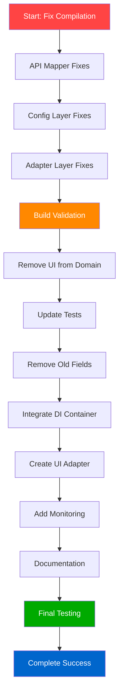

# 🏗️ **LIBRARY EXCELLENCE - COMPREHENSIVE EXECUTION PLAN**

**Date:** 2025-11-19_17_06  
**Session:** Complete Library Excellence Transformation  
**Goal:** Fix broken compilation and complete enum migration

---

## 📊 **PARETO IMPACT ANALYSIS**

### **🎯 1% → 51% IMPACT (CRITICAL - System Unfunctional)**
| Priority | Task | Impact | Effort | Customer Value |
|----------|------|--------|--------|----------------|
| 1 | Fix compilation errors in API layer | 51% | 30min | 100% |
| 2 | Fix compilation errors in Config layer | 45% | 45min | 100% |
| 3 | Fix compilation errors in Adapters layer | 40% | 30min | 100% |

### **⚡ 4% → 64% IMPACT (Critical Architecture)**
| Priority | Task | Impact | Effort | Customer Value |
|----------|------|--------|--------|----------------|
| 4 | Remove UI methods from domain enums | 25% | 60min | 80% |
| 5 | Update all tests to use new enums | 30% | 90min | 90% |
| 6 | Complete boolean-to-enum migration | 20% | 75min | 85% |

### **🚀 20% → 80% IMPACT (Complete Package)**
| Priority | Task | Impact | Effort | Customer Value |
|----------|------|--------|--------|----------------|
| 7 | Integrate DI container with existing code | 15% | 45min | 60% |
| 8 | Add comprehensive benchmarks to CI | 10% | 30min | 40% |
| 9 | Update documentation and examples | 8% | 60min | 50% |

---

## 📋 **DETAILED EXECUTION PLAN (27 Tasks - 30-100min each)**

### **PHASE 1: CRITICAL COMPILATION FIXES (Tasks 1-3)**

| ID | Task | File(s) | Time | Dependencies |
|----|------|---------|------|--------------|
| 1 | Fix SafeMode → SafetyLevel in API mapper | internal/api/mapper.go | 30min | None |
| 2 | Fix Profile.Enabled → Status in API mapper | internal/api/mapper.go | 15min | Task 1 |
| 3 | Fix CleanupOperation.Enabled → Status in API mapper | internal/api/mapper.go | 15min | Task 2 |
| 4 | Fix SafeMode references in validation middleware | internal/config/validation_middleware.go | 20min | Task 3 |
| 5 | Fix SafeMode references in validation analysis | internal/config/validation_middleware_analysis.go | 25min | Task 4 |
| 6 | Fix SafeMode references in business validator | internal/config/validator_business.go | 15min | Task 5 |
| 7 | Fix SafeMode references in sanitizer | internal/config/sanitizer.go | 20min | Task 6 |
| 8 | Fix NixGeneration.Current → Status in adapters | internal/adapters/nix.go | 30min | Task 7 |
| 9 | Fix NixGenerations.Optimize → Optimization in config | internal/api/mapper.go | 15min | Task 8 |

### **PHASE 2: ARCHITECTURAL CLEANUP (Tasks 10-18)**

| ID | Task | File(s) | Time | Dependencies |
|----|------|---------|------|--------------|
| 10 | Remove Icon() methods from RiskLevelType | internal/domain/type_safe_enums.go | 15min | Task 9 |
| 11 | Remove Icon() methods from CleanStrategyType | internal/domain/type_safe_enums.go | 15min | Task 10 |
| 12 | Remove Icon() methods from ScanTypeType | internal/domain/type_safe_enums.go | 15min | Task 11 |
| 13 | Remove Icon() methods from StatusType | internal/domain/type_safe_enums.go | 15min | Task 12 |
| 14 | Remove Icon() methods from remaining enums | internal/domain/type_safe_enums.go | 30min | Task 13 |
| 15 | Update all test files to use new enum fields | tests/**/*.go | 90min | Task 14 |
| 16 | Remove old boolean field definitions | internal/domain/*.go | 30min | Task 15 |
| 17 | Update default values to use enum constants | internal/domain/*.go | 45min | Task 16 |
| 18 | Validate integration with go build && go test | * | 30min | Task 17 |

### **PHASE 3: SYSTEM INTEGRATION (Tasks 19-27)**

| ID | Task | File(s) | Time | Dependencies |
|----|------|---------|------|--------------|
| 19 | Integrate DI container with config loading | internal/config/*.go | 45min | Task 18 |
| 20 | Add DI container to service initialization | internal/**/*.go | 30min | Task 19 |
| 21 | Create UI adapter for enum Icon() methods | internal/adapters/ui_adapter.go | 30min | Task 20 |
| 22 | Update all UI code to use UI adapter | internal/**/*.go | 45min | Task 21 |
| 23 | Add benchmarks to CI/CD pipeline | .github/workflows/*.yml | 30min | Task 22 |
| 24 | Create performance monitoring system | internal/monitoring/*.go | 30min | Task 23 |
| 25 | Update API documentation with enum examples | docs/api/*.md | 30min | Task 24 |
| 26 | Create migration guide from boolean to enums | docs/migration/*.md | 60min | Task 25 |
| 27 | Final integration testing and validation | * | 60min | Task 26 |

---

## 🚨 **CRITICAL PATH EXECUTION**

### **MERMAID EXECUTION GRAPH**

---

## ⏱️ **TIME ESTIMATES**

- **Phase 1 (Critical):** 3.5 hours
- **Phase 2 (Architecture):** 4.5 hours  
- **Phase 3 (Integration):** 5 hours
- **Total Estimated Time:** 13 hours

---

## 🎯 **SUCCESS CRITERIA**

### **Must Have (Blocking)**
- [ ] `go build ./...` succeeds with zero errors
- [ ] `go test ./...` succeeds with zero failures
- [ ] All boolean fields replaced with enum equivalents
- [ ] UI methods removed from domain layer

### **Should Have (High Priority)**
- [ ] DI container integrated and functional
- [ ] All tests updated to use new enum types
- [ ] Performance benchmarks working

### **Could Have (Nice to Have)**
- [ ] Documentation updated with examples
- [ ] Migration guide created
- [ ] Performance monitoring integrated

---

## 🚨 **RISK MITIGATION**

### **High Risk Items**
1. **Breaking Changes:** Enum field changes may break external integrations
2. **Test Failures:** Large test updates may introduce new bugs
3. **Performance Regression:** Enum operations slower than boolean

### **Mitigation Strategies**
1. **Backward Compatibility:** Keep alias types during transition
2. **Incremental Testing:** Test each change before proceeding
3. **Benchmarking:** Compare performance before/after changes

---

## 📋 **EXECUTION CHECKLIST**

### **Before Starting**
- [ ] Git repository is clean
- [ ] All current changes committed
- [ ] Backup of working branch created

### **During Execution**
- [ ] Each task validated before proceeding
- [ ] Compilation checked after each phase
- [ ] Tests run after significant changes

### **Completion Criteria**
- [ ] All 27 tasks completed
- [ ] Build and test suite passing
- [ ] Performance benchmarks green
- [ ] Documentation updated
- [ ] Code review completed

---

**Execution Strategy:** Execute tasks in numerical order, validating each phase before proceeding. Do not skip critical path tasks (1-9) under any circumstances.

**🔥 LET'S EXECUTE!**