```mermaid
gantt
    title Library Excellence Transformation Timeline
    dateFormat X
    axisFormat %s
    
    section Phase 1: Critical Path
    Test Suite Compilation Errors :crit, 1, 30
    Icon Method Removal :crit, 2, 20
    Test Data Structure Updates :crit, 3, 45
    
    section Phase 2: High Value
    UI Adapter Integration :4, 30
    System Validation :5, 15
    API Documentation :6, 30
    Performance Benchmarks :7, 45
    
    section Phase 3: Completion
    Migration Guide :8, 60
    Integration Tests :9, 45
    Code Generation Tools :10, 60
    Performance Monitoring :11, 75
```

# 📋 **LIBRARY EXCELLENCE TRANSFORMATION - EXECUTION PLAN**

**Date:** November 19, 2025 - 19:16 CET  
**Session:** Complete Phase 2 & Phase 3 Implementation  
**Branch:** feature/library-excellence-transformation  
**Status:** Ready for Execution  

---

## 🎯 **STRATEGIC PARETO ANALYSIS**

### **1% → 51% IMPACT (CRITICAL PATH - First 95min)**
| Task | Time | Impact | Priority |
|------|------|--------|----------|
| 1. Fix Test Suite Compilation Errors | 30min | 90% | P1-CRITICAL |
| 2. Complete Icon() Method Removal | 20min | 80% | P1-CRITICAL |
| 3. Update Test Data Structures | 45min | 85% | P1-CRITICAL |

### **4% → 64% IMPACT (HIGH VALUE - Next 120min)**
| Task | Time | Impact | Priority |
|------|------|--------|----------|
| 4. Integrate UI Adapter with CLI | 30min | 60% | P2-HIGH |
| 5. Validate Full System | 15min | 70% | P2-HIGH |
| 6. Update API Documentation | 30min | 45% | P2-HIGH |
| 7. Performance Benchmarks | 45min | 50% | P2-HIGH |

### **20% → 80% IMPACT (COMPLETION - Final 240min)**
| Task | Time | Impact | Priority |
|------|------|--------|----------|
| 8. Create Migration Guide | 60min | 40% | P3-MEDIUM |
| 9. Integration Tests | 45min | 35% | P3-MEDIUM |
|10. Code Generation Tools | 60min | 25% | P3-MEDIUM |
|11. Performance Monitoring | 75min | 30% | P3-MEDIUM |

---

## 📊 **DETAILED TASK BREAKDOWN (30min max each)**

### **PHASE 1: CRITICAL PATH (95min total)**

#### **Task 1: Fix Test Suite Compilation Errors (30min)**
- **1.1 Identify failing test files** (5min)
- **1.2 Update internal/api/mapper_test.go** (10min)
- **1.3 Update internal/config/bdd_nix_validation_test.go** (5min)
- **1.4 Update internal/config/integration_test.go** (5min)
- **1.5 Update internal/middleware/validation_test.go** (5min)

#### **Task 2: Complete Icon() Method Removal (20min)**
- **2.1 Remove Icon methods from enum types** (10min)
- **2.2 Add missing Icon methods to UI adapter** (5min)
- **2.3 Verify no UI concerns remain in domain** (5min)

#### **Task 3: Update Test Data Structures (45min)**
- **3.1 Update internal/di/container_test.go** (15min)
- **3.2 Update internal/domain/domain_fuzz_test.go** (10min)
- **3.3 Verify all enum field usage in tests** (10min)
- **3.4 Run full test suite to validate** (10min)

---

### **PHASE 2: HIGH VALUE (120min total)**

#### **Task 4: Integrate UI Adapter with CLI (30min)**
- **4.1 Find CLI commands using domain.Icon()** (10min)
- **4.2 Update CLI to use UI adapter** (15min)
- **4.3 Test CLI output formatting** (5min)

#### **Task 5: Validate Full System (15min)**
- **5.1 Run complete test suite** (5min)
- **5.2 Build verification** (5min)
- **5.3 Integration spot-checks** (5min)

#### **Task 6: Update API Documentation (30min)**
- **6.1 Document enum migration changes** (15min)
- **6.2 Update examples with new field names** (10min)
- **6.3 Verify API docs accuracy** (5min)

#### **Task 7: Performance Benchmarks (45min)**
- **7.1 Create enum operation benchmarks** (15min)
- **7.2 Baseline performance measurements** (15min)
- **7.3 Compare vs old boolean operations** (15min)

---

### **PHASE 3: COMPLETION (240min total)**

#### **Task 8: Create Migration Guide (60min)**
- **8.1 Document field mappings** (20min)
- **8.2 Create code examples** (20min)
- **8.3 Write troubleshooting section** (20min)

#### **Task 9: Integration Tests (45min)**
- **9.1 Write end-to-end test scenarios** (15min)
- **9.2 Test enum serialization/deserialization** (15min)
- **9.3 Validate UI adapter integration** (15min)

#### **Task 10: Code Generation Tools (60min)**
- **10.1 Design enum generation template** (20min)
- **10.2 implement code generator** (30min)
- **10.3 Test with existing enums** (10min)

#### **Task 11: Performance Monitoring (75min)**
- **11.1 Add metrics collection** (25min)
- **11.2 Performance dashboard** (25min)
- **11.3 Alerting thresholds** (25min)

---

## 🔍 **GRANULAR TASK BREAKDOWN (15min max each)**

### **CRITICAL PATH TASKS (45 tasks × 15min = 675min)**

#### **Test Suite Fixes (15 tasks)**
1. Analyze test compilation errors (15min)
2. Fix internal/api/mapper_test.go SafeMode (15min)
3. Fix internal/api/mapper_test.go Enabled fields (15min)
4. Fix internal/config/bdd_nix_validation_test.go Config (15min)
5. Fix internal/config/bdd_nix_validation_test.go Profile (15min)
6. Fix internal/config/bdd_nix_validation_test.go NixGenerations (15min)
7. Fix internal/config/integration_test.go structures (15min)
8. Fix internal/di/container_test.go SafeMode (15min)
9. Fix internal/di/container_test.go Profile (15min)
10. Fix internal/di/container_test.go Operations (15min)
11. Fix internal/middleware/validation_test.go ScanType (15min)
12. Fix internal/middleware/validation_test.go Recursive (15min)
13. Fix internal/domain/domain_fuzz_test.go Icon (15min)
14. Fix internal/domain/domain_fuzz_test.go Current (15min)
15. Validate all test files compile (15min)

#### **Icon Method Removal (8 tasks)**
16. Remove CleanStrategyType.Icon() from domain (15min)
17. Remove ScanTypeType.Icon() from domain (15min)
18. Remove StatusType.Icon() from domain (15min)
19. Remove EnforcementLevelType.Icon() from domain (15min)
20. Remove SelectedStatusType.Icon() from domain (15min)
21. Remove RecursionLevelType.Icon() from domain (15min)
22. Remove OptimizationLevelType.Icon() from domain (15min)
23. Remove FileSelectionStrategyType.Icon() from domain (15min)

#### **UI Adapter Enhancement (8 tasks)**
24. Add RiskLevelIcon to UI adapter (15min)
25. Add CleanStrategyIcon to UI adapter (15min)
26. Add ScanTypeIcon to UI adapter (15min)
27. Add StatusIcon to UI adapter (15min)
28. Add EnforcementLevelIcon to UI adapter (15min)
29. Add SelectedStatusIcon to UI adapter (15min)
30. Add RecursionLevelIcon to UI adapter (15min)
31. Add OptimizationLevelIcon to UI adapter (15min)

#### **Test Data Updates (14 tasks)**
32. Update DI container test defaults (15min)
33. Update profile test data structures (15min)
34. Update operation test data structures (15min)
35. Update config test defaults (15min)
36. Update scan request test data (15min)
37. Update nix generation test data (15min)
38. Update enum validation tests (15min)
39. Update enum serialization tests (15min)
40. Update UI adapter tests (15min)
41. Update integration test scenarios (15min)
42. Update BDD test scenarios (15min)
43. Run API package tests (15min)
44. Run Config package tests (15min)
45. Run DI package tests (15min)

---

### **HIGH VALUE TASKS (32 tasks × 15min = 480min)**

#### **CLI Integration (10 tasks)**
46. Find CLI files using domain icons (15min)
47. Update CLI commands to use UI adapter (15min)
48. Update CLI help text (15min)
49. Test CLI output formatting (15min)
50. Test CLI error handling (15min)
51. Update command descriptions (15min)
52. Test CLI with enum values (15min)
53. Update CLI examples (15min)
54. Test CLI integration (15min)
55. Validate CLI functionality (15min)

#### **System Validation (8 tasks)**
56. Run full test suite (15min)
57. Verify build passes (15min)
58. Test enum JSON serialization (15min)
59. Test UI adapter functionality (15min)
60. Test domain layer integrity (15min)
61. Test adapter layer integration (15min)
62. Test CLI functionality (15min)
63. Performance quick check (15min)

#### **Documentation Updates (14 tasks)**
64. Document enum migration strategy (15min)
65. Document field mappings (15min)
66. Update API examples (15min)
67. Update type documentation (15min)
68. Update configuration docs (15min)
69. Update CLI documentation (15min)
70. Create migration checklist (15min)
71. Document breaking changes (15min)
72. Update README with new patterns (15min)
73. Document UI adapter usage (15min)
84. Document enum best practices (15min)
85. Document testing guidelines (15min)
86. Document performance considerations (15min)
87. Review documentation accuracy (15min)

---

## 🚀 **EXECUTION GRAPH**

---

## ✅ **SUCCESS CRITERIA**

### **Phase 1 Complete When:**
- [ ] All tests compile without errors
- [ ] Zero Icon() methods remain in domain layer
- [ ] All test data uses new enum types
- [ ] Test suite runs successfully

### **Phase 2 Complete When:**
- [ ] CLI uses UI adapter for all display logic
- [ ] Full system validation passes
- [ ] API documentation updated
- [ ] Performance baselines established

### **Phase 3 Complete When:**
- [ ] Migration guide published
- [ ] Integration tests pass
- [ ] Code generation tools functional
- [ ] Performance monitoring active

---

## 🎯 **FINAL OUTCOMES**

### **Technical Excellence Achieved:**
- **100% Type Safety**: Zero boolean field violations
- **Clean Architecture**: UI concerns completely separated
- **World-Class Enums**: Generic EnumHelper pattern
- **Comprehensive Testing**: All functionality validated
- **Performance Optimized**: Nanosecond-scale enum operations

### **Business Value Delivered:**
- **Zero Runtime Errors**: Compile-time guarantees
- **Maintainable Code**: Clear separation of concerns
- **Developer Experience**: Intuitive type-safe patterns
- **Future-Proof**: Extensible architecture
- **Production Ready**: Full validation and monitoring

---

**Execution Start:** November 19, 2025 - 19:16 CET  
**Estimated Completion:** November 19, 2025 - 23:30 CET  
**Total Duration:** ~4 hours 15 minutes  
**Success Rate Target:** 100%  

---

*"This plan represents the culmination of strategic thinking and precise execution. Every task is designed to deliver maximum value with minimum risk. We will achieve library excellence through systematic, methodical progress."*