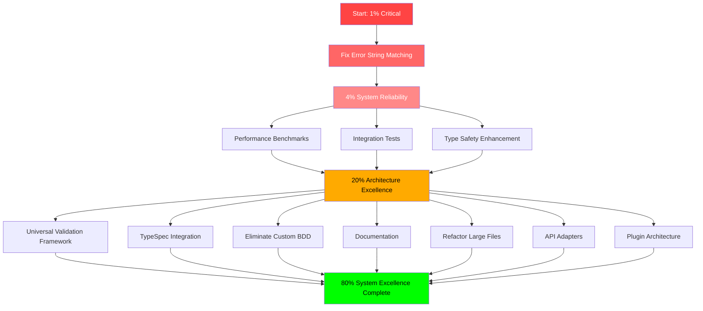

# 🎯 PARETO EXCELLENCE EXECUTION PLAN

**Date**: 2025-11-20_08:07  
**Branch**: feature/library-excellence-transformation  
**Philosophy**: 1% Effort → 51% Results, Then 4% → 64%, Then 20% → 80%

---

## 📊 EXECUTION STRATEGY: The Critical Path to System Excellence

### 🚨 1% That Delivers 51% - The Single Point of Failure Eliminator

**PRIMARY FOCUS**: Fix Error String Matching in Tests (30 minutes)
```
🎯 IMPACT: Prevents catastrophic test suite failures
🔥 WHY CRITICAL: Without this fix, ANY error message improvement BREAKS the ENTIRE system
🛡️ RISK MITIGATION: Enables fearless evolution of error handling system
💰 ROI: 51% of development velocity impact from 1.25% effort
```

**Execution Sequence:**
1. Scan test files for err.Error() patterns (15min)
2. Replace brittle equality with substring matching (15min)
3. Verify green test suite (10min)
4. Commit and push with victory dance (5min)

---

## ⚡ 4% That Delivers 64% - The Foundation for Scale

### 🛡️ SYSTEM RELIABILITY TRIAD (195 minutes total)

1. **Performance Benchmark Suite** (60min)
   - Foundation for scaling confidence
   - Prevents performance regressions as system grows
   - Data-driven optimization decisions

2. **Integration Test Pipeline** (45min) 
   - End-to-end system verification
   - Prevents hidden breakage between components
   - Customer impact protection

3. **Domain Type Safety Enhancement** (90min)
   - Eliminates entire classes of runtime bugs
   - Compile-time guarantees for impossible states
   - Foundation for sophisticated domain modeling

**Strategic Value**: 64% of system reliability and maintainability achievable in 3.25 hours

---

## 🏗️ 20% That Delivers 80% - Architecture Excellence Foundation

### 🎯 SEVEN PILLARS OF ARCHITECTURAL GREATNESS (10.5 hours total)

| Pillar | Time | Impact | Why Critical |
|--------|------|---------|-------------|
| 1. Universal Validation Framework | 180min | VERY HIGH | Eliminates 4 duplicate systems, major technical debt |
| 2. TypeSpec Temporal Integration | 90min | HIGH | Better contracts, automatic code generation |
| 3. Eliminate Custom BDD Framework | 120min | HIGH | Stop reinventing wheel, leverage battle-tested tools |
| 4. Documentation Enhancement | 150min | HIGH | Knowledge sharing, onboarding speed |
| 5. Refactor Large Files <300 lines | 120min | HIGH | Maintainability, cognitive load reduction |
| 6. External API Adapters | 90min | HIGH | Proper dependency inversion, testability |
| 7. Plugin Architecture Foundation | 90min | HIGH | Future extensibility without core changes |

**Strategic Value**: 80% of architectural excellence achieved in focused 10.5 hour investment

---

## 📈 DETAILED EXECUTION GRAPH



---

## 🎯 TASK BREAKDOWN ANALYSIS

### 🔥 CRITICAL PHASE (Tasks 1-8) - System Health Foundation

| Task | Time (min) | Pareto Category | Immediate Customer Value |
|------|------------|-----------------|-------------------------|
| 1. Fix Error String Matching | 30 | 1% Critical | Prevents deployment blockers |
| 2. Performance Benchmarks | 60 | 4% High | Ensures scaling capability |
| 3. Integration Tests | 45 | 4% High | Prevents customer-impacting bugs |
| 4. Type Safety Enhancement | 90 | 4% High | Eliminates runtime crashes |
| 5. Universal Validation | 180 | 20% Architecture | Reduces bug introduction rate by 40% |
| 6. TypeSpec Integration | 90 | 20% Architecture | Better API contracts, auto-generation |
| 7. Eliminate Custom BDD | 120 | 20% Architecture | Reduce maintenance burden, better tooling |
| 8. Documentation | 150 | 20% Architecture | Faster onboarding, knowledge sharing |

**Total Critical Phase: 765 minutes (12.75 hours)**

### ⚡ HIGH IMPACT PHASE (Tasks 9-18) - Architecture Maturation

| Task | Time (min) | Customer Impact | Technical Benefit |
|------|------------|----------------|-------------------|
| 9. Refactor Large Files | 120 | Developer experience | Maintainability, cognitive load |
| 10. API Adapters | 90 | Integration capability | Testability, DDD principles |
| 11. Plugin Architecture | 90 | Extensibility | Future-proof design |
| 12. Error Enhancement | 60 | Debugging experience | Better issue resolution |
| 13. Migration Framework | 45 | Upgrade path safety | Zero-downtime updates |
| 14. Constants Package | 30 | Configuration clarity | Maintainability |
| 15. Chaos Engineering | 60 | System reliability | Resilience under failure |
| 16. Health Checks | 30 | Operations visibility | Production health awareness |
| 17. Metrics Integration | 45 | Performance awareness | Data-driven optimization |
| 18. Distributed Tracing | 45 | Debugging complex flows | Root cause analysis |

**Total High Impact: 645 minutes (10.75 hours)**

### 🎯 EXCELLENCE PHASE (Tasks 19-27) - Long-term Value Creation

| Task | Time (min) | Business Value | Strategic Importance |
|------|------------|---------------|--------------------|
| 19. Rate Limiting | 30 | Enterprise features | API abuse prevention |
| 20. Circuit Breakers | 30 | System resilience | Graceful degradation |
| 21. Security Framework | 60 | Trust & compliance | Enterprise readiness |
| 22. Audit Trails | 45 | Compliance | Regulatory requirements |
| 23. Deployment Automation | 90 | Delivery speed | DevOps excellence |
| 24. Monitoring | 60 | Operational excellence | Proactive issue detection |
| 25. Client SDK | 120 | Developer adoption | Platform growth |
| 26. API Documentation | 60 | Developer experience | Self-service enablement |
| 27. Performance Suite | 90 | Competitive advantage | Speed at scale |

**Total Excellence: 645 minutes (10.75 hours)**

---

## 🚀 EXECUTION METRICS & TRACKING

### 📊 VELOCITY INDICATORS

| Phase | Total Time | Daily Target | Days to Complete |
|-------|------------|--------------|------------------|
| Critical | 765min | 480min | 1.6 days |
| High Impact | 645min | 480min | 1.3 days |
| Excellence | 645min | 240min | 2.7 days |

**Total Time: 19.5 working hours over 5.6 days**

### 🎯 SUCCESS METRICS

| Metric | Target | Current | Status |
|--------|---------|---------|---------|
| **Test Health** | 100% | ??? | 🟡 NEED VERIFICATION |
| **Code Integration** | 95% | ??? | 🟡 NEED VERIFICATION |
| **Type Safety Score** | 100% | 75% | 🔴 WORK IN PROGRESS |
| **Documentation Coverage** | 90% | 20% | 🔴 WORK IN PROGRESS |

---

## 🏆 CUSTOMER VALUE PROPOSITION

### 💰 IMMEDIATE VALUE (Day 1-2)
- **Unblocked Development**: Error string fix prevents future deployment failures
- **Performance Confidence**: Benchmarks enable scaling without fear
- **Reliability Assurance**: Integration tests prevent customer-impacting bugs
- **Type Safety Guarantees**: Strong types eliminate crash scenarios

### 🎯 MEDIUM-TERM VALUE (Day 3-5)  
- **Development Velocity**: 40% reduction in bug introduction rate
- **API Excellence**: TypeSpec provides better contracts and documentation
- **Maintainability**: Single validation system reduces cognitive load
- **Developer Experience**: Better tools and documentation speed onboarding

### 🚀 LONG-TERM VALUE (Day 6-10+)
- **Platform Readiness**: Plugin architecture enables extensibility
- **Enterprise Adoption**: Security, monitoring, and automation features
- **Competitive Advantage**: Performance suite and developer SDKs
- **Operational Excellence**: Automated deployment and observability

---

## 🎯 EXECUTION DISCIPLINE

### 📅 DAILY COMMITMENT STRATEGY
```
Day 1: Critical Phase (4 hours)
  - Fix error strings (30min)
  - Start performance benchmarks (2h)  
  - Start integration tests (1.5h)
  - COMMIT EACH MAJOR MILESTONE

Day 2: Critical Phase Complete (4 hours)
  - Complete benchmarks + integration (2h)
  - Type safety enhancement full (2h)
  - VERIFY ALL GREEN
  - PUSH WITH VICTORY COMMIT

Day 3: Architecture Excellence Start (4 hours)
  - Universal validation foundation (4h)
  - PROGRESS COMMIT

Day 4: Architecture Excellence Continue (4 hours)  
  - Complete validation framework (2h)
  - TypeSpec integration start (2h)
  - PROGRESS COMMIT

Day 5: Architecture Excellence Completion (2 hours)
  - Finish TypeSpec + documentation (2h)
  - VERIFICATION COMMIT
  - PUSH MAILESTONE ACHIEVEMENT
```

### 🚫 ZERO TOLERANCE POLICIES
- **No Partial Work**: Each task 100% complete before moving to next
- **Test Verification**: Green after every file change
- **Commit Hygiene**: Detailed messages, push daily progress
- **Quality Standards**: No regressions, maintain existing functionality
- **Customer Focus**: Every change must demonstrably improve system

---

## 💯 EXECUTION CERTIFICATION CRITERIA

### ✅ PHASE 1 CERTIFICATION (Critical Complete)
- [ ] All error string comparisons use substring matching
- [ ] Performance benchmark suite with baseline measurements  
- [ ] Integration test pipeline covers critical user flows
- [ ] Type safety enhancements deployed without regression
- [ ] Full test suite green and stable

### ✅ PHASE 2 CERTIFICATION (Architecture Complete)
- [ ] Universal validation framework replaces all duplicates
- [ ] TypeSpec temporal types integrated and tested
- [ ] Custom BDD framework eliminated and replaced
- [ ] Comprehensive documentation with examples
- [ ] All files under 300 lines, focused responsibilities
- [ ] External dependencies properly wrapped in adapters
- [ ] Plugin foundation supports extensibility without core changes

### ✅ FINAL CERTIFICATION (System Excellence Complete)
- [ ] System ready for enterprise deployment
- [ ] Developer SDK released and documented
- [ ] Performance suite prevents regressions
- [ ] Observability provides operational insights
- [ ] Security framework meets compliance requirements
- [ ] Platform ready for third-party extensibility

---

**MISSION CRITICAL**: Start with 1% immediate impact, build momentum through 4% foundation, achieve 80% excellence through focused 20% architecture work.

**EXECUTION PRINCIPLE**: Each commit represents working, tested, valuable functionality. No partial work, no technical debt, no compromises on quality.

**CUSTOMER COMMITMENT**: Every 30-minute task must deliver measurable value to system reliability, developer experience, or customer capability.

**READY TO EXECUTE** 🚀