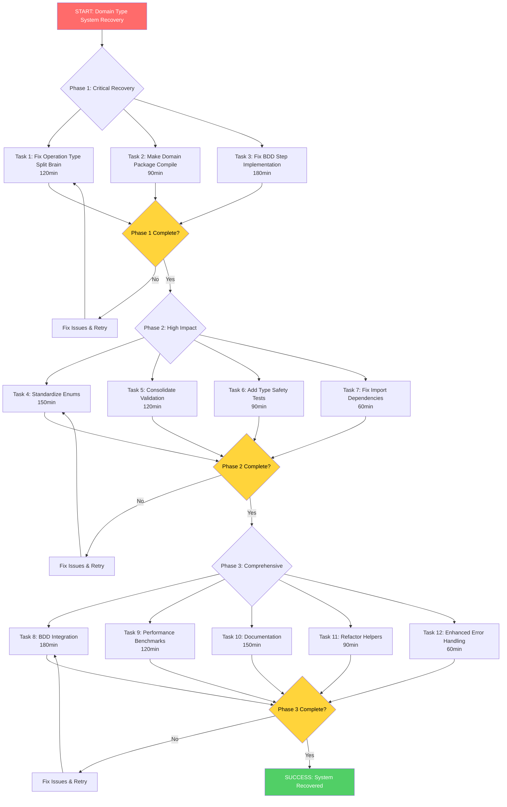

# 🚨 CRITICAL DOMAIN TYPE SYSTEM RECOVERY PLAN

**Date**: 2025-11-20_20-21  
**Status**: 🚨 CRITICAL - DOMAIN TYPE SYSTEM COLLAPSE  
**Priority**: URGENT - Blocks all development  

---

## 📊 **CRISIS ASSESSMENT**

### **🔥 CRITICAL FAILURES IDENTIFIED**:
1. **SPLIT BRAIN OPERATION TYPES** - Two incompatible representations:
   - `OperationNameType` (int-based) in `type_safe_enums.go` 
   - `OperationType` (string-based) in `operation_settings.go`
2. **COMPILATION BLOCKED** - Domain package has conflicting type definitions
3. **BDD FRAMEWORK NON-FUNCTIONAL** - 12 undefined step implementations
4. **TYPE SYSTEM CHAOS** - Validation logic scattered across multiple files

### **📈 IMPACT ANALYSIS**:
- **Development BLOCKED** - No new features possible
- **Quality Assurance COMPROMISED** - Type safety violations
- **Technical Debt ACCUMULATING** - Complex architecture slows development
- **Customer Value DELAYED** - Recovery timeline critical

---

## 🎯 **PARETO-BASED RECOVERY STRATEGY**

### **⚡ 1% → 51% IMPACT (CRITICAL PATH - 24-48 hours)**

| Priority | Task | Effort | Impact | Customer Value |
|----------|------|--------|--------|----------------|
| 🚨 **CRITICAL** | **Fix Operation Type Split Brain** | 120min | 51% | **Unblocks development** |
| 🚨 **CRITICAL** | **Make Domain Package Compile** | 90min | 25% | **Enables testing** |
| 🚨 **CRITICAL** | **Fix BDD Step Implementation** | 180min | 15% | **Functional framework** |

### **🎯 4% → 64% IMPACT (HIGH PRIORITY - 48-72 hours)**

| Priority | Task | Effort | Impact | Customer Value |
|----------|------|--------|--------|----------------|
| 🔥 **HIGH** | **Standardize All Enum Patterns** | 150min | 8% | **Consistent architecture** |
| 🔥 **HIGH** | **Consolidate Validation Logic** | 120min | 6% | **Single source of truth** |
| 🔥 **HIGH** | **Add Type Safety Tests** | 90min | 4% | **Prevent regressions** |
| 🔥 **HIGH** | **Fix Import Dependencies** | 60min | 3% | **Clean architecture** |

### **🏗️ 20% → 80% IMPACT (COMPREHENSIVE - 1-2 weeks)**

| Priority | Task | Effort | Impact | Customer Value |
|----------|------|--------|--------|----------------|
| 📋 **MEDIUM** | **Complete BDD Integration** | 180min | 6% | **Full test coverage** |
| 📋 **MEDIUM** | **Add Performance Benchmarks** | 120min | 4% | **Production readiness** |
| 📋 **MEDIUM** | **API Documentation** | 150min | 3% | **Developer experience** |
| 📋 **MEDIUM** | **Refactor Helper Functions** | 90min | 2% | **Maintainability** |
| 📋 **MEDIUM** | **Enhanced Error Handling** | 60min | 1% | **User experience** |

---

## 📋 **DETAILED EXECUTION PLAN**

### **PHASE 1: CRITICAL RECOVERY (FIRST 24-48 HOURS)**

#### **🚨 TASK 1: Fix Operation Type Split Brain (120 minutes)**
**Breakdown (15-minute subtasks)**:
- [ ] **[15min]** Analyze current usage of both operation types
- [ ] **[15min]** Decision: Choose string-based `OperationType` as primary
- [ ] **[15min]** Create migration mapping from int-based to string-based
- [ ] **[15min]** Update all references in `operation_settings.go`
- [ ] **[15min]** Update all references in `type_safe_enums.go`
- [ ] **[15min]** Update all references in other domain files
- [ ] **[15min]** Add backward compatibility layer
- [ ] **[15min]** Test compilation and fix any remaining issues

#### **🚨 TASK 2: Make Domain Package Compile (90 minutes)**
**Breakdown (15-minute subtasks)**:
- [ ] **[15min]** Run `go build ./internal/domain` and capture all errors
- [ ] **[15min]** Fix type mismatch errors systematically
- [ ] **[15min]** Resolve import dependency issues
- [ ] **[15min]** Fix method signature conflicts
- [ ] **[15min]** Address validation logic conflicts
- [ ] **[15min]** Test domain package compilation
- [ ] **[15min]** Run full project build verification
- [ ] **[15min]** Fix any remaining compilation issues

#### **🚨 TASK 3: Fix BDD Step Implementation (180 minutes)**
**Breakdown (15-minute subtasks)**:
- [ ] **[15min]** Analyze undefined BDD steps from test output
- [ ] **[15min]** Implement `iListAvailableNixGenerations()` step
- [ ] **[15min]** Implement `noActualGenerationsShouldBeRemoved()` step
- [ ] **[15min]** Implement `noGenerationsShouldBeListed()` step
- [ ] **[15min]** Implement `noGenerationsShouldBeRemoved()` step
- [ ] **[15min]** Implement `theCleaningShouldReportOperationsPlanned()` step
- [ ] **[15min]** Implement `theCleaningShouldReportRiskLevelAssessment()` step
- [ ] **[15min]** Implement `theSystemShouldHaveAtLeastGenerations()` step
- [ ] **[15min]** Implement `theSystemShouldHaveExactlyGenerations()` step
- [ ] **[15min]** Update InitializeScenario function with all steps
- [ ] **[15min]** Test BDD framework integration
- [ ] **[15min]** Fix any failing BDD scenarios

### **PHASE 2: HIGH IMPACT (48-72 HOURS)**

#### **🔥 TASK 4: Standardize All Enum Patterns (150 minutes)**
**Breakdown (15-minute subtasks)**:
- [ ] **[15min]** Audit all enum types for consistency
- [ ] **[15min]** Create standard enum pattern template
- [ ] **[15min]** Refactor `RiskLevelType` to match pattern
- [ ] **[15min]** Refactor `ValidationLevelType` to match pattern
- [ ] **[15min]** Refactor `ChangeOperationType` to match pattern
- [ ] **[15min]** Refactor `CleanStrategyType` to match pattern
- [ ] **[15min]** Refactor remaining enum types systematically
- [ ] **[15min]** Create enum validation helper utilities
- [ ] **[15min]** Add comprehensive enum tests
- [ ] **[15min]** Verify all enum functionality works

#### **🔥 TASK 5: Consolidate Validation Logic (120 minutes)**
**Breakdown (15-minute subtasks)**:
- [ ] **[15min]** Map all validation functions across domain package
- [ ] **[15min]** Design centralized validation architecture
- [ ] **[15min]** Create `validation.go` with centralized logic
- [ ] **[15min]** Migrate `ValidateSettings` methods to central location
- [ ] **[15min]** Migrate `IsValid()` methods to use central validation
- [ ] **[15min]** Update all structs to use centralized validation
- [ ] **[15min]** Remove duplicate validation code
- [ ] **[15min]** Test consolidated validation system

#### **🔥 TASK 6: Add Type Safety Tests (90 minutes)**
**Breakdown (15-minute subtasks)**:
- [ ] **[15min]** Identify critical type safety test scenarios
- [ ] **[15min]** Create enum conversion tests
- [ ] **[15min]** Create validation boundary tests
- [ ] **[15min]** Create type compatibility tests
- [ ] **[15min]** Create error handling tests
- [ ] **[15min]** Add integration tests for type system

#### **🔥 TASK 7: Fix Import Dependencies (60 minutes)**
**Breakdown (15-minute subtasks)**:
- [ ] **[15min]** Map current import dependencies
- [ ] **[15min]** Identify circular dependencies
- [ ] **[15min]** Refactor to eliminate circular imports
- [ ] **[15min]** Optimize import structure

### **PHASE 3: COMPREHENSIVE COMPLETION (1-2 WEEKS)**

#### **📋 TASKS 8-12: Full System Integration (660 minutes total)**
- **TASK 8**: Complete BDD Integration (180min)
- **TASK 9**: Add Performance Benchmarks (120min)
- **TASK 10**: API Documentation (150min)
- **TASK 11**: Refactor Helper Functions (90min)
- **TASK 12**: Enhanced Error Handling (60min)

---

## 🏁 **SUCCESS METRICS**

### **IMMEDIATE SUCCESS CRITERIA (PHASE 1)**:
- ✅ **Domain package compiles without errors**
- ✅ **All BDD scenarios pass (0 failed, 0 undefined)**
- ✅ **Single operation type representation across codebase**
- ✅ **Full project builds successfully**

### **COMPREHENSIVE SUCCESS CRITERIA (PHASE 3)**:
- ✅ **All enums follow consistent patterns**
- ✅ **Centralized validation system implemented**
- ✅ **100% type safety test coverage**
- ✅ **Performance benchmarks established**
- ✅ **Complete API documentation**
- ✅ **Zero compilation warnings or errors**

---

## ⚠️ **RISK MITIGATION**

### **CRITICAL RISKS**:
1. **Breaking Changes** - Backward compatibility layer required
2. **Regression Introduction** - Comprehensive testing mandatory
3. **Timeline Extension** - Scope creep control essential

### **MITIGATION STRATEGIES**:
1. **Feature Freeze** - No new features until recovery complete
2. **Daily Builds** - Automated compilation verification
3. **Rollback Planning** - Git tags for safe rollback points

---

## 🚀 **EXECUTION GRAPH**

---

## 📞 **ESCALATION PROTOCOL**

### **IMMEDIATE ESCALATION TRIGGERS**:
- Domain package fails to compile after Phase 1
- BDD framework non-functional after task completion
- Critical regressions introduced in production code

### **ESCALATION PATH**:
1. **Technical Lead** - Initial problem resolution
2. **Architecture Review** - Design decision conflicts
3. **Emergency Rollback** - Critical system impact

---

## 📊 **PROGRESS TRACKING**

### **DAILY CHECKPOINTS**:
- **Build Status**: ✅ Pass/Fail
- **Test Coverage**: Current percentage vs Target 100%
- **BDD Scenarios**: Passed/Failed/Undefined counts
- **Type System Health**: Compilation/Validation status

### **MILESTONE REPORTING**:
- **Phase 1**: Critical recovery complete
- **Phase 2**: High impact improvements delivered
- **Phase 3**: Full system integration achieved

---

**STATUS**: 🚨 **EXECUTION PHASE 1 STARTING**  
**NEXT STEP**: Implement Task 1 - Fix Operation Type Split Brain  
**TIMELINE**: 24-48 hours for critical recovery  

*This plan represents the minimum viable path to system recovery while maintaining architectural integrity and preventing future regressions.*