# 🚀 COMPREHENSIVE DUPLICATION ELIMINATION STRATEGY
**Date:** 2025-11-21 01:26  
**Mission:** Systematic Code Quality Excellence with Domain-Driven Precision

---

## 📊 CURRENT DUPLICATION LANDSCAPE ANALYSIS

### **🎯 CRITICAL FINDINGS**

#### **IMMEDIATE DUPLICATION CRISES:**
1. **internal/result/type_test.go**: 23.13% code duplication (502 tokens)
   - Lines 135-169 vs 178-212: Identical test scaffolding (34 lines, 251 tokens)
   - Lines 69-88 vs 194-213: Nearly identical test patterns (19 lines, 159 tokens)
   - **PRIORITY**: CRITICAL - Test infrastructure integrity at risk

#### **SYSTEMATIC PATTERN ANALYSIS:**
- **Threshold 100**: 0 clone groups - Major duplications eliminated ✅
- **Threshold 90**: 2 clone groups - New test duplications detected 🚨
- **Threshold 70**: 2 clone groups - Test scaffolding patterns identified 📊

#### **EXCELLENCE ACHIEVED:**
- **330+ tokens** of major duplications already eliminated
- **Factory patterns** consolidated and unified
- **Validation rules** centralized with proper generics
- **Test helpers** abstracted into reusable utilities

---

## 🏗️ ARCHITECTURAL DECISION FRAMEWORK

### **CRITICAL QUESTION #1: TEST INFRASTRUCTURE INTEGRITY**

**Should we eliminate test scaffolding duplication or focus on business logic duplication?**

**Architectural Analysis:**
- **Test Duplication Impact**: Reduced maintainability, brittle test infrastructure
- **Business Logic Impact**: Higher code complexity, potential runtime bugs
- **Customer Value**: Both critical - tests ensure reliability, business logic delivers functionality

**Decision**: **ELIMINATE TEST SCAFFOLDING FIRST** - Foundation integrity before feature optimization

---

## 🎯 TOP 25 PRIORITY ACTION PLAN

### **PRIORITY 1: CRITICAL INFRASTRUCTURE (1% → 51% IMPACT)**

| # | Task | Impact | Effort | Customer Value | Status |
|---|------|---------|--------|----------------|---------|
| 1 | **Fix type_test.go scaffolding duplication** | HIGH | LOW | 🛡️ Test reliability | 🚨 CRITICAL |
| 2 | **Create shared test helper utilities** | HIGH | MEDIUM | 🔧 Maintainability | 🔥 IMMEDIATE |
| 3 | **Verify all tests pass after refactoring** | HIGH | LOW | ✅ Quality assurance | 🔥 IMMEDIATE |
| 4 | **Run full test suite validation** | HIGH | LOW | 🎯 Confidence | 🔥 IMMEDIATE |

### **PRIORITY 2: SYSTEMATIC ANALYSIS (4% → 64% IMPACT)**

| # | Task | Impact | Effort | Customer Value | Status |
|---|------|---------|--------|----------------|---------|
| 5 | **Continue threshold analysis (80, 60, 50, 40, 30)** | HIGH | MEDIUM | 📈 Complete mapping | 🎯 STRATEGIC |
| 6 | **Document all remaining duplication patterns** | HIGH | MEDIUM | 📚 Knowledge base | 🎯 STRATEGIC |
| 7 | **Identify business logic vs test duplication** | HIGH | MEDIUM | 🎯 Prioritization | 🎯 STRATEGIC |
| 8 | **Create duplication elimination roadmap** | HIGH | LOW | 🗺️ Clear path | 🎯 STRATEGIC |

### **PRIORITY 3: ELIMINATION CAMPAIGN (20% → 80% IMPACT)**

| # | Task | Impact | Effort | Customer Value | Status |
|---|------|---------|--------|----------------|---------|
| 9 | **Eliminate threshold 90 duplications** | HIGH | MEDIUM | ⚡ Immediate gains | 📋 PLANNED |
| 10 | **Eliminate threshold 80 duplications** | HIGH | MEDIUM | ⚡ Continued gains | 📋 PLANNED |
| 11 | **Eliminate threshold 70 duplications** | HIGH | MEDIUM | ⚡ Consistent progress | 📋 PLANNED |
| 12 | **Eliminate threshold 60-30 duplications** | MEDIUM | HIGH | 🏆 Comprehensive cleanup | 📋 PLANNED |

### **PRIORITY 4: EXCELLENCE VALIDATION (MEDIUM IMPACT)**

| # | Task | Impact | Effort | Customer Value | Status |
|---|------|---------|--------|----------------|---------|
| 13 | **Run performance benchmarks** | MEDIUM | LOW | ⚡ Speed validation | 📋 PLANNED |
| 14 | **Validate build integrity** | HIGH | LOW | 🔒 Stability | 📋 PLANNED |
| 15 | **Create final duplication report** | MEDIUM | LOW | 📊 Documentation | 📋 PLANNED |

---

## 🔧 DETAILED EXECUTION STRATEGY

### **PHASE 1: IMMEDIATE CRISIS RESOLUTION (Next 30 minutes)**

#### **Step 1.1: Analyze Test Duplication Patterns**
```go
// CURRENT PROBLEM: Duplicate test scaffolding
func TestResult_Error(t *testing.T) { /* 34 lines */ }
func runErrorMethodTest(t *testing.T, methodFunc func(Result[int]) string) { /* 34 nearly identical lines */ }
```

#### **Step 1.2: Create Unified Test Helper**
```go
// SOLUTION: Extract common test pattern
func runResultMethodTest[T any](t *testing.T, methodName string, methodFunc func(Result[T]) T, okValue T, errorResult Result[T])
```

#### **Step 1.3: Refactor Duplicate Tests**
- Replace `TestResult_Error` with unified helper
- Consolidate `runErrorMethodTest` functionality
- Ensure test coverage remains 100%

### **PHASE 2: SYSTEMATIC ELIMINATION (Next 2-3 hours)**

#### **Threshold Progression Strategy:**
1. **90 → 80 → 70**: Focus on high-impact patterns
2. **60 → 50 → 40**: Medium-impact systematic cleanup
3. **30**: Comprehensive final sweep

#### **Pattern Recognition Approach:**
- **Test Infrastructure**: Shared helpers, common assertions
- **Business Logic**: Extract to services, create utilities
- **Configuration**: Consolidate validation rules
- **Error Handling**: Unify error patterns

---

## 🎯 CUSTOMER VALUE CREATION

### **IMMEDIATE BENEFITS (Today)**
- **🛡️ Enhanced Test Reliability**: Robust test infrastructure prevents regressions
- **⚡ Improved Development Velocity**: Clean tests speed up feature development
- **🔧 Better Maintainability**: Shared patterns reduce maintenance burden

### **SHORT-TERM BENEFITS (This Week)**
- **📈 Code Quality Excellence**: Systematic duplication elimination
- **🎯 Technical Debt Reduction**: Cleaner, more maintainable codebase
- **🚀 Enhanced Developer Experience**: Clear patterns and conventions

### **LONG-TERM BENEFITS (This Quarter)**
- **💰 Reduced Maintenance Costs**: Less duplicated code = less maintenance
- **📚 Knowledge Preservation**: Well-documented patterns and conventions
- **🏗️ Scalable Architecture**: Foundation for rapid business growth

---

## 📊 SUCCESS METRICS

### **QUANTITATIVE GOALS**
- **Duplication Reduction**: Target <5% code duplication across all files
- **Test Coverage**: Maintain 95%+ coverage during refactoring
- **Build Success**: 100% pass rate throughout elimination campaign
- **Performance**: No regression in build/execution times

### **QUALITATIVE GOALS**
- **Developer Experience**: Clear, consistent patterns across codebase
- **Code Clarity**: Self-documenting through proper abstraction
- **Maintainability**: Easy to extend and modify existing functionality
- **Testing Culture**: Robust, reliable test infrastructure

---

## 🚀 EXECUTION TIMELINE

```mermaid
gantt
    title Duplication Elimination Timeline
    dateFormat HH:mm
    axisFormat %H:%M
    
    section CRITICAL PHASE
    Fix Test Duplication     :crit, 01:30, 30min
    Create Shared Helpers    :crit, 02:00, 20min
    Validate Tests          :crit, 02:20, 10min
    
    section SYSTEMATIC PHASE
    Threshold 90 Analysis   :active, 02:30, 20min
    Threshold 80 Analysis   :03:00, 20min
    Threshold 70 Analysis   :03:30, 20min
    Threshold 60-30 Sweep  :04:00, 60min
    
    section VALIDATION PHASE
    Final Testing          :05:00, 20min
    Performance Check      :05:20, 10min
    Documentation          :05:30, 20min
```



---

## 🤔 ARCHITECTURAL REFLECTION

### **🎯 KEY INSIGHTS**
1. **Test Infrastructure is Business Critical**: Brittle tests = unreliable releases
2. **Small Duplications Matter**: 23% duplication in one file compounds across codebase
3. **Systematic Approach Wins**: Threshold-based analysis ensures comprehensive coverage
4. **Type Safety Guides Refactoring**: Generic patterns maintain Go's strengths

### **🔥 EXECUTION PRINCIPLES**
- **Foundation First**: Fix test infrastructure before business logic
- **Incremental Progress**: Validate at each threshold level
- **Zero Regression**: Every change must improve without breaking
- **Documentation Matters**: Record patterns for future reference

---

## 🏆 VISION OF EXCELLENCE

### **BEFORE CURRENT STATE:**
```go
// ❌ DUPLICATION PATTERN: Brittle test infrastructure
func TestResult_Error(t *testing.T) {
    tests := []struct { /* 34 lines of scaffolding */ }
    for _, tt := range tests { /* 15 lines of test logic */ }
}
func runErrorMethodTest(t *testing.T, methodFunc func(Result[int]) string) {
    tests := []struct { /* 34 nearly identical lines */ }
    for _, tt := range tests { /* 15 lines of test logic */ }
}
```

### **AFTER TARGET STATE:**
```go
// ✅ EXCELLENCE PATTERN: Unified test infrastructure
func runResultMethodTest[T any](t *testing.T, methodName string, methodFunc func(Result[T]) T, okValue T)
func TestResult_Error(t *testing.T) {
    runResultMethodTest(t, "Error", func(r Result[int]) string { return r.Error() }, 42)
}
```

### **CUSTOMER IMPACT:**
- **Reliability**: Robust tests catch bugs before production
- **Velocity**: Clean patterns speed up development
- **Maintainability**: Shared infrastructure reduces cognitive load
- **Scalability**: Foundation supports rapid business growth

---

## 📋 NEXT IMMEDIATE ACTIONS

### **RIGHT NOW (Next 30 minutes):**
1. ✅ **Create comprehensive plan** ← COMPLETED
2. 🔄 **Fix type_test.go duplication** ← IN PROGRESS
3. 📋 **Create shared test helpers**
4. 🧪 **Validate all tests pass**

### **TODAY (Remaining time):**
1. 📊 **Complete threshold analysis** (90→30)
2. 🧹 **Eliminate discovered duplications**
3. ✅ **Final validation and documentation**

---

## 🎖️ COMMITMENT TO EXCELLENCE

**This is not just about eliminating duplication—this is about building a foundation for sustainable excellence.**

Every line of code we clean today pays dividends in:
- **Developer productivity** tomorrow
- **System reliability** next month  
- **Business agility** next quarter
- **Technical debt reduction** next year

**We are not just writing code—we are crafting the future of this system.**

---

**🎯 EXCELLENCE IS NOT AN ACT, IT'S A HABIT.**  
**🚀 DUPLICATION ELIMINATION IS WHERE HABIT BECOMES CRAFTSMANSHIP.**  
**🏆 TODAY WE BUILD THE FOUNDATION FOR TOMORROW'S SUCCESS.**

---

*Generated by Crush - Comprehensive Duplication Elimination Strategy*  
*Date: 2025-11-21 01:26*  
*Mission: Systematic Code Quality Excellence*