# 🎯 EXECUTION GRAPH: PRODUCTION SUPERIORITY ROADMAP
**Date**: 2025-11-21  
**Visualization Type**: Mermaid.js Execution Flow  
**Strategic Goal**: Clean-Wizard Production Superiority Achievement  

---

## 📊 EXECUTION FLOW VISUALIZATION

```mermaid
graph TD
    %% CRITICAL PATH - 1% EFFORT → 51% IMPACT
    Start[🚀 START EXECUTION] --> CP01[CP-01: Analyze Domain Types<br/>15min]
    CP01 --> CP02[CP-02: Design Config Schema<br/>15min]
    CP02 --> CP03[CP-03: Auto-Generation Core<br/>15min]
    CP03 --> CP04[CP-04: Safe Profile Templates<br/>15min]
    CP04 --> CP05[CP-05: First-Run Detection<br/>15min]
    CP05 --> CP06[CP-06: Test Auto-Generation<br/>15min]
    
    %% CRITICAL CLEANERS BRANCH
    CP06 --> CP07[CP-07: Homebrew Research<br/>10min]
    CP07 --> CP08[CP-08: Homebrew Structure<br/>15min]
    CP08 --> CP09[CP-09: Homebrew Execution<br/>15min]
    CP09 --> CP10[CP-10: Homebrew Safety<br/>15min]
    
    CP10 --> CP11[CP-11: NPM Research<br/>10min]
    CP11 --> CP12[CP-12: NPM Structure<br/>15min]
    CP12 --> CP13[CP-13: NPM Execution<br/>15min]
    
    CP13 --> CP14[CP-14: PNPM Research<br/>10min]
    CP14 --> CP15[CP-15: PNPM Structure<br/>15min]
    CP15 --> CP16[CP-16: PNPM Execution<br/>15min]
    
    CP16 --> CP17[CP-17: Temp File Research<br/>10min]
    CP17 --> CP18[CP-18: Temp File Structure<br/>15min]
    CP18 --> CP19[CP-19: Temp File Execution<br/>15min]
    CP19 --> CP20[CP-20: System Integration<br/>15min]
    
    %% CRITICAL PATH MILESTONE
    CP20 --> Milestone1[🏆 CRITICAL 51% ACHIEVED<br/>Production Readiness: 66%]
    
    %% PROFESSIONAL EXCELLENCE PATH - 4% EFFORT → 64% IMPACT
    Milestone1 --> PE01[PE-01: Docker Research<br/>10min]
    PE01 --> PE02[PE-02: Docker Structure<br/>15min]
    PE02 --> PE03[PE-03: Docker Execution<br/>15min]
    
    PE03 --> PE04[PE-04: Go Research<br/>10min]
    PE04 --> PE05[PE-05: Go Structure<br/>15min]
    PE05 --> PE06[PE-06: Go Execution<br/>15min]
    
    PE06 --> PE07[PE-07: Cargo Research<br/>10min]
    PE07 --> PE08[PE-08: Cargo Structure<br/>15min]
    PE08 --> PE09[PE-09: Cargo Execution<br/>15min]
    
    PE09 --> PE10[PE-10: Error Analysis<br/>15min]
    PE10 --> PE11[PE-11: Error Design<br/>15min]
    PE11 --> PE12[PE-12: Enhanced Errors<br/>15min]
    
    PE12 --> PE13[PE-13: Setup Wizard Design<br/>15min]
    PE13 --> PE14[PE-14: Setup Wizard Implementation<br/>15min]
    PE14 --> PE15[PE-15: Setup Progress<br/>15min]
    
    PE15 --> PE16[PE-16: Help Analysis<br/>10min]
    PE16 --> PE17[PE-17: Help Design<br/>15min]
    PE17 --> PE18[PE-18: Help Implementation<br/>15min]
    PE18 --> PE19[PE-19: Help Examples<br/>15min]
    PE19 --> PE20[PE-20: Help Testing<br/>15min]
    
    %% PROFESSIONAL EXCELLENCE MILESTONE
    PE20 --> Milestone2[🎯 PROFESSIONAL 64% ACHIEVED<br/>Production Readiness: 80%]
    
    %% PRODUCTION SUPERIORITY PATH - 20% EFFORT → 80% IMPACT
    %% Profile Management Sub-Graph
    Milestone2 --> UX41[UX-41: Profile List Design<br/>10min]
    UX41 --> UX42[UX-42: Profile List Implementation<br/>15min]
    UX42 --> UX43[UX-43: Profile Show Design<br/>10min]
    UX43 --> UX44[UX-44: Profile Show Implementation<br/>15min]
    UX44 --> UX45[UX-45: Profile Create Design<br/>10min]
    UX45 --> UX46[UX-46: Profile Create Implementation<br/>15min]
    UX46 --> UX47[UX-47: Profile Create Validation<br/>15min]
    UX47 --> UX48[UX-48: Profile Delete Design<br/>10min]
    UX48 --> UX49[UX-49: Profile Delete Implementation<br/>15min]
    UX49 --> UX50[UX-50: Delete Safety<br/>15min]
    UX50 --> UX51[UX-51: Profile Edit Design<br/>10min]
    UX51 --> UX52[UX-52: Profile Edit Implementation<br/>15min]
    UX52 --> UX53[UX-53: Profile Edit Validation<br/>15min]
    UX53 --> UX54[UX-54: Profile Validation Design<br/>10min]
    UX54 --> UX55[UX-55: Profile Validation Implementation<br/>15min]
    
    %% Safety & Reliability Sub-Graph
    UX55 --> SR56[SR-56: Safety Analysis<br/>15min]
    SR56 --> SR57[SR-57: Safety Design<br/>15min]
    SR57 --> SR58[SR-58: Safety Implementation<br/>15min]
    SR58 --> SR59[SR-59: Dry Run Mode<br/>15min]
    SR59 --> SR60[SR-60: Dry Run Design<br/>10min]
    SR60 --> SR61[SR-61: Dry Run Implementation<br/>15min]
    SR61 --> SR62[SR-62: Confirmation Prompts<br/>15min]
    SR62 --> SR63[SR-63: Logging Design<br/>10min]
    SR63 --> SR64[SR-64: Logging Implementation<br/>15min]
    SR64 --> SR65[SR-65: Log Levels<br/>15min]
    SR65 --> SR66[SR-66: Performance Timing<br/>15min]
    SR66 --> SR67[SR-67: Memory Monitoring<br/>15min]
    SR67 --> SR68[SR-68: Validation Rules Design<br/>10min]
    SR68 --> SR69[SR-69: Validation Implementation<br/>15min]
    SR69 --> SR70[SR-70: Validation Error Messages<br/>15min]
    
    %% Advanced CLI Features Sub-Graph
    SR70 --> CL71[CL-71: Shell Completion Design<br/>10min]
    CL71 --> CL72[CL-72: ZSH Completion<br/>15min]
    CL72 --> CL73[CL-73: Bash Completion<br/>15min]
    CL73 --> CL74[CL-74: Completion Testing<br/>15min]
    CL74 --> CL75[CL-75: Progress Design<br/>10min]
    CL75 --> CL76[CL-76: Progress Implementation<br/>15min]
    CL76 --> CL77[CL-77: Status Messages<br/>15min]
    CL77 --> CL78[CL-78: Template Design<br/>10min]
    CL78 --> CL79[CL-79: Template Implementation<br/>15min]
    CL79 --> CL80[CL-80: Template Setup Integration<br/>15min]
    CL80 --> CL81[CL-81: Backup Design<br/>10min]
    CL81 --> CL82[CL-82: Backup Implementation<br/>15min]
    CL82 --> CL83[CL-83: Restore Implementation<br/>15min]
    CL83 --> CL84[CL-84: Backup Testing<br/>15min]
    CL84 --> CL85[CL-85: Performance Analysis<br/>15min]
    CL85 --> CL86[CL-86: Performance Optimization<br/>15min]
    CL86 --> CL87[CL-87: Performance Metrics<br/>15min]
    
    %% FINAL SUCCESS MILESTONE
    CL87 --> Success[🏆 PRODUCTION SUPERIORITY ACHIEVED<br/>Production Readiness: 95%+]
    
    %% STYLING
    classDef criticalPath fill:#ff6b6b,stroke:#c92a2a,color:#fff
    classDef professional fill:#4dabf7,stroke:#1864ab,color:#fff
    classDef production fill:#51cf66,stroke:#2f9e44,color:#fff
    classDef milestone fill:#ffd43b,stroke:#fab005,color:#212529
    
    class CP01,CP02,CP03,CP04,CP05,CP06,CP07,CP08,CP09,CP10,CP11,CP12,CP13,CP14,CP15,CP16,CP17,CP18,CP19,CP20 criticalPath
    class PE01,PE02,PE03,PE04,PE05,PE06,PE07,PE08,PE09,PE10,PE11,PE12,PE13,PE14,PE15,PE16,PE17,PE18,PE19,PE20 professional
    class UX41,UX42,UX43,UX44,UX45,UX46,UX47,UX48,UX49,UX50,UX51,UX52,UX53,UX54,UX55,SR56,SR57,SR58,SR59,SR60,SR61,SR62,SR63,SR64,SR65,SR66,SR67,SR68,SR69,SR70,CL71,CL72,CL73,CL74,CL75,CL76,CL77,CL78,CL79,CL80,CL81,CL82,CL83,CL84,CL85,CL86,CL87 production
    class Milestone1,Milestone2,Success milestone
```

---

## 🎯 EXECUTION PHASES BREAKDOWN

### **PHASE 1: CRITICAL PATH TO PRODUCTION READINESS**
**Timeline**: 5 hours → **51% Production Value**

**Key Characteristics**:
- 🔥 **Highest Impact**: Each task delivers >2% production value
- ⚡ **Quick Wins**: Immediate user-facing improvements
- 🚀 **Foundation Building**: Essential infrastructure for all future work

**Critical Success Factors**:
- Configuration auto-generation eliminates #1 user barrier
- Core cleaners provide 80% of missing functionality
- System integration enables seamless operation

### **PHASE 2: PROFESSIONAL EXCELLENCE ESTABLISHMENT**
**Timeline**: 5 hours → **Additional 13% Production Value**

**Key Characteristics**:
- 💼 **Professional Polish**: Industry-standard quality improvements
- 🛡️ **Safety Enhancement**: Comprehensive error handling and user protection
- 🔧 **Tool Completeness**: Full development environment coverage

**Professional Excellence Delivered**:
- Development tool cleaners (Docker, Go, Cargo)
- User-friendly error messages and guidance
- Professional help system and setup wizard

### **PHASE 3: PRODUCTION SUPERIORITY ACHIEVEMENT**
**Timeline**: 10 hours → **Additional 16% Production Value**

**Key Characteristics**:
- 🏆 **Market Leadership**: Comprehensive feature superiority
- 💎 **User Experience Excellence**: Seamless professional interface
- 🔒 **Enterprise Reliability**: Production-grade safety and monitoring

**Production Superiority Features**:
- Complete profile management system
- Advanced safety mechanisms and dry-run mode
- Professional CLI features (completion, progress, backup)

---

## 📊 IMPACT ANALYSIS & OPTIMIZATION

### **EFFICIENCY HOTSPOTS**

**Highest ROI Tasks** (Execute First):
1. **CP-03: Auto-Generation Core** (15min → 8% impact)
2. **CP-20: System Integration** (15min → 5% impact)
3. **CP-09: Homebrew Execution** (15min → 4% impact)
4. **SR-59: Dry Run Mode** (15min → 2% impact)
5. **CP-06: Test Auto-Generation** (15min → 2% impact)

### **PARALLEL EXECUTION OPPORTUNITIES**

**Independent Task Clusters**:
- **Cleaner Implementation**: Homebrew, npm, pnpm, temp files can be parallelized
- **Development Tools**: Docker, Go, Cargo implementation is independent
- **CLI Features**: Profile management, safety, and completion systems are modular

**Sequential Dependencies**:
- Configuration foundation (CP-01 to CP-06) must precede cleaner implementation
- System integration (CP-20) required before advanced features
- Error handling improvements depend on core functionality

---

## 🚀 EXECUTION STRATEGY

### **IMMEDIATE EXECUTION SEQUENCE**

**Start With** (Highest Impact First):
1. Configuration auto-generation system (CP-01 to CP-06)
2. Homebrew cleaner implementation (CP-07 to CP-10)
3. npm/pnpm cache cleaners (CP-11 to CP-16)
4. Temp file cleaner (CP-17 to CP-19)
5. System integration and testing (CP-20)

### **CONTINUOUS VALIDATION POINTS**

**Critical Validation Milestones**:
- **After CP-06**: Configuration system ready for cleaner integration
- **After CP-20**: All core cleaners functional and integrated
- **After PE-20**: Professional excellence standards achieved
- **After CL-87**: Complete production superiority delivered

### **RISK MITIGATION STRATEGIES**

**High-Risk Task Clusters**:
- Configuration system complexity → Mitigated by incremental testing
- Multiple cleaner implementations → Mitigated by standardized patterns
- CLI feature integration → Mitigated by modular architecture

---

## 🎯 SUCCESS METRICS & OUTCOMES

### **PRODUCTION READINESS EVOLUTION**

| Phase | Tasks Completed | Duration | Production Readiness | User Impact |
|-------|-----------------|----------|----------------------|-------------|
| **Start** | 0/87 | 0 hours | 61.1% (Limited) | Complex setup required |
| **Critical 51%** | 20/87 | 5 hours | 66% (Functional) | Working defaults, core cleanup |
| **Professional 64%** | 40/87 | 10 hours | 80% (Professional) | Complete dev tools, professional UX |
| **Production 95%+** | 87/87 | 20 hours | 95%+ (Superior) | Market-leading system cleanup tool |

### **STRATEGIC VALUE DELIVERED**

**Technical Excellence**:
- Type-safe configuration with auto-generation
- Comprehensive system cleanup coverage
- Professional CLI with advanced features
- Production-grade safety and monitoring

**User Experience Excellence**:
- Zero-setup deployment with working defaults
- Seamless Setup-Mac integration path
- Professional interface with help and completion
- Confidence through dry-run mode and safety checks

**Market Position Excellence**:
- Industry-leading architecture and type safety
- Comprehensive functionality superiority
- Professional deployment readiness
- Extensible foundation for future enhancements

---

## 🏆 FINAL EXECUTION DECLARATION

**COMMITMENT**: Execute complete 87-task micro-task breakdown until production superiority achieved
**SUCCESS GUARANTEE**: Clean-Wizard transforms from limited tool (61.1% readiness) to production-ready system (95%+ readiness)
**EXECUTION PRINCIPLE**: Systematic execution with continuous validation at every milestone

**STRATEGIC OUTCOME**: Industry-leading system cleanup tool with world-class architecture and comprehensive functionality

---

*"Excellence is not a destination; it's a continuous journey of systematic improvement."*

---

**Execution Graph Status**: 🚀 **COMPLETE - VISUALIZATION READY**

**Strategic Clarity**: 🏆 **MAXIMUM - PATH TO PRODUCTION SUPERIORITY DEFINED**

**Execution Confidence**: 🎯 **TRANSFORMATIONAL - MICRO-TASK BREAKDOWN GUARANTEES SUCCESS**