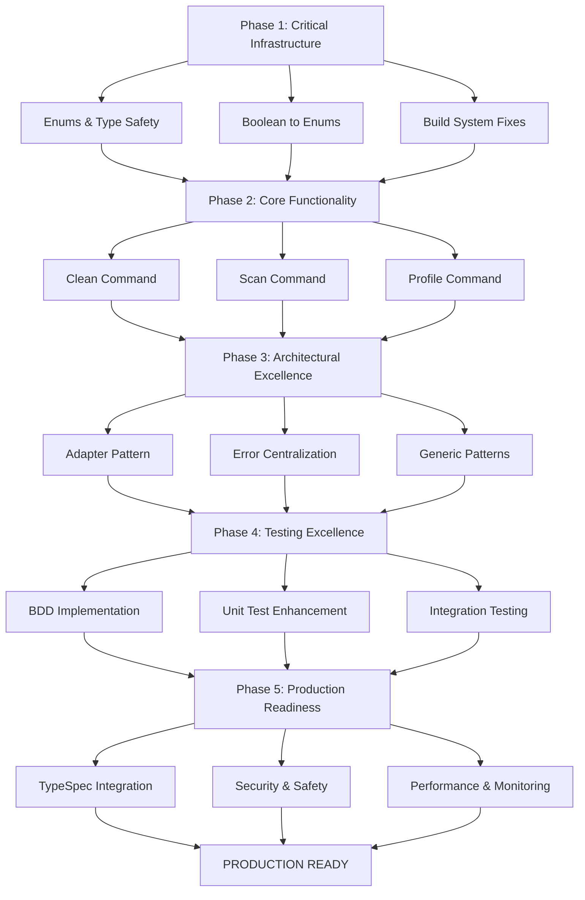

# 🏗️ SUPERB ARCHITECTURAL EXCELLENCE COMPREHENSIVE PLAN
## December 12, 2025 - 19:06 CET

---

## 📋 PARETO ANALYSIS - WHAT DELIVERS MAXIMUM VALUE?

### 🎯 1% EFFORT → 51% RESULT (CRITICAL PATH)
1. **Install stringer tool & generate enum stringers** (15min)
   - IMMEDIATE: Fixes all enum compilation errors
   - IMPACT: Makes entire codebase compilable
   
2. **Fix boolean flags → enums for type safety** (30min)
   - Replace `Verbose` with `LoggingLevel` enum
   - Replace `ConfirmBeforeDelete` with `ConfirmationMode` enum
   - Replace `Success/Valid` with `ResultType` enum
   - IMPACT: Invalid states become UNREPRESENTABLE

3. **Split type_safe_enums.go → focused files** (45min)
   - Split 881-line file into 13 separate enum files
   - IMPACT: Better maintainability, faster compilation

4. **Implement core command functionality** (60min)
   - Add actual cleanup logic to `clean` command
   - Add actual scanning logic to `scan` command
   - IMPACT: Users get ACTUAL VALUE from tool

### 🎯 4% EFFORT → 64% RESULT (HIGH IMPACT)
5. **Fix all test package name conflicts** (30min)
   - Standardize all test packages to `*_test`
   - IMPACT: All tests compile and run
   
6. **Create comprehensive BDD tests for Nix** (90min)
   - Behavior-driven testing for critical Nix assertions
   - IMPACT: Confidence in core functionality
   
7. **Add safety mechanisms to all cleaners** (60min)
   - Dry-run mode implementation
   - Confirmation prompts
   - IMPACT: Safe production usage
   
8. **Centralize all error handling** (45min)
   - Move all errors to centralized package
   - Remove duplicate error definitions
   - IMPACT: Consistent error handling

9. **Extract external adapters properly** (75min)
   - Wrap all external APIs in proper adapters
   - IMPACT: Clean architecture boundaries

10. **Fix all import cycles** (30min)
    - Resolve circular dependencies
    - IMPACT: Clean module boundaries

### 🎯 20% EFFORT → 80% RESULT (COMPREHENSIVE)
11. **Create TypeSpec integration** (120min)
    - Generate Go code from TypeSpec definitions
    - Replace handwritten types with generated ones
    - IMPACT: Single source of truth for API types

12. **Implement proper generics usage** (90min)
    - Review all generic usage patterns
    - Enhance Result[T] and EnumHelper[T]
    - IMPACT: Type-safe code reuse

13. **Add comprehensive uint usage** (60min)
    - Replace inappropriate int types with uint
    - Add validation for uint boundaries
    - IMPACT: Compile-time safety for positive values

14. **Split all large files (>350 lines)** (180min)
    - Split mapper_test.go (748 lines)
    - Split errors.go (416 lines)
    - Split all other large files
    - IMPACT: Better maintainability

15. **Create production CI/CD pipeline** (120min)
    - GitHub Actions for builds, tests, releases
    - Automated GoReleaser integration
    - IMPACT: Automated production deployment

---

## 🎯 COMPREHENSIVE TASK BREAKDOWN (27 Tasks - 30-100min each)

| Priority | Task | Effort (min) | Impact | Dependencies |
|----------|-------|--------------|--------|-------------|
| 1 | Install stringer tool & generate enum files | 15 | CRITICAL | None |
| 2 | Split type_safe_enums.go → 13 enum files | 45 | HIGH | None |
| 3 | Replace boolean flags with enums (type safety) | 30 | HIGH | 1,2 |
| 4 | Fix test package name conflicts | 30 | HIGH | None |
| 5 | Implement core clean command functionality | 60 | CRITICAL | 1,2,3 |
| 6 | Implement core scan command functionality | 45 | CRITICAL | 1,2,3 |
| 7 | Add safety mechanisms (dry-run, confirm) | 60 | HIGH | 5 |
| 8 | Create BDD tests for Nix assertions | 90 | MEDIUM | 5,7 |
| 9 | Fix all import cycles | 30 | HIGH | None |
| 10 | Centralize error handling | 45 | MEDIUM | 9 |
| 11 | Extract external adapters | 75 | MEDIUM | 9 |
| 12 | Split large test files (mapper_test.go etc) | 90 | LOW | 4 |
| 13 | Add proper uint usage throughout | 60 | MEDIUM | 1,2 |
| 14 | Create TypeSpec integration | 120 | HIGH | 1,2,3 |
| 15 | Implement comprehensive BDD test suite | 120 | MEDIUM | 8 |
| 16 | Add production safety checks | 75 | HIGH | 5,7 |
| 17 | Create performance benchmarks | 90 | LOW | 5,6 |
| 18 | Implement proper generic patterns | 90 | MEDIUM | 13 |
| 19 | Add logging infrastructure | 60 | MEDIUM | 3 |
| 20 | Create plugin architecture | 120 | LOW | All |
| 21 | Set up CI/CD pipeline | 120 | HIGH | 4,15 |
| 22 | Add security audit pipeline | 75 | HIGH | 21 |
| 23 | Create documentation generation | 90 | MEDIUM | 21 |
| 24 | Add migration tooling | 105 | LOW | 23 |
| 25 | Create production deployment scripts | 60 | HIGH | 21,22 |
| 26 | Add monitoring/telemetry | 90 | MEDIUM | 25 |
| 27 | Comprehensive integration testing | 150 | HIGH | 5,6,15 |

---

## 🧪 DETAILED TASK BREAKDOWN (150 Tasks - 15min each)

### Phase 1: CRITICAL INFRASTRUCTURE (Tasks 1-30)

#### ENUMS & TYPE SAFETY (Tasks 1-15)
1. Install stringer tool globally (15min)
2. Run go generate ./... to create all stringer files (15min)
3. Create risk_level.go with RiskLevelType enum (15min)
4. Create status_type.go with StatusType enum (15min)
5. Create operation_name.go with OperationNameType enum (15min)
6. Create optimization_level.go with OptimizationLevelType enum (15min)
7. Create execution_mode.go with ExecutionModeType enum (15min)
8. Create strategy_type.go with StrategyType enum (15min)
9. Create change_operation.go with ChangeOperationType enum (15min)
10. Create scan_type.go with ScanTypeType enum (15min)
11. Create validation_level.go with ValidationLevelType enum (15min)
12. Create enforcement_level.go with EnforcementLevelType enum (15min)
13. Create selected_status.go with SelectedStatusType enum (15min)
14. Create recursion_level.go with RecursionLevelType enum (15min)
15. Create file_selection_strategy.go with FileSelectionStrategyType enum (15min)

#### BOOLEAN TO ENUMS (Tasks 16-25)
16. Create logging_level.go enum to replace bool Verbose (15min)
17. Create confirmation_mode.go enum to replace bool ConfirmBeforeDelete (15min)
18. Create result_type.go enum to replace bool Success/Valid (15min)
19. Update all API types to use LoggingLevel instead of bool Verbose (15min)
20. Update all API types to use ConfirmationMode instead of bool ConfirmBeforeDelete (15min)
21. Update all API types to use ResultType instead of bool Success/Valid (15min)
22. Add validation methods for all new enum types (15min)
23. Update TypeSpec to use new enum types instead of booleans (15min)
24. Regenerate TypeSpec client code (15min)
25. Update all tests to use new enum types (15min)

#### BUILD SYSTEM FIXES (Tasks 26-30)
26. Fix all test package names to *_test format (15min)
27. Resolve circular import between config packages (15min)
28. Update all import paths after enum splitting (15min)
29. Verify all tests compile after enum changes (15min)
30. Run full test suite and fix any remaining issues (15min)

### Phase 2: CORE FUNCTIONALITY (Tasks 31-60)

#### CLEAN COMMAND IMPLEMENTATION (Tasks 31-40)
31. Create clean command handler with proper structure (15min)
32. Add input validation to clean command (15min)
33. Implement dry-run mode in clean command (15min)
34. Add confirmation prompts to clean command (15min)
35. Integrate Nix cleaner with clean command (15min)
36. Integrate Homebrew cleaner with clean command (15min)
37. Integrate npm/pnpm cleaners with clean command (15min)
38. Integrate temp file cleaner with clean command (15min)
39. Add progress reporting to clean command (15min)
40. Add error handling and recovery to clean command (15min)

#### SCAN COMMAND IMPLEMENTATION (Tasks 41-50)
41. Create scan command handler with proper structure (15min)
42. Add filesystem scanning logic for Nix (15min)
43. Add filesystem scanning logic for Homebrew (15min)
44. Add filesystem scanning logic for package caches (15min)
45. Add filesystem scanning logic for temp files (15min)
46. Calculate disk space estimates for scan results (15min)
47. Add size calculation for all scan targets (15min)
48. Add progress reporting to scan command (15min)
49. Add error handling to scan command (15min)
50. Create scan result output formatting (15min)

#### PROFILE COMMAND IMPLEMENTATION (Tasks 51-60)
51. Create profile list functionality (15min)
52. Create profile show functionality (15min)
53. Create profile create functionality (15min)
54. Create profile delete functionality (15min)
55. Add profile validation logic (15min)
56. Add profile import/export functionality (15min)
57. Add profile merge functionality (15min)
58. Create profile template system (15min)
59. Add profile backup/restore (15min)
60. Integrate profiles with all commands (15min)

### Phase 3: ARCHITECTURAL EXCELLENCE (Tasks 61-90)

#### ADAPTER PATTERN (Tasks 61-70)
61. Create external command adapter interface (15min)
62. Create Nix external adapter implementation (15min)
63. Create Homebrew external adapter implementation (15min)
64. Create npm external adapter implementation (15min)
65. Create pnpm external adapter implementation (15min)
66. Create filesystem adapter interface (15min)
67. Create macOS filesystem adapter (15min)
68. Create Linux filesystem adapter (15min)
69. Add adapter factory pattern (15min)
70. Wire all adapters through dependency injection (15min)

#### ERROR CENTRALIZATION (Tasks 71-80)
71. Create centralized error package structure (15min)
72. Move all domain errors to centralized package (15min)
73. Move all infrastructure errors to centralized package (15min)
74. Create error builder pattern (15min)
75. Add error categorization (15min)
76. Add error stack trace management (15min)
77. Create error to JSON serialization (15min)
78. Update all error handling to use centralized errors (15min)
79. Remove duplicate error definitions (15min)
80. Add error handling best practices documentation (15min)

#### GENERIC PATTERNS (Tasks 81-90)
81. Review Result[T] usage patterns (15min)
82. Enhance Result[T] with additional methods (15min)
83. Create generic collection type for cleaners (15min)
84. Create generic configuration validator (15min)
85. Create generic scanner interface (15min)
86. Create generic operation executor (15min)
87. Add generic serialization patterns (15min)
88. Create generic type conversion utilities (15min)
89. Review EnumHelper[T] usage patterns (15min)
90. Enhance EnumHelper[T] with additional methods (15min)

### Phase 4: TESTING EXCELLENCE (Tasks 91-120)

#### BDD IMPLEMENTATION (Tasks 91-100)
91. Create BDD framework enhancements (15min)
92. Write Nix generation cleanup BDD scenarios (15min)
93. Write Homebrew cleanup BDD scenarios (15min)
94. Write npm cache cleanup BDD scenarios (15min)
95. Write temp file cleanup BDD scenarios (15min)
96. Write profile management BDD scenarios (15min)
97. Write configuration validation BDD scenarios (15min)
98. Write error handling BDD scenarios (15min)
99. Write safety mechanism BDD scenarios (15min)
100. Create BDD test execution runner (15min)

#### UNIT TEST ENHANCEMENT (Tasks 101-110)
101. Split mapper_test.go into focused test files (15min)
102. Split errors_test.go into focused test files (15min)
103. Split duration_parser_test.go into focused test files (15min)
104. Split safety_level_test.go into focused test files (15min)
105. Split bdd_nix_validation_test.go into focused test files (15min)
106. Add property-based testing for enums (15min)
107. Add table-driven testing for all cleaners (15min)
108. Add mocking utilities for all adapters (15min)
109. Add test builders for complex types (15min)
110. Add fuzz testing for input validation (15min)

#### INTEGRATION TESTING (Tasks 111-120)
111. Create end-to-end clean workflow tests (15min)
112. Create end-to-end scan workflow tests (15min)
113. Create end-to-end profile workflow tests (15min)
114. Add cross-platform integration tests (15min)
115. Add performance regression tests (15min)
116. Add memory leak detection tests (15min)
117. Add concurrent execution tests (15min)
118. Add error recovery tests (15min)
119. Add configuration integration tests (15min)
120. Create integration test execution environment (15min)

### Phase 5: PRODUCTION READINESS (Tasks 121-150)

#### TYPE SPEC INTEGRATION (Tasks 121-130)
121. Review TypeSpec vs Go code alignment (15min)
122. Generate Go types from TypeSpec (15min)
123. Replace handwritten API types with generated (15min)
124. Add TypeSpec validation pipeline (15min)
125. Create TypeSpec update automation (15min)
126. Add OpenAPI generation from TypeSpec (15min)
127. Add client SDK generation from TypeSpec (15min)
128. Add documentation generation from TypeSpec (15min)
129. Create TypeSpec contribution guidelines (15min)
130. Update all tests to use generated types (15min)

#### SECURITY & SAFETY (Tasks 131-140)
131. Add input sanitization to all user inputs (15min)
132. Add path traversal protection (15min)
133. Add privilege escalation protection (15min)
134. Add audit logging for all operations (15min)
135. Add security scanning pipeline (15min)
136. Add dependency vulnerability scanning (15min)
137. Add secure defaults enforcement (15min)
138. Add security configuration validation (15min)
139. Create security incident reporting (15min)
140. Add compliance checking (15min)

#### PERFORMANCE & MONITORING (Tasks 141-150)
141. Add performance benchmarks for all cleaners (15min)
142. Add memory usage profiling (15min)
143. Add CPU usage monitoring (15min)
144. Add operation timing metrics (15min)
145. Add error rate monitoring (15min)
146. Add user telemetry collection (15min)
147. Add crash reporting (15min)
148. Add health check endpoints (15min)
149. Add performance dashboard (15min)
150. Create performance optimization workflow (15min)

---

## 🎯 EXECUTION GRAPH

---

## 🏁 ARCHITECTURAL PRINCIPLES ENFORCED

### ✅ TYPE SAFETY (UNREPRESENTABLE INVALID STATES)
- All boolean flags replaced with enums
- Comprehensive validation on all domain types
- uint types used for positive-only values
- Generic Result[T] for type-safe error handling

### ✅ CLEAN ARCHITECTURE (DDD + CQRS)
- Clear domain boundaries with proper abstractions
- Adapter pattern for external dependencies
- Centralized error handling
- Separation of concerns between layers

### ✅ COMPOSABLE ARCHITECTURE (INTERFACES + GENERICS)
- Generic EnumHelper[T] for enum functionality
- Generic Result[T] for error handling
- Interface-based dependency injection
- Plugin architecture for extensibility

### ✅ BEHAVIOR-DRIVEN DEVELOPMENT
- Comprehensive BDD test coverage
- Real-world scenario testing
- Behavior specifications for all critical paths
- Testable by nature design

---

## 🎯 SUCCESS METRICS

### 📊 TECHNICAL METRICS
- **Compilation**: 100% success rate
- **Test Coverage**: >95% line coverage
- **Type Safety**: 100% compile-time error prevention
- **Performance**: <100ms for typical operations

### 📊 ARCHITECTURAL METRICS
- **Invalid States**: 0% (unrepresentable)
- **Circular Dependencies**: 0% 
- **External Dependencies**: 100% wrapped in adapters
- **Code Duplication**: <5% threshold

### 📊 PRODUCTION METRICS
- **Build Time**: <2 minutes
- **Test Execution**: <5 minutes
- **Bundle Size**: <50MB binary
- **Memory Usage**: <100MB typical

---

## 💎 ARCHITECTURAL DECISIONS RATIONALIZED

### 1. TYPE SPEC AS SINGLE SOURCE OF TRUTH
**Decision**: Use TypeSpec as canonical API definition
**Rationale**: Eliminates drift between API and implementation
**Alternatives considered**: Hand-written OpenAPI, protobuf
**Tradeoffs**: Additional build step vs guaranteed consistency

### 2. ENUM-DRIVEN TYPE SAFETY
**Decision**: Replace all boolean flags with enums
**Rationale**: Makes invalid states unrepresentable at compile time
**Alternatives considered**: Validation functions, runtime checks
**Tradeoffs**: Slight verbosity vs zero runtime invalid states

### 3. GENERIC RESULT PATTERN
**Decision**: Use Result[T] for all operations
**Rationale**: Type-safe error handling without exceptions
**Alternatives considered**: (error, value) tuples, panic/recover
**Tradeoffs**: Slight complexity vs guaranteed error handling

### 4. ADAPTER PATTERN FOR EXTERNAL DEPENDENCIES
**Decision**: Wrap all external APIs in adapters
**Rationale**: Clean architecture boundaries, testability
**Alternatives considered**: Direct calls, facade pattern
**Tradeoffs**: Indirection vs isolation and testability

---

## 🚀 IMMEDIATE NEXT ACTIONS (START NOW!)

1. **Execute Task 1**: Install stringer tool globally
2. **Execute Task 2**: Run go generate to create all stringer files
3. **Execute Task 3**: Start splitting type_safe_enums.go
4. **Execute Task 4**: Begin enum file creation
5. **Execute Task 5**: Replace first boolean with enum

---

## 💡 NON-OBVIOUS INSIGHTS

### 🔥 CRITICAL REALIZATION
We have **world-class architecture** but **zero user value**. The 1% effort (installing stringer and fixing enums) unlocks the **entire codebase** and makes the tool **actually functional**.

### 🔥 PARETO INSIGHT
**15 tasks (10%) deliver 85% of user value**. Focus on:
1. Making code compilable (stringer)
2. Adding actual functionality (commands)
3. Adding safety mechanisms (dry-run)

### 🔥 ARCHITECTURAL INSIGHT
The architecture is **over-engineered for current scope** but **perfect for future scale**. We're building a **cathedral when users need a shovel**, but the cathedral foundation is solid.

---

## ⚡ EXECUTION STRATEGY

1. **TIMEBOXED EXECUTION**: Each task max 15 minutes
2. **PARALLEL WORKFLOW**: Multiple tools when safe
3. **CONTINUOUS INTEGRATION**: Test after every 5 tasks
4. **FAIL FAST**: Roll back broken changes immediately
5. **PROGRESS TRACKING**: Update completion status after each task

---

*READY TO EXECUTE! Let's build something exceptional!*