# 🎯 CORE-FIRST APPROACH - COMPREHENSIVE EXECUTION PLAN

**Date**: 2025-12-14_23-48  
**Strategy**: Core-First Approach - Perfect stability before extensibility  
**Goal**: Achieve 51% result with 1% effort, then 64% with 4%, then 80% with 20%

## 📊 PARETO ANALYSIS BREAKDOWN

### **⚡ 51% RESULT FROM 1% EFFORT (PRIORITY #1)**

- **🎯 SINGLE MOST IMPACTFUL**: Progress Bar Implementation
- **Customer Value**: ⭐⭐⭐⭐⭐ (Addresses biggest pain point)
- **Effort**: 15min × 4 tasks = 60min total
- **Impact**: Visual feedback transforms user experience

### **🚀 64% RESULT FROM 4% EFFORT (TOP PRIORITIES)**

- **🧪 CLI Integration Test Suite** - Ensures reliability
- **📋 Configuration Templates** - Instant usability
- **📈 Performance Metrics** - Data-driven optimization
- **🔍 Enhanced Error Messages** - Better user guidance

### **🏆 80% RESULT FROM 20% EFFORT (CORE COMPLETION)**

- All P0 and P1 features implemented
- Production-grade reliability and usability
- Complete core functionality with excellent UX

---

## 📋 TASK BREAKDOWN

### **⚡ PRIORITY 0 - CRITICAL PATH (1% effort → 51% result)**

#### **📊 Progress Bar Implementation** (60min = 4×15min)

| Task  | Duration | Description                                  |
| ----- | -------- | -------------------------------------------- |
| PB-01 | 15min    | Research progress bar libraries for Go CLI   |
| PB-02 | 15min    | Implement basic progress bar interface       |
| PB-03 | 15min    | Integrate with Nix cleaner operations        |
| PB-04 | 15min    | Add progress bars to scan and clean commands |

---

### **🚀 PRIORITY 1 - CORE COMPLETION (4% effort → 64% result)**

#### **🧪 CLI Integration Test Suite** (60min = 4×15min)

| Task  | Duration | Description                               |
| ----- | -------- | ----------------------------------------- |
| CT-01 | 15min    | Set up test framework for CLI integration |
| CT-02 | 15min    | Write tests for init command workflow     |
| CT-03 | 15min    | Write tests for profile management        |
| CT-04 | 15min    | Write tests for config operations         |

#### **📋 Configuration Templates** (60min = 4×15min)

| Task  | Duration | Description                                   |
| ----- | -------- | --------------------------------------------- |
| PT-01 | 15min    | Define template structure and schema          |
| PT-02 | 15min    | Create developer template                     |
| PT-03 | 15min    | Create server/admin template                  |
| PT-04 | 15min    | Integrate template selection into init wizard |

#### **📈 Performance Metrics** (60min = 4×15min)

| Task  | Duration | Description                                  |
| ----- | -------- | -------------------------------------------- |
| PM-01 | 15min    | Design metrics collection interface          |
| PM-02 | 15min    | Implement timing and resource usage tracking |
| PM-03 | 15min    | Add metrics to clean operations              |
| PM-04 | 15min    | Create metrics display command               |

#### **🔍 Enhanced Error Messages** (60min = 4×15min)

| Task  | Duration | Description                                  |
| ----- | -------- | -------------------------------------------- |
| EM-01 | 15min    | Audit current error messages for improvement |
| EM-02 | 15min    | Implement enhanced error formatting          |
| EM-03 | 15min    | Add actionable suggestions to error messages |
| EM-04 | 15min    | Update all error points with new system      |

---

### **🔧 PRIORITY 1 - ENHANCEMENTS (Remaining for 20% effort)**

#### **📊 JSON Output Support** (45min = 3×15min)

| Task  | Duration | Description                               |
| ----- | -------- | ----------------------------------------- |
| JS-01 | 15min    | Add JSON flag support to all commands     |
| JS-02 | 15min    | Implement structured output formatting    |
| JS-03 | 15min    | Test JSON output and update documentation |

#### **🔧 Configuration Validation** (45min = 3×15min)

| Task  | Duration | Description                                 |
| ----- | -------- | ------------------------------------------- |
| CV-01 | 15min    | Enhance validation rules and error messages |
| CV-02 | 15min    | Add cross-field validation                  |
| CV-03 | 15min    | Implement validation suggestions and fixes  |

#### **💾 Automated Backups** (45min = 3×15min)

| Task  | Duration | Description                                 |
| ----- | -------- | ------------------------------------------- |
| AB-01 | 15min    | Design backup strategy and retention policy |
| AB-02 | 15min    | Implement automatic backup creation         |
| AB-03 | 15min    | Add backup management commands              |

#### **🔄 One-Click Rollback** (45min = 3×15min)

| Task  | Duration | Description                          |
| ----- | -------- | ------------------------------------ |
| RB-01 | 15min    | Implement rollback functionality     |
| RB-02 | 15min    | Add rollback command to CLI          |
| RB-03 | 15min    | Test rollback with various scenarios |

#### **📝 Usage Analytics** (45min = 3×15min)

| Task  | Duration | Description                        |
| ----- | -------- | ---------------------------------- |
| UA-01 | 15min    | Design analytics collection system |
| UA-02 | 15min    | Implement basic usage tracking     |
| UA-03 | 15min    | Create analytics reporting system  |

#### **🎯 Smart Recommendations** (45min = 3×15min)

| Task  | Duration | Description                        |
| ----- | -------- | ---------------------------------- |
| SR-01 | 15min    | Design recommendation engine logic |
| SR-02 | 15min    | Implement cleanup suggestions      |
| SR-03 | 15min    | Add recommendations to scan output |

#### **📱 TUI Interface** (45min = 3×15min)

| Task  | Duration | Description                              |
| ----- | -------- | ---------------------------------------- |
| UI-01 | 15min    | Research TUI libraries (bubbletea, etc.) |
| UI-02 | 15min    | Implement basic TUI framework            |
| UI-03 | 15min    | Create TUI version of main commands      |

#### **📊 Advanced Logging** (30min = 2×15min)

| Task  | Duration | Description                         |
| ----- | -------- | ----------------------------------- |
| LG-01 | 15min    | Implement configurable log levels   |
| LG-02 | 15min    | Add structured logging with context |

#### **🔍 Health Monitoring** (30min = 2×15min)

| Task  | Duration | Description                      |
| ----- | -------- | -------------------------------- |
| HM-01 | 15min    | Implement system health checks   |
| HM-02 | 15min    | Create health monitoring command |

#### **📋 Help System** (30min = 2×15min)

| Task  | Duration | Description                       |
| ----- | -------- | --------------------------------- |
| HP-01 | 15min    | Enhance help text and examples    |
| HP-02 | 15min    | Add context-sensitive help system |

#### **⏰ Scheduling System** (30min = 2×15min)

| Task  | Duration | Description                              |
| ----- | -------- | ---------------------------------------- |
| SC-01 | 15min    | Design scheduling interface and storage  |
| SC-02 | 15min    | Implement basic scheduling functionality |

#### **🌐 Config Import/Export** (30min = 2×15min)

| Task  | Duration | Description                    |
| ----- | -------- | ------------------------------ |
| IE-01 | 15min    | Implement configuration export |
| IE-02 | 15min    | Implement configuration import |

#### **🔧 Plugin Foundation** (30min = 2×15min)

| Task  | Duration | Description                           |
| ----- | -------- | ------------------------------------- |
| PF-01 | 15min    | Design plugin interface architecture  |
| PF-02 | 15min    | Implement basic plugin loading system |

#### **📊 Monitoring Dashboard** (30min = 2×15min)

| Task  | Duration | Description                       |
| ----- | -------- | --------------------------------- |
| DB-01 | 15min    | Create dashboard data structure   |
| DB-02 | 15min    | Implement basic dashboard display |

#### **🔄 Update System** (30min = 2×15min)

| Task  | Duration | Description                |
| ----- | -------- | -------------------------- |
| UP-01 | 15min    | Implement version checking |
| UP-02 | 15min    | Add update functionality   |

---

### **⭐ PRIORITY 2 - FUTURE ENHANCEMENTS**

#### **📱 Mobile Companion** (30min = 2×15min)

| Task  | Duration | Description                      |
| ----- | -------- | -------------------------------- |
| MB-01 | 15min    | Design mobile API interface      |
| MB-02 | 15min    | Implement basic mobile endpoints |

#### **☁️ Cloud Integration** (30min = 2×15min)

| Task  | Duration | Description                       |
| ----- | -------- | --------------------------------- |
| CL-01 | 15min    | Design cloud sync architecture    |
| CL-02 | 15min    | Implement basic cloud integration |

#### **🔌 Plugin Marketplace** (30min = 2×15min)

| Task  | Duration | Description                          |
| ----- | -------- | ------------------------------------ |
| MP-01 | 15min    | Design marketplace structure         |
| MP-02 | 15min    | Implement basic marketplace features |

#### **🌍 Multi-Language** (30min = 2×15min)

| Task  | Duration | Description                              |
| ----- | -------- | ---------------------------------------- |
| ML-01 | 15min    | Implement internationalization framework |
| ML-02 | 15min    | Add basic translations                   |

#### **📊 Advanced Analytics** (30min = 2×15min)

| Task  | Duration | Description                      |
| ----- | -------- | -------------------------------- |
| AA-01 | 15min    | Design advanced analytics system |
| AA-02 | 15min    | Implement analytics features     |

#### **🎨 Theme System** (30min = 2×15min)

| Task  | Duration | Description                  |
| ----- | -------- | ---------------------------- |
| TH-01 | 15min    | Design theme architecture    |
| TH-02 | 15min    | Implement basic theme system |

#### **🔐 Enterprise Features** (30min = 2×15min)

| Task  | Duration | Description                              |
| ----- | -------- | ---------------------------------------- |
| EN-01 | 15min    | Design enterprise security features      |
| EN-02 | 15min    | Implement basic enterprise functionality |

---

## 📈 EXECUTION SEQUENCE & MILESTONES

### **PHASE 1: CRITICAL PATH (1% effort → 51% result)**

```
START: Progress Bar Implementation
  ├─ PB-01: Research libraries (15min)
  ├─ PB-02: Implement interface (15min)
  ├─ PB-03: Integrate with cleaner (15min)
  └─ PB-04: Add to commands (15min)
MILESTONE: 51% of user experience value achieved
```

### **PHASE 2: CORE COMPLETION (4% effort → 64% result)**

```
START: High-Impact Core Features
  ├─ CLI Integration Test Suite (4×15min)
  ├─ Configuration Templates (4×15min)
  ├─ Performance Metrics (4×15min)
  └─ Enhanced Error Messages (4×15min)
MILESTONE: 64% of production readiness achieved
```

### **PHASE 3: CORE PERFECTION (20% effort → 80% result)**

```
START: Core Feature Completion
  ├─ JSON Output Support (3×15min)
  ├─ Configuration Validation (3×15min)
  ├─ Automated Backups (3×15min)
  ├─ One-Click Rollback (3×15min)
  ├─ Usage Analytics (3×15min)
  ├─ Smart Recommendations (3×15min)
  ├─ TUI Interface (3×15min)
  └─ Remaining P1 features (18×15min)
MILESTONE: 80% of complete core system achieved
```

### **PHASE 4: FUTURE ENHANCEMENTS**

```
START: Advanced Features (P2 tasks)
  └─ Mobile, Cloud, Plugins, etc. (14×15min)
MILESTONE: Full-featured production system
```

---

## 🎯 SUCCESS METRICS

### **PHASE 1 SUCCESS CRITERIA** (51% result)

- ✅ Progress bars working on all long-running operations
- ✅ Visual feedback during cleanup and scan operations
- ✅ User can see operation progress and estimated completion
- ✅ Professional CLI experience achieved

### **PHASE 2 SUCCESS CRITERIA** (64% result)

- ✅ All core commands have automated tests
- ✅ Users can quickly start with configuration templates
- ✅ Performance data collected and displayed
- ✅ Error messages are clear and actionable
- ✅ Production-grade reliability achieved

### **PHASE 3 SUCCESS CRITERIA** (80% result)

- ✅ Machine-readable output available for automation
- ✅ Comprehensive configuration validation and suggestions
- ✅ Automated backup and restore system
- ✅ Usage insights and smart recommendations
- ✅ Enhanced user interfaces (TUI, JSON output)
- ✅ Enterprise-ready core system achieved

---

## 🚨 RISK MITIGATION & QUALITY ASSURANCE

### **QUALITY GATES**

Each phase must meet criteria before proceeding:

- **All tests passing**
- **Code quality standards met**
- **User acceptance validated**
- **Documentation updated**

### **ROLLBACK PLANS**

- **Feature flags** for new functionality
- **Backward compatibility** maintained
- **Automated testing** prevents regressions
- **User feedback loops** guide adjustments

---

## 📊 RESOURCES & TIME ALLOCATION

### **TOTAL TIME ESTIMATES**

- **Phase 1**: 60min (1% effort → 51% result)
- **Phase 2**: 240min (4% effort → 64% result)
- **Phase 3**: 540min (20% effort → 80% result)
- **Phase 4**: 420min (remaining for full features)

### **GRAND TOTAL**: 1,260min (21 hours)

- **High-Impact Work**: 60min (immediate 51% value)
- **Core Completion**: 300min (solid 64% value)
- **Production Excellence**: 900min (comprehensive 80% value)

---

## 🎉 EXPECTED OUTCOMES

### **AFTER PHASE 1 (51% value)**

- Users see progress feedback during operations
- Major pain point eliminated
- Professional CLI experience

### **AFTER PHASE 2 (64% value)**

- Production-grade reliability with automated tests
- Instant usability with configuration templates
- Data-driven optimization with metrics
- Excellent user experience with clear error messages

### **AFTER PHASE 3 (80% value)**

- Enterprise-ready core system
- Automation-friendly with JSON output
- Robust configuration management
- Advanced user interfaces and insights
- Production deployment ready

---

**🚀 EXECUTION READY - Start with Phase 1: Progress Bars! 🚀**

## 🚀 EXECUTION GRAPH - MERMAID.JS FLOWCHART

```mermaid
graph TD
    %% Phase 1: Critical Path (1% effort → 51% result)
    subgraph "Phase 1: CRITICAL PATH (60min → 51% value)"
        PB01[PB-01: Research Libraries<br/>15min]
        PB02[PB-02: Implement Interface<br/>15min]
        PB03[PB-03: Integrate with Cleaner<br/>15min]
        PB04[PB-04: Add to Commands<br/>15min]

        PB01 --> PB02 --> PB03 --> PB04
        PB04 --> MILESTONE1
    end

    MILESTONE1["🎯 MILESTONE 1: 51% VALUE ACHIEVED<br/>Professional CLI Experience"]

    %% Phase 2: Core Completion (4% effort → 64% result)
    subgraph "Phase 2: CORE COMPLETION (240min → 64% value)"
        subgraph "CLI Tests"
            CT01[CT-01: Test Framework<br/>15min]
            CT02[CT-02: Init Tests<br/>15min]
            CT03[CT-03: Profile Tests<br/>15min]
            CT04[CT-04: Config Tests<br/>15min]
            CT01 --> CT02 --> CT03 --> CT04
        end

        subgraph "Config Templates"
            PT01[PT-01: Template Structure<br/>15min]
            PT02[PT-02: Developer Template<br/>15min]
            PT03[PT-03: Server Template<br/>15min]
            PT04[PT-04: Wizard Integration<br/>15min]
            PT01 --> PT02 --> PT03 --> PT04
        end

        subgraph "Performance Metrics"
            PM01[PM-01: Metrics Interface<br/>15min]
            PM02[PM-02: Timing Implementation<br/>15min]
            PM03[PM-03: Resource Tracking<br/>15min]
            PM04[PM-04: Metrics Display<br/>15min]
            PM01 --> PM02 --> PM03 --> PM04
        end

        subgraph "Error Messages"
            EM01[EM-01: Error Audit<br/>15min]
            EM02[EM-02: Enhanced Formatting<br/>15min]
            EM03[EM-03: Actionable Suggestions<br/>15min]
            EM04[EM-04: System Integration<br/>15min]
            EM01 --> EM02 --> EM03 --> EM04
        end

        CT04 --> MILESTONE2
        PT04 --> MILESTONE2
        PM04 --> MILESTONE2
        EM04 --> MILESTONE2
    end

    MILESTONE2["🚀 MILESTONE 2: 64% VALUE ACHIEVED<br/>Production-Grade Reliability"]

    %% Phase 3: Core Perfection (20% effort → 80% result)
    subgraph "Phase 3: CORE PERFECTION (540min → 80% value)"
        subgraph "JSON Output"
            JS01[JS-01: JSON Flag<br/>15min]
            JS02[JS-02: Structured Format<br/>15min]
            JS03[JS-03: JSON Testing<br/>15min]
            JS01 --> JS02 --> JS03
        end

        subgraph "Config Validation"
            CV01[CV-01: Validation Rules<br/>15min]
            CV02[CV-02: Cross-Field Validation<br/>15min]
            CV03[CV-03: Validation Suggestions<br/>15min]
            CV01 --> CV02 --> CV03
        end

        subgraph "Automated Backups"
            AB01[AB-01: Backup Strategy<br/>15min]
            AB02[AB-02: Automated Creation<br/>15min]
            AB03[AB-03: Backup Management<br/>15min]
            AB01 --> AB02 --> AB03
        end

        subgraph "Rollback System"
            RB01[RB-01: Rollback Implementation<br/>15min]
            RB02[RB-02: Rollback Command<br/>15min]
            RB03[RB-03: Rollback Testing<br/>15min]
            RB01 --> RB02 --> RB03
        end

        subgraph "Usage Analytics"
            UA01[UA-01: Analytics Design<br/>15min]
            UA02[UA-02: Analytics Implementation<br/>15min]
            UA03[UA-03: Analytics Reporting<br/>15min]
            UA01 --> UA02 --> UA03
        end

        subgraph "Smart Recommendations"
            SR01[SR-01: Recommendation Engine<br/>15min]
            SR02[SR-02: Implementation<br/>15min]
            SR03[SR-03: Scan Integration<br/>15min]
            SR01 --> SR02 --> SR03
        end

        subgraph "TUI Interface"
            UI01[UI-01: TUI Research<br/>15min]
            UI02[UI-02: TUI Framework<br/>15min]
            UI03[UI-03: TUI Commands<br/>15min]
            UI01 --> UI02 --> UI03
        end

        subgraph "Advanced Logging"
            LG01[LG-01: Configurable Levels<br/>15min]
            LG02[LG-02: Structured Logging<br/>15min]
            LG01 --> LG02
        end

        subgraph "Health Monitoring"
            HM01[HM-01: Health Checks<br/>15min]
            HM02[HM-02: Monitoring Command<br/>15min]
            HM01 --> HM02
        end

        subgraph "Help System"
            HP01[HP-01: Help Enhancement<br/>15min]
            HP02[HP-02: Context-Sensitive Help<br/>15min]
            HP01 --> HP02
        end

        subgraph "Scheduling System"
            SC01[SC-01: Scheduling Interface<br/>15min]
            SC02[SC-02: Scheduling Implementation<br/>15min]
            SC01 --> SC02
        end

        subgraph "Config Import/Export"
            IE01[IE-01: Config Export<br/>15min]
            IE02[IE-02: Config Import<br/>15min]
            IE01 --> IE02
        end

        subgraph "Plugin Foundation"
            PF01[PF-01: Plugin Interface<br/>15min]
            PF02[PF-02: Plugin Loading<br/>15min]
            PF01 --> PF02
        end

        subgraph "Monitoring Dashboard"
            DB01[DB-01: Dashboard Structure<br/>15min]
            DB02[DB-02: Dashboard Display<br/>15min]
            DB01 --> DB02
        end

        subgraph "Update System"
            UP01[UP-01: Version Checking<br/>15min]
            UP02[UP-02: Update Implementation<br/>15min]
            UP01 --> UP02
        end

        %% Connect all P1 features to Milestone 3
        JS03 --> MILESTONE3
        CV03 --> MILESTONE3
        AB03 --> MILESTONE3
        RB03 --> MILESTONE3
        UA03 --> MILESTONE3
        SR03 --> MILESTONE3
        UI03 --> MILESTONE3
        LG02 --> MILESTONE3
        HM02 --> MILESTONE3
        HP02 --> MILESTONE3
        SC02 --> MILESTONE3
        IE02 --> MILESTONE3
        PF02 --> MILESTONE3
        DB02 --> MILESTONE3
        UP02 --> MILESTONE3
    end

    MILESTONE3["🏆 MILESTONE 3: 80% VALUE ACHIEVED<br/>Enterprise-Ready Core System"]

    %% Phase 4: Future Enhancements (30% effort → 100% result)
    subgraph "Phase 4: FUTURE ENHANCEMENTS (420min → 100% value)"
        subgraph "P2 Features"
            FUTURE[Future Features:<br/>Mobile, Cloud, Plugins,<br/>Multi-Language, Enterprise,<br/>Advanced Analytics, etc.]
        end

        FUTURE --> MILESTONE4
    end

    MILESTONE4["🌟 MILESTONE 4: 100% VALUE ACHIEVED<br/>Complete Professional System"]

    %% Styling
    classDef critical fill:#ff6b6b,stroke:#c92a2a,color:#fff
    classDef high fill:#4dabf7,stroke:#1864ab,color:#fff
    classDef medium fill:#69db7c,stroke:#2b8a3e,color:#fff
    classDef milestone fill:#ffd43b,stroke:#fab005,color:#000

    class PB01,PB02,PB03,PB04 critical
    class CT01,CT02,CT03,CT04 high
    class PT01,PT02,PT03,PT04 high
    class PM01,PM02,PM03,PM04 high
    class EM01,EM02,EM03,EM04 high
    class JS01,JS02,JS03 medium
    class CV01,CV02,CV03 medium
    class AB01,AB02,AB03 medium
    class RB01,RB02,RB03 medium
    class UA01,UA02,UA03 medium
    class SR01,SR02,SR03 medium
    class UI01,UI02,UI03 medium
    class LG01,LG02 medium
    class HM01,HM02 medium
    class HP01,HP02 medium
    class SC01,SC02 medium
    class IE01,IE02 medium
    class PF01,PF02 medium
    class DB01,DB02 medium
    class UP01,UP02 medium
    class MILESTONE1,MILESTONE2,MILESTONE3,MILESTONE4 milestone
```



---

_Created: 2025-12-14_23-48_  
_Strategy: Core-First Approach_  
_Focus: Maximum customer value with minimum effort_
