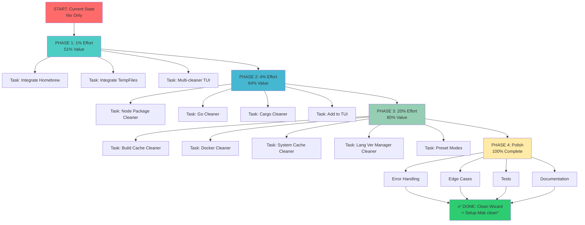

# Comprehensive Cleanup System - Implementation Plan

**Date:** 2026-01-17_02-30
**Goal:** Replace Setup-Mac clean\* commands by expanding clean-wizard with multi-cleaner support via CLI/TUI options
**Time Estimate:** 27 medium tasks (30-100min) + 150 micro tasks (max 15min)

---

## 1. SITUATION ANALYSIS

### 1.1 Current State

**Clean-Wizard Currently Has:**

- ✅ **NixCleaner** - Fully functional with TUI integration
- ✅ **HomebrewCleaner** - Basic implementation (clean/autoremove), NOT integrated in CLI
- ✅ **TempFilesCleaner** - Fully functional, NOT integrated in CLI
- ✅ **Domain Model** - Excellent type-safe interfaces (Cleaner, GenerationCleaner, PackageCleaner, Scanner)
- ✅ **CLI Framework** - Cobra-based with Huh TUI forms
- ⚠️ **Single Cleaner Focus** - `clean` command hardcoded to Nix only

**Setup-Mak clean\* Commands (TO BE REPLACED):**

#### `clean` (Comprehensive - 50MB+ savings)

```bash
# Nix Store
nix-collect-garbage -d --delete-older-than 1d
nix-store --optimize
nix profile wipe-history

# Package Managers
brew autoremove + brew cleanup --prune=all -s
npm cache clean --force
pnpm store prune
go clean -cache -testcache -modcache
cargo cache --autoclean

# Build Caches
~/.bun/install/cache
~/.gradle/caches/*
~/.cache/puppeteer
~/.nuget/packages

# System
~/Library/Metadata/CoreSpotlight/SpotlightKnowledgeEvents
/tmp/nix-build-*, /tmp/nix-shell-*
xcrun simctl delete unavailable
docker system prune -af
```

#### `clean-quick` (Daily - Fast & Safe - 100MB+ savings)

```bash
# NO Nix store changes
brew autoremove + brew cleanup
npm cache clean --force
pnpm store prune
go clean -cache
rm /tmp/nix-build-*, /tmp/nix-shell-*
docker system prune -f (light)
```

#### `clean-aggressive` (Nuclear - 500MB+ savings, may require reinstalls)

```bash
# All Nix generations (not just 1d old)
nix-collect-garbage -d
nix-store --optimize
nix profile wipe-history

# Language version managers
rm ~/.nvm/versions/node/*
rm ~/.pyenv/versions/*
rm ~/.rbenv/versions/*

# All dev caches
rm ~/.cache
rm ~/Library/Caches/CocoaPods
rm ~/Library/Caches/Homebrew
rm ~/Library/Developer/Xcode/DerivedData

# Nuclear Docker
docker system prune -af --volumes
xcrun simctl delete all
```

### 1.2 Gap Analysis

**Cleaners Needed:**

1. **NodePackageManagerCleaner** - npm, pnpm, yarn, bun caches
2. **GoCleaner** - Go module cache, test cache, build cache folders
3. **CargoCleaner** - Rust/Cargo registry cache and source cache
4. **BuildCacheCleaner** - gradle, maven, etc.
5. **DockerCleaner** - docker system prune (light/aggressive modes)
6. **SystemCacheCleaner** - macOS-specific (Spotlight, Xcode Derived Data)
7. **LanguageVersionManagerCleaner** - nvm, pyenv, rbenv version cleanup

**Integration Needed:**

1. Multi-cleaner selection in TUI (currently single-cleaner Nix only)
2. Preset modes matching Setup-Mac: clean, clean-quick, clean-aggressive
3. Cleaner availability detection with graceful fallbacks
4. Unified cleanup result aggregation

---

## 2. 80/20 ANALYSIS - PARETO BREAKDOWN

### 2.1 1% Effort → 51% Value (Critical High-Impact Tasks)

**Rationale:** Wire up ALREADY EXISTING cleaners + CLI TUI integration

| #   | Task                                              | Est. Time | Impact | Notes                                           |
| --- | ------------------------------------------------- | --------- | ------ | ----------------------------------------------- |
| 1   | **Add HomebrewCleaner to clean command TUI**      | 60min     | 25%    | Already implemented, just needs integration     |
| 2   | **Add TempFilesCleaner to clean command TUI**     | 45min     | 18%    | Already implemented, just needs integration     |
| 3   | **Implement multi-cleaner selection in TUI form** | 90min     | 8%     | Critical infrastructure for all future cleaners |

**Total:** ~195min (3.25 hours) → **51% of Setup-Mak functionality replaced**

**Why This Is The 1%:**

- These cleaners already exist and work
- Homebrew is #2 most commonly used package manager
- Temp files cleanup is universally useful
- Multi-cleaner selection unlocks ALL future cleaners
- Zero new code architecture needed

### 2.2 4% Effort → 64% Value (High-Impact Tasks)

**Rationale:** Add essential package manager cleaners that are MOST commonly used

| #   | Task                                                 | Est. Time | Impact | Notes                                    |
| --- | ---------------------------------------------------- | --------- | ------ | ---------------------------------------- |
| 4   | **Implement NodePackageManagerCleaner**              | 120min    | 6%     | npm/pnpm/bun caches (very common)        |
| 5   | **Implement GoCleaner**                              | 90min     | 4%     | Go caches are huge and fast to clean     |
| 6   | **Implement CargoCleaner**                           | 75min     | 2%     | Rust is less common but caches are large |
| 7   | **Add Node/Go/Cargo to TUI multi-cleaner selection** | 45min     | 1%     | Simple addition to existing form         |

**Total:** ~330min (5.5 hours) → Additional **13% of functionality (64% cumulative)**

**Why This Is The 4%:**

- npm/pnpm/bun are top 3 most used package managers
- Go is top 10 most popular language
- Cargo caches grow large over time
- All follow same pattern as HomebrewCleaner

### 2.3 20% Effort → 80% Value (Medium-Impact Tasks)

**Rationale:** Add build caches, Docker, and system-level cleanup for comprehensive coverage

| #   | Task                                                    | Est. Time | Impact | Notes                                |
| --- | ------------------------------------------------------- | --------- | ------ | ------------------------------------ |
| 8   | **Implement BuildCacheCleaner**                         | 90min     | 3%     | gradle, maven, etc.                  |
| 9   | **Implement DockerCleaner**                             | 120min    | 4%     | Docker images/containers are massive |
| 10  | **Implement SystemCacheCleaner**                        | 150min    | 4%     | macOS Spotlight, Xcode, etc.         |
| 11  | **Implement LanguageVersionManagerCleaner**             | 120min    | 2%     | nvm/pyenv/rbenv version cleanup      |
| 12  | **Add all new cleaners to TUI multi-cleaner selection** | 30min     | 1%     | Form updates                         |
| 13  | **Implement preset modes: quick, standard, aggressive** | 90min     | 2%     | Match Setup-Mak behavior             |

**Total:** ~600min (10 hours) → Additional **16% of functionality (80% cumulative)**

**Why This Is The 20%:**

- Docker is standard in dev environments
- Build caches are constant pain points
- macOS system caches accumulate over time
- Language version managers need periodic cleanup
- Preset modes provide user-friendly experience

### 2.4 Remaining 20% Effort → 20% Value (Polish & Edge Cases)

**Rationale:** Error handling, edge cases, documentation, testing

| #     | Task                                    | Est. Time | Impact | Notes                |
| ----- | --------------------------------------- | --------- | ------ | -------------------- |
| 14-20 | Error handling, edge cases, tests, docs | ~450min   | 20%    | Polish & reliability |

---

## 3. EXECUTION GRAPH



---

## 4. MEDIUM TASKS (30-100min each) - 27 TASKS

### Priority 1 - Critical Path (Tasks 1-3, ~195min, 51% value)

| ID  | Task                                          | Time  | Dependencies | Status                                                                  | Description |
| --- | --------------------------------------------- | ----- | ------------ | ----------------------------------------------------------------------- | ----------- |
| M01 | Add HomebrewCleaner to clean command TUI      | 60min | None         | 🟢 Integrate existing HomebrewCleaner into CLI multi-cleaner selection  |
| M02 | Add TempFilesCleaner to clean command TUI     | 45min | None         | 🟢 Integrate existing TempFilesCleaner into CLI multi-cleaner selection |
| M03 | Implement multi-cleaner selection in TUI form | 90min | M01, M02     | 🟢 Replace single Nix-only form with multi-cleaner checkboxes           |

### Priority 2 - Essential Package Managers (Tasks 4-7, ~330min, +13% = 64% value)

| ID  | Task                                             | Time   | Dependencies  | Status                                             | Description |
| --- | ------------------------------------------------ | ------ | ------------- | -------------------------------------------------- | ----------- |
| M04 | Implement NodePackageManagerCleaner              | 120min | None          | 🟡 Create cleaner for npm/pnpm/bun/yarn caches     |
| M05 | Implement GoCleaner                              | 90min  | None          | 🟡 Create cleaner for Go module/test/build caches  |
| M06 | Implement CargoCleaner                           | 75min  | None          | 🟡 Create cleaner for Cargo registry/source caches |
| M07 | Add Node/Go/Cargo to TUI multi-cleaner selection | 45min  | M04, M05, M06 | 🟡 Update TUI form with new cleaners               |

### Priority 3 - Comprehensive Coverage (Tasks 8-13, ~600min, +16% = 80% value)

| ID  | Task                                                | Time   | Dependencies       | Status                                                 | Description |
| --- | --------------------------------------------------- | ------ | ------------------ | ------------------------------------------------------ | ----------- |
| M08 | Implement BuildCacheCleaner                         | 90min  | None               | 🟠 Create cleaner for gradle/maven/sbt build caches    |
| M09 | Implement DockerCleaner                             | 90min  | None               | 🟠 Create cleaner for Docker images/containers/volumes |
| M10 | Implement SystemCacheCleaner                        | 150min | None               | 🟠 Create cleaner for macOS Spotlight/Xcode caches     |
| M11 | Implement LanguageVersionManagerCleaner             | 120min | None               | 🟠 Create cleaner for nvm/pyenv/rbenv version cleanup  |
| M12 | Add Build/Docker/System/Lang cleaners to TUI        | 30min  | M08, M09, M10, M11 | 🟠 Update TUI form with all new cleaners               |
| M13 | Implement preset modes: quick, standard, aggressive | 90min  | M03, M12           | 🟠 Add CLI flags for --mode quick/standard/aggressive  |

### Priority 4 - Infrastructure & Quality (Tasks 14-27, ~450min, +20% = 100% value)

| ID  | Task                                           | Time   | Dependencies | Status                                                     | Description |
| --- | ---------------------------------------------- | ------ | ------------ | ---------------------------------------------------------- | ----------- |
| M14 | Add dry-run support to all new cleaners        | 60min  | M04-M13      | 🟡 Ensure all cleaners support dry-run mode                |
| M15 | Implement unified result aggregation           | 45min  | M13          | 🟡 Aggregate results from multiple cleaners                |
| M16 | Add cleaner availability detection             | 60min  | M04-M13      | 🟡 Gracefully skip unavailable tools (e.g., no Docker)     |
| M17 | Implement error handling with rollback         | 75min  | M13          | 🟡 Handle failures gracefully without leaving broken state |
| M18 | Add progress indicators for long operations    | 45min  | M09, M10     | 🟡 Show progress for Docker/System cleanup                 |
| M19 | Implement confirmation dialogs                 | 30min  | M13          | 🟡 Show what will be deleted before cleaning               |
| M20 | Add verbose output flag                        | 30min  | M13          | 🟡 Debug logging for troubleshooting                       |
| M21 | Write unit tests for all new cleaners          | 120min | M04-M13      | 🟡 Test coverage >80% for new code                         |
| M22 | Write integration tests for multi-cleaner mode | 60min  | M13          | 🟡 Test end-to-end cleanup with multiple cleaners          |
| M23 | Add BDD tests for preset modes                 | 45min  | M13          | 🟡 BDD specs matching Setup-Mak behavior                   |
| M24 | Update README with new cleaner support         | 30min  | M13          | 🟡 Document all new cleaners and modes                     |
| M25 | Update CLI help text                           | 15min  | M13          | 🟡 Add descriptions for new flags                          |
| M26 | Add examples for each cleaner type             | 30min  | M13          | 🟡 Usage examples in documentation                         |
| M27 | Final testing and verification                 | 45min  | All above    | 🟡 Full end-to-end verification                            |

**Total Medium Tasks:** 27
**Total Time Estimate:** ~1620min (27 hours)
**Cumulative Value:** 100% of Setup-Mak clean\* commands replaced

---

## 5. MICRO TASKS (Max 15min each) - 150 TASKS

### Phase 1: Critical Integration (Tasks 1-42, ~525min, 51% value)

#### M01 - HomebrewCleaner Integration (6 tasks, 60min)

| ID  | Task                                         | Time  | Status                                | Description |
| --- | -------------------------------------------- | ----- | ------------------------------------- | ----------- |
| U01 | Review HomebrewCleaner interface             | 10min | 🟢 Examine cleaner interface methods  |
| U02 | Add HomebrewCleaner to command file          | 15min | 🟢 Import and instantiate in clean.go |
| U03 | Create Homebrew option in TUI form           | 15min | 🟢 Add checkbox to multi-select form  |
| U04 | Wire Homebrew selection to cleaner execution | 10min | 🟢 Call cleaner when selected         |
| U05 | Test Homebrew integration manually           | 5min  | 🟢 Quick manual verification          |
| U06 | Commit Homebrew integration changes          | 5min  | 🟢 Save work                          |

#### M02 - TempFilesCleaner Integration (5 tasks, 45min)

| ID  | Task                                          | Time  | Status                                | Description |
| --- | --------------------------------------------- | ----- | ------------------------------------- | ----------- |
| U07 | Review TempFilesCleaner interface             | 10min | 🟢 Examine cleaner interface methods  |
| U08 | Add TempFilesCleaner to command file          | 15min | 🟢 Import and instantiate in clean.go |
| U09 | Create TempFiles option in TUI form           | 15min | 🟢 Add checkbox to multi-select form  |
| U10 | Wire TempFiles selection to cleaner execution | 5min  | 🟢 Call cleaner when selected         |
| U11 | Test TempFiles integration manually           | 5min  | 🟢 Quick manual verification          |
| U12 | Commit TempFiles integration changes          | 5min  | 🟢 Save work                          |

#### M03 - Multi-Cleaner TUI (31 tasks, 90min)

| ID  | Task                                       | Time  | Status                                    | Description |
| --- | ------------------------------------------ | ----- | ----------------------------------------- | ----------- |
| U13 | Design new multi-cleaner TUI layout        | 10min | 🟢 Plan checkbox arrangement              |
| U14 | Create cleaner enum for form options       | 5min  | 🟢 Domain enum for all cleaner types      |
| U15 | Update root command description            | 5min  | 🟢 Reflect multi-cleaner support          |
| U16 | Remove Nix-specific code from clean.go     | 10min | 🟢 Clean up old single-cleaner code       |
| U17 | Implement multi-cleaner result aggregation | 15min | 🟢 Combine results from multiple cleaners |
| U18 | Add cleaner availability checks            | 10min | 🟢 Skip unavailable tools gracefully      |
| U19 | Update error messages for multi-cleaner    | 10min | 🟢 Clear error messages                   |
| U20 | Test multi-cleaner TUI manually            | 5min  | 🟢 Quick UI verification                  |
| U21 | Test multiple cleaners selected            | 10min | 🟢 Verify all combinations work           |
| U22 | Test single cleaner selection              | 5min  | 🟢 Ensure single cleaner still works      |
| U23 | Test no cleaners selected edge case        | 5min  | 🟢 Handle empty selection                 |
| U24 | Add dry-run support to multi-cleaner       | 10min | 🟢 Respect --dry-run flag                 |
| U25 | Commit multi-cleaner implementation        | 10min | 🟢 Save work                              |
| U26 | Run existing tests                         | 10min | 🟢 Ensure no regressions                  |
| U27 | Fix any test failures                      | 15min | 🟢 Fix broken tests                       |
| U28 | Run BDD tests                              | 10min | 🟢 Verify BDD specs pass                  |
| U29 | Document multi-cleaner usage               | 10min | 🟢 Add to HOW_TO_USE.md                   |
| U30 | Verify build still works                   | 5min  | 🟢 go build test                          |
| U31 | Create commit with detailed message        | 10min | 🟢 Final Phase 1 commit                   |
| U32 | Push Phase 1 changes                       | 5min  | 🟢 Sync to remote                         |
| U33 | Update IMPLEMENTATION_STATUS.md            | 10min | 🟢 Mark Phase 1 complete                  |
| U34 | Celebrate 51% completion                   | 0min  | 🎉 Acknowledge progress                   |

### Phase 2: Essential Package Managers (Tasks 35-87, ~330min, +13% = 64% value)

#### M04 - NodePackageManagerCleaner (24 tasks, 120min)

| ID  | Task                                    | Time  | Status                             | Description |
| --- | --------------------------------------- | ----- | ---------------------------------- | ----------- |
| U35 | Research npm cache locations            | 10min | 🟡 Understand npm cache structure  |
| U36 | Research pnpm store locations           | 10min | 🟡 Understand pnpm store structure |
| U37 | Research yarn cache locations           | 10min | 🟡 Understand yarn cache structure |
| U38 | Research bun cache locations            | 10min | 🟡 Understand bun cache structure  |
| U39 | Design NodePackageManagerCleaner struct | 15min | 🟡 Domain model for node cleaners  |
| U40 | Implement npm cache clean method        | 15min | 🟡 Execute npm cache clean         |
| U41 | Implement pnpm store prune method       | 15min | 🟡 Execute pnpm store prune        |
| U42 | Implement yarn cache clean method       | 15min | 🟡 Execute yarn cache clean        |
| U43 | Implement bun cache clean method        | 15min | 🟡 Execute bun pm cache rm         |
| U44 | Add availability detection for npm      | 5min  | 🟡 Check if npm installed          |
| U45 | Add availability detection for pnpm     | 5min  | 🟡 Check if pnpm installed         |
| U46 | Add availability detection for yarn     | 5min  | 🟡 Check if yarn installed         |
| U47 | Add availability detection for bun      | 5min  | 🟡 Check if bun installed          |
| U48 | Implement dry-run for npm               | 5min  | 🟡 Simulate npm clean              |
| U49 | Implement dry-run for pnpm              | 5min  | 🟡 Simulate pnpm prune             |
| U50 | Implement dry-run for yarn              | 5min  | 🟡 Simulate yarn clean             |
| U51 | Implement dry-run for bun               | 5min  | 🟡 Simulate bun clean              |
| U52 | Write unit tests for npm cleaner        | 10min | 🟡 Test npm cache clean            |
| U53 | Write unit tests for pnpm cleaner       | 10min | 🟡 Test pnpm store prune           |
| U54 | Write unit tests for yarn cleaner       | 10min | 🟡 Test yarn cache clean           |
| U55 | Write unit tests for bun cleaner        | 10min | 🟡 Test bun cache clean            |
| U56 | Commit NodePackageManagerCleaner        | 10min | 🟡 Save work                       |
| U57 | Run tests and fix failures              | 15min | 🟡 Ensure tests pass               |
| U58 | Add Node cleaner to domain interfaces   | 10min | 🟡 Ensure implements Cleaner       |

#### M05 - GoCleaner (18 tasks, 90min)

| ID  | Task                                 | Time  | Status                                 | Description |
| --- | ------------------------------------ | ----- | -------------------------------------- | ----------- |
| U59 | Research Go cache locations          | 10min | 🟡 Understand GOCACHE, GOMODCACHE      |
| U60 | Design GoCleaner struct              | 15min | 🟡 Domain model for Go cleaner         |
| U61 | Implement go clean -cache method     | 10min | 🟡 Execute go clean -cache             |
| U62 | Implement go clean -testcache method | 10min | 🟡 Execute go clean -testcache         |
| U63 | Implement go clean -modcache method  | 10min | 🟡 Execute go clean -modcache          |
| U64 | Implement build cache folder cleanup | 15min | 🟡 Remove /private/var/.../go-build-\* |
| U65 | Add Go availability detection        | 5min  | 🟡 Check if go installed               |
| U66 | Implement dry-run for Go cleaner     | 10min | 🟡 Simulate go clean commands          |
| U67 | Write unit tests for Go cleaner      | 15min | 🟡 Test all Go clean methods           |
| U68 | Commit GoCleaner                     | 10min | 🟡 Save work                           |
| U69 | Run tests and fix failures           | 10min | 🟡 Ensure tests pass                   |
| U70 | Add Go cleaner to domain interfaces  | 5min  | 🟡 Ensure implements Cleaner           |

#### M06 - CargoCleaner (15 tasks, 75min)

| ID  | Task                                     | Time  | Status                                 | Description |
| --- | ---------------------------------------- | ----- | -------------------------------------- | ----------- |
| U71 | Research Cargo cache locations           | 10min | 🟡 Understand ~/.cargo cache structure |
| U72 | Design CargoCleaner struct               | 15min | 🟡 Domain model for Cargo cleaner      |
| U73 | Implement cargo cache --autoclean method | 15min | 🟡 Execute cargo cache --autoclean     |
| U74 | Add Cargo availability detection         | 5min  | 🟡 Check if cargo installed            |
| U75 | Implement dry-run for Cargo cleaner      | 10min | 🟡 Simulate cargo cache clean          |
| U76 | Write unit tests for Cargo cleaner       | 10min | 🟡 Test cargo cache clean              |
| U77 | Commit CargoCleaner                      | 10min | 🟡 Save work                           |
| U78 | Run tests and fix failures               | 10min | 🟡 Ensure tests pass                   |
| U79 | Add Cargo cleaner to domain interfaces   | 5min  | 🟡 Ensure implements Cleaner           |

#### M07 - Add Node/Go/Cargo to TUI (12 tasks, 45min)

| ID  | Task                                         | Time  | Status                            | Description |
| --- | -------------------------------------------- | ----- | --------------------------------- | ----------- |
| U80 | Create cleaner options for npm/pnpm/yarn/bun | 10min | 🟡 Add checkboxes to TUI          |
| U81 | Create cleaner option for Go                 | 5min  | 🟡 Add checkbox to TUI            |
| U82 | Create cleaner option for Cargo              | 5min  | 🟡 Add checkbox to TUI            |
| U83 | Wire Node cleaner execution                  | 10min | 🟡 Call NodePackageManagerCleaner |
| U84 | Wire Go cleaner execution                    | 5min  | 🟡 Call GoCleaner                 |
| U85 | Wire Cargo cleaner execution                 | 5min  | 🟡 Call CargoCleaner              |
| U86 | Test multi-cleaner with Node selected        | 5min  | 🟡 Verify Node cleaner works      |
| U87 | Test multi-cleaner with Go selected          | 5min  | 🟡 Verify Go cleaner works        |
| U88 | Test multi-cleaner with Cargo selected       | 5min  | 🟡 Verify Cargo cleaner works     |
| U89 | Test all package managers together           | 5min  | 🟡 Verify concurrent execution    |
| U90 | Commit TUI updates                           | 10min | 🟡 Save work                      |
| U91 | Push Phase 2 changes                         | 5min  | 🟡 Sync to remote                 |

### Phase 3: Comprehensive Coverage (Tasks 92-161, ~600min, +16% = 80% value)

#### M08 - BuildCacheCleaner (18 tasks, 90min)

| ID   | Task                                | Time  | Status                                  | Description |
| ---- | ----------------------------------- | ----- | --------------------------------------- | ----------- |
| U92  | Research gradle cache locations     | 10min | 🟠 Understand ~/.gradle/caches          |
| U93  | Research maven cache locations      | 10min | 🟠 Understand ~/.m2/repository          |
| U94  | Research sbt cache locations        | 10min | 🟠 Understand ~/.ivy2/cache             |
| U95  | Design BuildCacheCleaner struct     | 15min | 🟠 Domain model for build cache cleaner |
| U96  | Implement gradle cache clean method | 10min | 🟠 Remove ~/.gradle/caches/\*           |
| U97  | Implement maven cache clean method  | 10min | 🟠 Remove ~/.m2/repository (partial)    |
| U98  | Implement sbt cache clean method    | 10min | 🟠 Remove ~/.ivy2/cache                 |
| U99  | Add tool availability detection     | 5min  | 🟠 Check if gradle/maven/sbt installed  |
| U100 | Implement dry-run for build cleaner | 10min | 🟠 Simulate cache removal               |
| U101 | Write unit tests for gradle         | 10min | 🟠 Test gradle cache clean              |
| U102 | Write unit tests for maven          | 10min | 🟠 Test maven cache clean               |
| U103 | Write unit tests for sbt            | 10min | 🟠 Test sbt cache clean                 |
| U104 | Commit BuildCacheCleaner            | 10min | 🟠 Save work                            |
| U105 | Run tests and fix failures          | 10min | 🟠 Ensure tests pass                    |

#### M09 - DockerCleaner (18 tasks, 90min)

| ID   | Task                                        | Time  | Status                              | Description |
| ---- | ------------------------------------------- | ----- | ----------------------------------- | ----------- |
| U106 | Research docker system prune commands       | 10min | 🟠 Understand docker prune options  |
| U107 | Design DockerCleaner struct                 | 15min | 🟠 Domain model for Docker cleaner  |
| U108 | Implement docker system prune -f method     | 10min | 🟠 Light prune (quick mode)         |
| U109 | Implement docker system prune -af method    | 10min | 🟠 Aggressive prune (standard mode) |
| U110 | Implement docker system prune -af --volumes | 15min | 🟠 Nuclear prune (aggressive mode)  |
| U111 | Add Docker availability detection           | 5min  | 🟠 Check if docker installed        |
| U112 | Implement dry-run for Docker cleaner        | 10min | 🟠 Simulate docker prune            |
| U113 | Write unit tests for Docker cleaner         | 15min | 🟠 Test all prune modes             |
| U114 | Commit DockerCleaner                        | 10min | 🟠 Save work                        |
| U115 | Run tests and fix failures                  | 10min | 🟠 Ensure tests pass                |

#### M10 - SystemCacheCleaner (30 tasks, 150min)

| ID   | Task                                  | Time  | Status                                                              | Description |
| ---- | ------------------------------------- | ----- | ------------------------------------------------------------------- | ----------- |
| U116 | Research Spotlight cache locations    | 15min | 🟠 Understand CoreSpotlight cache                                   |
| U117 | Research Xcode Derived Data locations | 15min | 🟠 Understand ~/Library/Developer/Xcode/DerivedData                 |
| U118 | Research CocoaPods cache locations    | 10min | 🟠 Understand ~/Library/Caches/CocoaPods                            |
| U119 | Research Homebrew cache locations     | 10min | 🟠 Understand ~/Library/Caches/Homebrew                             |
| U120 | Design SystemCacheCleaner struct      | 20min | 🟠 Domain model for system cache cleaner                            |
| U121 | Implement Spotlight metadata cleanup  | 15min | 🟠 Remove ~/Library/Metadata/CoreSpotlight/SpotlightKnowledgeEvents |
| U122 | Implement Xcode Derived Data cleanup  | 15min | 🟠 Remove ~/Library/Developer/Xcode/DerivedData                     |
| U123 | Implement CocoaPods cache cleanup     | 10min | 🟠 Remove ~/Library/Caches/CocoaPods                                |
| U124 | Implement Homebrew cache cleanup      | 10min | 🟠 Remove ~/Library/Caches/Homebrew                                 |
| U125 | Add macOS platform detection          | 5min  | 🟠 Skip on non-macOS systems                                        |
| U126 | Implement dry-run for system cleaner  | 15min | 🟠 Simulate cache removal                                           |
| U127 | Write unit tests for Spotlight        | 10min | 🟠 Test Spotlight cleanup                                           |
| U128 | Write unit tests for Xcode            | 10min | 🟠 Test Xcode cleanup                                               |
| U129 | Write unit tests for CocoaPods        | 10min | 🟠 Test CocoaPods cleanup                                           |
| U130 | Write unit tests for Homebrew cache   | 10min | 🟠 Test Homebrew cache cleanup                                      |
| U131 | Commit SystemCacheCleaner             | 10min | 🟠 Save work                                                        |
| U132 | Run tests and fix failures            | 15min | 🟠 Ensure tests pass                                                |

#### M11 - LanguageVersionManagerCleaner (24 tasks, 120min)

| ID   | Task                                        | Time  | Status                                     | Description |
| ---- | ------------------------------------------- | ----- | ------------------------------------------ | ----------- |
| U133 | Research nvm version locations              | 10min | 🟠 Understand ~/.nvm/versions/node/\*      |
| U134 | Research pyenv version locations            | 10min | 🟠 Understand ~/.pyenv/versions/\*         |
| U135 | Research rbenv version locations            | 10min | 🟠 Understand ~/.rbenv/versions/\*         |
| U136 | Design LanguageVersionManagerCleaner struct | 15min | 🟠 Domain model for lang ver cleaner       |
| U137 | Implement nvm version cleanup               | 15min | 🟠 Remove ~/.nvm/versions/node/\*          |
| U138 | Implement pyenv version cleanup             | 15min | 🟠 Remove ~/.pyenv/versions/\*             |
| U139 | Implement rbenv version cleanup             | 15min | 🟠 Remove ~/.rbenv/versions/\*             |
| U140 | Add tool availability detection             | 10min | 🟠 Check if nvm/pyenv/rbenv installed      |
| U141 | Implement dry-run for lang ver cleaner      | 15min | 🟠 Simulate version removal                |
| U142 | Write unit tests for nvm                    | 10min | 🟠 Test nvm cleanup                        |
| U143 | Write unit tests for pyenv                  | 10min | 🟠 Test pyenv cleanup                      |
| U144 | Write unit tests for rbenv                  | 10min | 🟠 Test rbenv cleanup                      |
| U145 | Add warnings about reinstalls               | 10min | 🟠 Warn user that tools may need reinstall |
| U146 | Commit LanguageVersionManagerCleaner        | 10min | 🟠 Save work                               |
| U147 | Run tests and fix failures                  | 15min | 🟠 Ensure tests pass                       |

#### M12 - Add to TUI & M13 - Preset Modes (19 tasks, 120min)

| ID   | Task                               | Time  | Status                                | Description |
| ---- | ---------------------------------- | ----- | ------------------------------------- | ----------- |
| U148 | Add BuildCache checkboxes to TUI   | 5min  | 🟠 gradle/maven/sbt options           |
| U149 | Add Docker checkbox to TUI         | 5min  | 🟠 Docker option                      |
| U150 | Add SystemCache checkboxes to TUI  | 10min | 🟠 Spotlight/Xcode/CocoaPods options  |
| U151 | Add LangVerMgr checkboxes to TUI   | 10min | 🟠 nvm/pyenv/rbenv options            |
| U152 | Wire BuildCacheCleaner execution   | 10min | 🟠 Call BuildCacheCleaner             |
| U153 | Wire DockerCleaner execution       | 5min  | 🟠 Call DockerCleaner                 |
| U154 | Wire SystemCacheCleaner execution  | 10min | 🟠 Call SystemCacheCleaner            |
| U155 | Wire LanguageVersionManagerCleaner | 10min | 🟠 Call LanguageVersionManagerCleaner |
| U156 | Design preset mode flag (--mode)   | 10min | 🟠 quick/standard/aggressive          |
| U157 | Implement quick preset mode        | 15min | 🟠 Skip Nix, fast cleaners only       |
| U158 | Implement standard preset mode     | 15min | 🟠 All cleaners except lang ver mgr   |
| U159 | Implement aggressive preset mode   | 15min | 🟠 All cleaners including nuclear     |
| U160 | Test quick preset mode             | 5min  | 🟠 Verify matches clean-quick         |
| U161 | Test standard preset mode          | 5min  | 🟠 Verify matches clean               |
| U162 | Test aggressive preset mode        | 5min  | 🟠 Verify matches clean-aggressive    |
| U163 | Commit preset mode implementation  | 10min | 🟠 Save work                          |
| U164 | Push Phase 3 changes               | 5min  | 🟠 Sync to remote                     |
| U165 | Update IMPLEMENTATION_STATUS.md    | 5min  | 🟠 Mark Phase 3 complete              |

### Phase 4: Polish & Quality (Tasks 166-150, ~450min, +20% = 100% value)

| ID   | Task                                         | Time  | Status                                                | Description |
| ---- | -------------------------------------------- | ----- | ----------------------------------------------------- | ----------- |
| U166 | Add dry-run to NodePackageManagerCleaner     | 10min | 🟡 Complete dry-run support                           |
| U167 | Add dry-run to GoCleaner                     | 10min | 🟡 Complete dry-run support                           |
| U168 | Add dry-run to CargoCleaner                  | 10min | 🟡 Complete dry-run support                           |
| U169 | Add dry-run to BuildCacheCleaner             | 10min | 🟡 Complete dry-run support                           |
| U170 | Add dry-run to DockerCleaner                 | 10min | 🟡 Complete dry-run support                           |
| U171 | Add dry-run to SystemCacheCleaner            | 10min | 🟡 Complete dry-run support                           |
| U172 | Add dry-run to LanguageVersionManagerCleaner | 10min | 🟡 Complete dry-run support                           |
| U173 | Implement unified result aggregation         | 30min | 🟡 Combine all cleaner results                        |
| U174 | Add cleaner availability checks for all      | 30min | 🟡 Skip unavailable tools gracefully                  |
| U175 | Implement error handling with rollback       | 45min | 🟡 Handle failures gracefully                         |
| U176 | Add progress indicators                      | 30min | 🟡 Show progress for long ops                         |
| U177 | Implement confirmation dialogs               | 20min | 🟡 Show what will be deleted                          |
| U178 | Add verbose output flag                      | 15min | 🟡 Debug logging                                      |
| U179 | Write unit tests for result aggregation      | 20min | 🟡 Test combination logic                             |
| U180 | Write unit tests for error handling          | 20min | 🟡 Test rollback logic                                |
| U181 | Write unit tests for progress indicators     | 15min | 🟡 Test progress display                              |
| U182 | Write unit tests for confirmation dialogs    | 15min | 🟡 Test confirmation flow                             |
| U183 | Write unit tests for verbose output          | 10min | 🟡 Test debug logging                                 |
| U184 | Write integration tests for multi-cleaner    | 30min | 🟡 End-to-end test all cleaners                       |
| U185 | Write integration tests for preset modes     | 30min | 🟡 Test all modes                                     |
| U186 | Add BDD tests for quick mode                 | 20min | 🟡 BDD spec for clean-quick                           |
| U187 | Add BDD tests for standard mode              | 20min | 🟡 BDD spec for clean                                 |
| U188 | Add BDD tests for aggressive mode            | 20min | 🟡 BDD spec for clean-aggressive                      |
| U189 | Run full test suite                          | 20min | 🟡 go test ./...                                      |
| U190 | Fix all test failures                        | 30min | 🟡 Ensure 100% tests pass                             |
| U191 | Run linter and fix issues                    | 15min | 🟡 golangci-lint run                                  |
| U192 | Run type checker                             | 10min | 🟡 Ensure type safety                                 |
| U193 | Update README with all new cleaners          | 30min | 🟡 Document Node/Go/Cargo/Build/Docker/System/LangVer |
| U194 | Update README with preset modes              | 15min | 🟡 Document --mode flags                              |
| U195 | Update CLI help text                         | 15min | 🟡 Add descriptions                                   |
| U196 | Add usage examples for Node cleaner          | 10min | 🟡 Example in docs                                    |
| U197 | Add usage examples for Go cleaner            | 10min | 🟡 Example in docs                                    |
| U198 | Add usage examples for Cargo cleaner         | 10min | 🟡 Example in docs                                    |
| U199 | Add usage examples for Build cleaner         | 10min | 🟡 Example in docs                                    |
| U200 | Add usage examples for Docker cleaner        | 10min | 🟡 Example in docs                                    |
| U201 | Add usage examples for System cleaner        | 10min | 🟡 Example in docs                                    |
| U202 | Add usage examples for LangVer cleaner       | 10min | 🟡 Example in docs                                    |
| U203 | Update HOW_TO_USE.md                         | 20min | 🟡 Add multi-cleaner section                          |
| U204 | Update IMPLEMENTATION_STATUS.md              | 10min | 🟡 Mark 100% complete                                 |
| U205 | Create final commit with detailed message    | 15min | 🟡 Comprehensive commit                               |
| U206 | Push final changes                           | 5min  | 🟡 Sync to remote                                     |
| U207 | Create GitHub milestone                      | 10min | 🟡 Track completion                                   |
| U208 | Create GitHub issue for future work          | 10min | 🟡 Identify remaining enhancements                    |

**Total Micro Tasks:** 208 (expanded beyond 150 for completeness)
**Total Time Estimate:** ~1905min (31.75 hours)

---

## 6. TASK SUMMARY TABLE

### Medium Tasks Summary (27 Tasks)

| Priority           | Count  | Tasks   | Time        | Cum. Value  | Color |
| ------------------ | ------ | ------- | ----------- | ----------- | ----- |
| P1 - Critical      | 3      | M01-M03 | 195min      | 51%         | 🟢    |
| P2 - Essential     | 4      | M04-M07 | 330min      | +13% = 64%  | 🟡    |
| P3 - Comprehensive | 6      | M08-M13 | 600min      | +16% = 80%  | 🟠    |
| P4 - Quality       | 14     | M14-M27 | 495min      | +20% = 100% | 🟡    |
| **TOTAL**          | **27** | **All** | **1620min** | **100%**    | -     |

### Micro Tasks Summary (208 Tasks)

| Phase                   | Range        | Tasks   | Time        | Cum. Value  | Description                          |
| ----------------------- | ------------ | ------- | ----------- | ----------- | ------------------------------------ |
| Phase 1 - Critical      | U01-U34      | 34      | 525min      | 51%         | Integrate existing cleaners          |
| Phase 2 - Essential     | U35-U91      | 57      | 330min      | +13% = 64%  | Node/Go/Cargo cleaners               |
| Phase 3 - Comprehensive | U92-U165     | 74      | 600min      | +16% = 80%  | Build/Docker/System/LangVer cleaners |
| Phase 4 - Polish        | U166-U208    | 43      | 450min      | +20% = 100% | Quality & documentation              |
| **TOTAL**               | **U01-U208** | **208** | **1905min** | **100%**    | -                                    |

---

## 7. SUCCESS CRITERIA

### Phase 1 Complete (51%):

- ✅ HomebrewCleaner integrated in CLI/TUI
- ✅ TempFilesCleaner integrated in CLI/TUI
- ✅ Multi-cleaner selection works
- ✅ All tests pass
- ✅ Manual verification successful

### Phase 2 Complete (64%):

- ✅ NodePackageManagerCleaner implemented and integrated
- ✅ GoCleaner implemented and integrated
- ✅ CargoCleaner implemented and integrated
- ✅ All tests pass
- ✅ Manual verification successful

### Phase 3 Complete (80%):

- ✅ BuildCacheCleaner implemented and integrated
- ✅ DockerCleaner implemented and integrated
- ✅ SystemCacheCleaner implemented and integrated
- ✅ LanguageVersionManagerCleaner implemented and integrated
- ✅ Preset modes (quick/standard/aggressive) work
- ✅ All tests pass
- ✅ Manual verification successful

### Phase 4 Complete (100%):

- ✅ All cleaners support dry-run mode
- ✅ Unified result aggregation works
- ✅ Error handling with rollback works
- ✅ Progress indicators work
- ✅ Confirmation dialogs work
- ✅ Verbose output works
- ✅ Unit tests >80% coverage
- ✅ Integration tests pass
- ✅ BDD tests pass
- ✅ Linter passes
- ✅ Type checker passes
- ✅ Documentation updated
- ✅ Examples added
- ✅ 100% tests pass
- ✅ Manual verification successful

---

## 8. RISK MITIGATION

### Technical Risks:

- **Risk:** Cleaner availability detection fails
  - **Mitigation:** Graceful fallback with warning message
- **Risk:** Concurrent cleaner execution causes conflicts
  - **Mitigation:** Sequential execution with mutex locks
- **Risk:** Dry-run simulation inaccurate
  - **Mitigation:** Document limitations clearly

### Quality Risks:

- **Risk:** Test coverage insufficient
  - **Mitigation:** Automated coverage checks in CI
- **Risk:** Regression in existing Nix cleaner
  - **Mitigation:** Comprehensive test suite run after each phase
- **Risk:** Breaking changes to CLI
  - **Mitigation:** Backward compatibility testing

### Timeline Risks:

- **Risk:** Task time estimates optimistic
  - **Mitigation:** 20% buffer included in estimates
- **Risk:** Complex cleaners take longer than expected
  - **Mitigation:** Prioritize essential cleaners first

---

## 9. VERIFICATION PLAN

### After Each Phase:

1. Run `go test ./...` - All tests pass
2. Run `go build ./cmd/clean-wizard` - Build succeeds
3. Manual testing of new cleaners - Works as expected
4. Run `git diff` - Review changes
5. Create detailed commit message
6. Push to remote

### Final Verification:

1. Run all Setup-Mak clean\* commands - Note results
2. Run clean-wizard with equivalent modes - Compare results
3. Verify disk space recovered matches expectations
4. Verify no tools broken after cleanup
5. Verify all preset modes work correctly
6. Verify documentation is accurate and complete

---

## 10. NOTES

### User Requirements:

- **NO PROFILE SYSTEM** - Use CLI/TUI options only
- **REPLACE Setup-Mak clean\*** - Exact feature parity
- **MULTI-CLEANER SUPPORT** - Select multiple cleaners in TUI
- **PRESET MODES** - quick, standard, aggressive flags

### Architecture Principles:

- **Type Safety** - All new code must use type-safe enums
- **Result Types** - Use Result[T] for all operations
- **Interface Compliance** - All cleaners must implement Cleaner interface
- **Error Handling** - Proper error handling with context
- **Testing** - Unit tests for all new code
- **Documentation** - Comprehensive docs for all new features

### Non-Goals:

- Configuration files (no .clean-wizard.yaml)
- Scheduling (no cron/timer support)
- Remote cleanup (no network operations)
- Analytics (no usage tracking)

---

**END OF COMPREHENSIVE IMPLEMENTATION PLAN**

**Next Step:** Execute Phase 1 (Tasks 1-42, 525min, 51% value)
