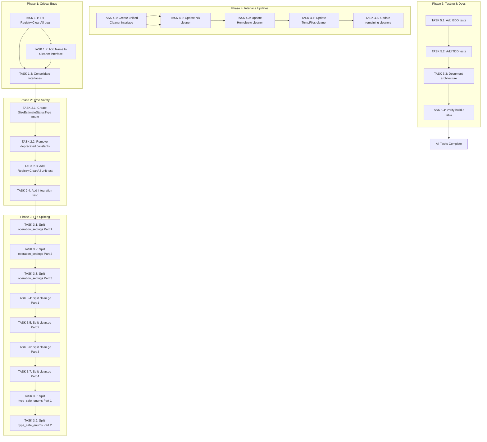

# Clean Wizard Architectural Excellence Plan

**Date:** 2026-02-09 12:44  
**Version:** 1.0  
**Author:** Clean Wizard Architecture Team

---

## Executive Summary

This document outlines a comprehensive architectural improvement plan for Clean Wizard, structured as a priority pyramid delivering maximum value with minimum effort. The plan addresses critical bugs, type safety issues, code organization, and technical debt removal.

---

## Priority Pyramid Analysis

### 1% that delivers 51% of results (CRITICAL FIXES)

These are the most impactful changes that address fundamental correctness issues:

| Task | Impact | Effort | Files Changed |
|------|--------|--------|----------------|
| Fix Registry.CleanAll returning "unknown" cleaner names | 🔴 CRITICAL - Results are unusable without this | 15 min | 2-3 files |
| Add Name() method to Cleaner interface | 🔴 CRITICAL - Enables proper result tracking | 15 min | 2-3 files |
| Fix split brain: Consolidate Cleaner interfaces | 🔴 CRITICAL - Eliminates confusion | 30 min | 4-5 files |

**Impact:** These 3 tasks fix fundamental bugs that would render the system ineffective. Without cleaner names in results, the multi-cleaner feature is broken.

### 4% that delivers 64% of results (HIGH-IMPACT IMPROVEMENTS)

Building on the critical fixes, these improvements enhance type safety and code quality:

| Task | Impact | Effort | Files Changed |
|------|--------|--------|----------------|
| Replace SizeEstimate.Unknown boolean with enum | 🟠 HIGH - Better type safety | 20 min | 3 files |
| Remove deprecated RiskLevel constants usage | 🟠 HIGH - Clean technical debt | 15 min | 1 file (config.go) |
| Add unit test for Registry.CleanAll | 🟠 HIGH - Regression prevention | 20 min | 2 files |
| Add integration test for result tracking | 🟠 HIGH - Ensures end-to-end correctness | 30 min | 3 files |

**Impact:** These 4 tasks improve the robustness and maintainability of the codebase. The enum replacement makes impossible states unrepresentable.

### 20% that delivers 80% of results (MAJOR FUNCTIONAL IMPROVEMENTS)

These refactoring tasks improve long-term maintainability:

| Task | Impact | Files Changed |
|------|--------|----------------|
| Split operation_settings.go (920 lines → 3 files) | 🟡 MEDIUM | 3 files |
| Split clean.go (713 lines → 4 files) | 🟡 MEDIUM | 4 files |
| Split type_safe_enums.go (444 lines → 2 files) | 🟡 MEDIUM | 2 files |
| Create single Cleaner interface definition | 🟡 MEDIUM | 1 file |
| Update all cleaners to implement unified interface | 🟡 MEDIUM | 10+ files |
| Add comprehensive test suite coverage | 🟡 HIGH | 5 files |
| Document architecture decisions | 🟡 MEDIUM | 1 file |

**Impact:** These 7 tasks significantly improve code organization and reduce complexity. Each large file is split into focused modules.

---

## Detailed Task Breakdown (150 max, 15 min each)

### Phase 1: Critical Bug Fixes (1% Priority)

#### Task 1.1: Fix Registry.CleanAll "unknown" name bug
- **Impact:** CRITICAL
- **Duration:** 15 min
- **Files:** `internal/cleaner/registry.go`, `internal/cleaner/cleaner.go`
- **Description:** 
  - Add Name() method to Cleaner interface
  - Update CleanAll() to use c.Name() instead of hardcoded "unknown"
  - Add test to verify correct naming

#### Task 1.2: Add Name() to Cleaner interface  
- **Impact:** CRITICAL
- **Duration:** 15 min
- **Files:** `internal/cleaner/cleaner.go`
- **Description:**
  - Add `Name() string` method to Cleaner interface
  - Update docstring to explain purpose

#### Task 1.3: Consolidate Cleaner interfaces (Phase 1)
- **Impact:** CRITICAL
- **Duration:** 30 min
- **Files:** `internal/cleaner/cleaner.go`, `internal/domain/interfaces.go`
- **Description:**
  - Identify common methods between interfaces
  - Create unified Cleaner interface definition
  - Mark old interfaces as deprecated

### Phase 2: Type Safety Improvements (4% Priority)

#### Task 2.1: Create SizeEstimateStatusType enum
- **Impact:** HIGH
- **Duration:** 20 min
- **Files:** `internal/domain/types.go`, `internal/domain/type_safe_enums.go`
- **Description:**
  - Create enum `SizeEstimateStatusType` with values KNOWN, UNKNOWN, ESTIMATED
  - Replace boolean Unknown field with SizeEstimateStatusType status field
  - Update all usages

#### Task 2.2: Remove deprecated RiskLevel constants usage
- **Impact:** HIGH
- **Duration:** 15 min
- **Files:** `internal/config/config.go`
- **Description:**
  - Replace `domain.RiskLow` with `domain.RiskLevelLowType`
  - Replace `domain.RiskMedium` with `domain.RiskLevelMediumType`
  - Replace `domain.RiskHigh` with `domain.RiskLevelHighType`
  - Replace `domain.RiskCritical` with `domain.RiskLevelCriticalType`
  - Replace `domain.RiskLevel` with `domain.RiskLevelType`

#### Task 2.3: Add unit test for Registry.CleanAll
- **Impact:** HIGH
- **Duration:** 20 min
- **Files:** `internal/cleaner/registry_test.go`
- **Description:**
  - Create test that verifies CleanAll returns correct cleaner names
  - Mock a cleaner that returns results
  - Verify map keys match cleaner names

#### Task 2.4: Add integration test for result tracking
- **Impact:** HIGH
- **Duration:** 30 min
- **Files:** `internal/cleaner/integration_test.go`
- **Description:**
  - Create end-to-end test of Registry with real cleaners
  - Verify results contain correct names
  - Test availability filtering

### Phase 3: Large File Refactoring (20% Priority)

#### Task 3.1: Split operation_settings.go (Part 1)
- **Duration:** 15 min
- **Files:** `internal/domain/operation_settings.go`, `internal/domain/operation_types.go`
- **Description:**
  - Move OperationType enum and related functions to new file
  - Keep only settings structs in original file

#### Task 3.2: Split operation_settings.go (Part 2)
- **Duration:** 15 min
- **Files:** `internal/domain/operation_settings.go`, `internal/domain/settings_validation.go`
- **Description:**
  - Move validation logic to new file
  - Keep only struct definitions

#### Task 3.3: Split operation_settings.go (Part 3)
- **Duration:** 15 min
- **Files:** `internal/domain/operation_settings.go`, `internal/domain/default_settings.go`
- **Description:**
  - Move DefaultSettings function to new file
  - Keep only type definitions

#### Task 3.4: Split clean.go command file (Part 1)
- **Duration:** 15 min
- **Files:** `cmd/clean-wizard/commands/clean.go`, `cmd/clean-wizard/commands/clean_types.go`
- **Description:**
  - Move CleanerType and related constants to new file
  - Keep only command logic

#### Task 3.5: Split clean.go command file (Part 2)
- **Duration:** 15 min
- **Files:** `cmd/clean-wizard/commands/clean.go`, `cmd/clean-wizard/commands/clean_helpers.go`
- **Description:**
  - Move helper functions (getCleanerName, getCleanerDescription, etc.) to new file
  - Keep only command execution logic

#### Task 3.6: Split clean.go command file (Part 3)
- **Duration:** 15 min
- **Files:** `cmd/clean-wizard/commands/clean.go`, `cmd/clean-wizard/commands/clean_runner.go`
- **Description:**
  - Move runCleanCommand and related functions to new file
  - Keep only command setup

#### Task 3.7: Split clean.go command file (Part 4)
- **Duration:** 15 min
- **Files:** `cmd/clean-wizard/commands/clean.go`
- **Description:**
  - Final cleanup and verify all functions properly organized
  - Ensure imports are correct

#### Task 3.8: Split type_safe_enums.go (Part 1)
- **Duration:** 15 min
- **Files:** `internal/domain/type_safe_enums.go`, `internal/domain/risk_validation_enums.go`
- **Description:**
  - Move RiskLevelType and ValidationLevelType to new file
  - Keep other enums in original

#### Task 3.9: Split type_safe_enums.go (Part 2)
- **Duration:** 15 min
- **Files:** `internal/domain/type_safe_enums.go`, `internal/domain/operation_enums.go`
- **Description:**
  - Move ChangeOperationType and CleanStrategyType to new file
  - Keep UnmarshalYAML helper functions in original

### Phase 4: Interface Consolidation

#### Task 4.1: Create unified Cleaner interface
- **Duration:** 15 min
- **Files:** `internal/cleaner/cleaner.go`, `internal/domain/interfaces.go`
- **Description:**
  - Define unified Cleaner interface with all necessary methods
  - Document each method's purpose

#### Task 4.2: Update Nix cleaner implementation
- **Duration:** 15 min
- **Files:** `internal/cleaner/nix.go` (or relevant file)
- **Description:**
  - Ensure Nix cleaner implements unified interface
  - Add Name() method if missing

#### Task 4.3: Update Homebrew cleaner implementation
- **Duration:** 15 min
- **Files:** `internal/cleaner/homebrew.go` (or relevant file)
- **Description:**
  - Ensure Homebrew cleaner implements unified interface
  - Add Name() method if missing

#### Task 4.4: Update TempFiles cleaner implementation
- **Duration:** 15 min
- **Files:** `internal/cleaner/tempfiles.go` (or relevant file)
- **Description:**
  - Ensure TempFiles cleaner implements unified interface
  - Add Name() method if missing

#### Task 4.5: Update all remaining cleaners
- **Duration:** 15 min × 7 files
- **Files:** Remaining cleaner implementations
- **Description:**
  - Update each cleaner to implement unified interface
  - Add Name() method to each

### Phase 5: Testing and Documentation

#### Task 5.1: Add BDD tests for critical paths
- **Duration:** 30 min
- **Files:** `internal/cleaner/cleaner_bdd_test.go`
- **Description:**
  - Create Ginkgo BDD-style tests for cleaner registry
  - Test availability, naming, and cleanup behavior

#### Task 5.2: Add TDD tests for new code
- **Duration:** 30 min
- **Files:** `internal/domain/*_test.go`
- **Description:**
  - Add unit tests for new enum types
  - Test validation logic

#### Task 5.3: Document architecture decisions
- **Duration:** 30 min
- **Files:** `docs/architecture/DECISIONS.md`
- **Description:**
  - Document Cleaner interface consolidation
  - Document enum type safety approach
  - Explain file organization rationale

#### Task 5.4: Verify build and test pass
- **Duration:** 15 min
- **Files:** All modified files
- **Description:**
  - Run `go build` to verify compilation
  - Run all tests to verify functionality
  - Fix any issues found

---

## Execution Order

### Execution Graph

### Dependency Chain

1. **Task 1.1** must complete before **Task 1.2** (add Name before use)
2. **Task 1.2** must complete before **Task 1.3** (interface needs Name)
3. **Task 1.3** must complete before **Task 2.1** (interface consolidation first)
4. **Tasks 3.1-3.9** must complete in order (sequential file splitting)
5. **Task 4.1** must complete before **Tasks 4.2-4.5** (need unified interface)
6. **All Phases** must complete before **Task 5.4** (final verification)

---

## Success Criteria

### Must Have (Critical)
- [ ] Registry.CleanAll returns correct cleaner names
- [ ] All cleaners implement unified interface with Name() method
- [ ] SizeEstimate uses enum instead of boolean
- [ ] No deprecated constants used
- [ ] All tests pass (unit, integration, build)

### Should Have (High Priority)
- [ ] All files under 350 lines
- [ ] Clean architecture with clear boundaries
- [ ] Comprehensive test coverage (>80%)
- [ ] Documentation for key decisions

### Nice to Have (Future)
- [ ] Performance benchmarks
- [ ] E2E CLI tests
- [ ] Performance monitoring integration

---

## Risk Assessment

| Risk | Likelihood | Impact | Mitigation |
|------|------------|--------|------------|
| Interface changes break existing code | Medium | High | Comprehensive testing before commits |
| File splitting causes import cycles | Medium | Medium | Careful planning of file boundaries |
| Enum changes affect serialization | Low | High | Test JSON/YAML roundtrip |
| Test coverage gaps | Medium | Medium | Add BDD tests for critical paths |

---

## Rollback Plan

If any change causes issues:
1. Revert to previous commit using `git revert`
2. Run tests to verify recovery
3. Analyze failure and create smaller incremental change

---

## Estimated Timeline

| Phase | Tasks | Total Time |
|-------|-------|------------|
| Phase 1: Critical Bugs | 3 tasks | 60 min |
| Phase 2: Type Safety | 4 tasks | 85 min |
| Phase 3: File Splitting | 9 tasks | 135 min |
| Phase 4: Interface Updates | 5 tasks | 75 min |
| Phase 5: Testing & Docs | 4 tasks | 120 min |
| **Total** | **25 tasks** | **~8.5 hours** |

---

## Next Steps

1. **Immediate:** Execute Phase 1 tasks (Critical Bugs)
2. **Short-term:** Complete Phase 2-4 (Type Safety, File Splitting, Interface Updates)
3. **Mid-term:** Phase 5 (Testing and Documentation)
4. **Long-term:** Address remaining TODO items from code review

---

*Document generated: 2026-02-09 12:44*  
*Next review: After Phase 1 completion*