# Clean Wizard - Architectural Excellence Plan

**Date:** 2026-02-09 12:46  
**Author:** Crush (Senior Software Architect + Product Owner)  
**Version:** 1.0

---

## Executive Summary

This document outlines a comprehensive plan to achieve architectural excellence for the Clean Wizard Go-based system cleanup tool. The plan follows the Pareto principle: focusing on the **1% of tasks that deliver 51% of value**, then the **4% that deliver 64%**, then the **20% that deliver 80%**.

---

## Current State Analysis

### ✅ What Works Well

- **Build Status**: `go build ./...` passes without errors
- **Test Coverage**: All tests pass (`go test ./...`)
- **Type-safe Enums**: Excellent patterns in `type_safe_enums.go` (RiskLevelType, ValidationLevelType, CleanStrategyType, etc.)
- **Registry Pattern**: CleanerRegistry properly tracks and manages cleaners
- **Result Tracking**: Named results from cleaners now work correctly

### ❌ Critical Issues Identified

| Issue | Severity | Location | Impact |
|-------|----------|----------|--------|
| **Boolean instead of Enum** | CRITICAL | `types.go:177` | Type safety violation - Unknown state unrepresentable as enum |
| **Split Brain - Two Cleaner Interfaces** | CRITICAL | `cleaner.go:11` & `interfaces.go:6` | Interface inconsistency, confusion in codebase |
| **Deprecated Constants in Use** | HIGH | `config.go:98-107` | Linter warnings, technical debt |
| **File Too Large** | HIGH | `operation_settings.go:920` | Violates 350-line limit, hard to maintain |
| **File Too Large** | HIGH | `test_helpers.go:742` | Violates 350-line limit, hard to maintain |
| **File Too Large** | HIGH | `clean.go:713` | Violates 350-line limit, hard to maintain |
| **File Too Large** | MEDIUM | `type_safe_enums.go:444` | Borderline, exceeds 350-line guideline |
| **Missing Test Coverage** | HIGH | `registry_test.go` | No unit test for `Registry.CleanAll` |

---

## The 1% - Delivers 51% of Value

These are the **highest-impact, lowest-effort** tasks that immediately improve the codebase:

### Task 1.1: Replace Boolean with SizeEstimateStatusType Enum

**File:** `internal/domain/types.go:174-201`  
**Impact:** Makes impossible states unrepresentable  
**Effort:** ~15 minutes  
**Lines Changed:** ~30

```go
// BEFORE (Type Unsafe):
type SizeEstimate struct {
    Known   uint64 `json:"known"`
    Unknown bool   `json:"unknown"`  // ❌ Boolean!
}

// AFTER (Type Safe):
type SizeEstimateStatusType int

const (
    SizeEstimateStatusKnown   SizeEstimateStatusType = iota
    SizeEstimateStatusUnknown
)

type SizeEstimate struct {
    Known   uint64                  `json:"known"`
    Status  SizeEstimateStatusType `json:"status"`  // ✅ Enum!
}
```

### Task 1.2: Add Unit Test for Registry.CleanAll

**File:** `internal/cleaner/registry_test.go`  
**Impact:** Critical functionality now tested  
**Effort:** ~15 minutes  
**Lines Added:** ~40

### Task 1.3: Remove Deprecated RiskLevel Constants from config.go

**File:** `internal/config/config.go:98-107`  
**Impact:** Eliminates linter warnings, technical debt  
**Effort:** ~10 minutes  
**Lines Changed:** ~12

```go
// BEFORE (Deprecated):
op.RiskLevel = domain.RiskLow      // ⚠️ Warning!
op.RiskLevel = domain.RiskMedium   // ⚠️ Warning!

// AFTER (Type Safe):
op.RiskLevel = domain.RiskLevelType(domain.RiskLevelLowType)    // ✅ No warning
op.RiskLevel = domain.RiskLevelType(domain.RiskLevelMediumType) // ✅ No warning
```

---

## The 4% - Delivers 64% of Value (Cumulative: 65%)

These tasks build on the 1% and deliver significant architectural improvements:

### Task 4.1: Create SizeEstimateStatusType in type_safe_enums.go

**File:** `internal/domain/type_safe_enums.go`  
**Impact:** Centralized type-safe enum definition  
**Effort:** ~15 minutes  
**Lines Added:** ~50

### Task 4.2: Consolidate Cleaner Interfaces (Phase 1)

**Files:** `internal/cleaner/cleaner.go` & `internal/domain/interfaces.go`  
**Impact:** Eliminates split brain, single source of truth  
**Effort:** ~30 minutes  
**Lines Changed:** ~40

**Strategy:**
- Keep `Cleaner` interface in `cleaner.go` (implementation package)
- Remove or deprecate duplicate in `interfaces.go`
- Update all cleaners to use the unified interface

### Task 4.3: Update All Usage Sites for SizeEstimate Status

**Files:** All files using `SizeEstimate.Unknown`  
**Impact:** Consistent type usage across codebase  
**Effort:** ~20 minutes  
**Lines Changed:** ~30

---

## The 20% - Delivers 80% of Value (Cumulative: 85%)

These tasks complete the major architectural improvements:

### Task 5.1: Split operation_settings.go (920 lines → 3 files)

**Current:** `internal/domain/operation_settings.go:920`  
**Impact:** Each file under 350 lines, single responsibility  
**Effort:** ~45 minutes  
**Files Created:**

1. `operation_settings_types.go` - All struct definitions (~300 lines)
2. `operation_settings_defaults.go` - `DefaultSettings()` function (~200 lines)
3. `operation_settings_validation.go` - `ValidateSettings()` & validation logic (~300 lines)

### Task 5.2: Split test_helpers.go (742 lines → 3 files)

**Current:** `internal/cleaner/test_helpers.go:742`  
**Impact:** Each file under 350 lines, better organization  
**Effort:** ~45 minutes  
**Files Created:**

1. `test_helpers_mocks.go` - Mock implementations (~250 lines)
2. `test_helpers_factories.go` - Factory functions (~200 lines)
3. `test_helpers_helpers.go` - Helper utilities (~200 lines)

### Task 5.3: Split clean.go (713 lines → 4 files)

**Current:** `cmd/clean-wizard/commands/clean.go:713`  
**Impact:** Each file under 350 lines, command separation  
**Effort:** ~60 minutes  
**Files Created:**

1. `clean.go` - Main command entry point (~200 lines)
2. `clean_execution.go` - Execution logic (~200 lines)
3. `clean_result.go` - Result handling (~150 lines)
4. `clean_flags.go` - Flag definitions (~150 lines)

### Task 5.4: Refactor type_safe_enums.go (444 lines → 2 files)

**Current:** `internal/domain/type_safe_enums.go:444`  
**Impact:** Under 350 lines, separation of helpers and enums  
**Effort:** ~30 minutes  
**Files Created:**

1. `type_safe_enums.go` - Enum definitions only (~250 lines)
2. `type_safe_enum_helpers.go` - Helper functions (~180 lines)

---

## Complete Task List (150 Max)

### Phase 1: Type Safety (Tasks 1-8)

| # | Task | File(s) | Effort | Impact | Priority |
|---|------|---------|--------|--------|----------|
| 1 | Create SizeEstimateStatusType enum | `type_safe_enums.go` | 15min | HIGH | P0 |
| 2 | Replace Unknown bool with Status enum | `types.go` | 15min | CRITICAL | P0 |
| 3 | Update all SizeEstimate.Usage sites | `*.go` | 20min | HIGH | P1 |
| 4 | Add SizeEstimateStatusType tests | `type_safe_enums_test.go` | 15min | HIGH | P1 |
| 5 | Remove deprecated RiskLevel constants | `config.go` | 10min | MEDIUM | P1 |
| 6 | Fix RiskLevel usage in GetDefaultConfig | `config.go` | 10min | MEDIUM | P1 |
| 7 | Add Registry.CleanAll unit test | `registry_test.go` | 15min | HIGH | P0 |
| 8 | Verify build after changes | `go build ./...` | 5min | HIGH | P0 |

### Phase 2: Interface Consolidation (Tasks 9-15)

| # | Task | File(s) | Effort | Impact | Priority |
|---|------|---------|--------|--------|----------|
| 9 | Audit all Cleaner interface usages | `*.go` | 15min | HIGH | P1 |
| 10 | Define unified Cleaner interface | `cleaner.go` | 10min | CRITICAL | P0 |
| 11 | Update domain/interfaces.go | `interfaces.go` | 10min | HIGH | P1 |
| 12 | Update all cleaner implementations | `*_cleaner.go` | 30min | HIGH | P1 |
| 13 | Update registry.go interface usage | `registry.go` | 10min | CRITICAL | P0 |
| 14 | Add integration test for interface | `cleaner_test.go` | 15min | MEDIUM | P2 |
| 15 | Verify build after changes | `go build ./...` | 5min | HIGH | P0 |

### Phase 3: File Splitting - operation_settings.go (Tasks 16-22)

| # | Task | File(s) | Effort | Impact | Priority |
|---|------|---------|--------|--------|----------|
| 16 | Create operation_settings_types.go | `operation_settings_types.go` | 15min | HIGH | P1 |
| 17 | Create operation_settings_defaults.go | `operation_settings_defaults.go` | 15min | HIGH | P1 |
| 18 | Create operation_settings_validation.go | `operation_settings_validation.go` | 15min | HIGH | P1 |
| 19 | Update operation_settings.go to import new files | `operation_settings.go` | 10min | HIGH | P1 |
| 20 | Update all import sites | `*.go` | 15min | MEDIUM | P2 |
| 21 | Remove duplicate type definitions | `operation_settings.go` | 10min | MEDIUM | P2 |
| 22 | Verify build after changes | `go build ./...` | 5min | HIGH | P0 |

### Phase 4: File Splitting - test_helpers.go (Tasks 23-29)

| # | Task | File(s) | Effort | Impact | Priority |
|---|------|---------|--------|--------|----------|
| 23 | Create test_helpers_mocks.go | `test_helpers_mocks.go` | 15min | HIGH | P2 |
| 24 | Create test_helpers_factories.go | `test_helpers_factories.go` | 15min | HIGH | P2 |
| 25 | Create test_helpers_helpers.go | `test_helpers_helpers.go` | 15min | HIGH | P2 |
| 26 | Update test_helpers.go to import new files | `test_helpers.go` | 10min | MEDIUM | P2 |
| 27 | Update all test imports | `*_test.go` | 15min | MEDIUM | P2 |
| 28 | Remove duplicate code | `test_helpers.go` | 10min | MEDIUM | P2 |
| 29 | Verify build after changes | `go build ./...` | 5min | HIGH | P0 |

### Phase 5: File Splitting - clean.go (Tasks 30-37)

| # | Task | File(s) | Effort | Impact | Priority |
|---|------|---------|--------|--------|----------|
| 30 | Create clean.go (entry point only) | `clean.go` | 15min | HIGH | P2 |
| 31 | Create clean_execution.go | `clean_execution.go` | 15min | HIGH | P2 |
| 32 | Create clean_result.go | `clean_result.go` | 15min | HIGH | P2 |
| 33 | Create clean_flags.go | `clean_flags.go` | 15min | MEDIUM | P2 |
| 34 | Update imports in clean command | `clean.go` | 10min | HIGH | P1 |
| 35 | Update root.go to use new structure | `root.go` | 10min | MEDIUM | P2 |
| 36 | Update main.go if needed | `main.go` | 5min | LOW | P3 |
| 37 | Verify build after changes | `go build ./...` | 5min | HIGH | P0 |

### Phase 6: File Splitting - type_safe_enums.go (Tasks 38-43)

| # | Task | File(s) | Effort | Impact | Priority |
|---|------|---------|--------|--------|----------|
| 38 | Extract enum helpers to new file | `type_safe_enum_helpers.go` | 10min | MEDIUM | P2 |
| 39 | Create type_safe_enum_tests.go | `type_safe_enum_tests.go` | 15min | MEDIUM | P2 |
| 40 | Update type_safe_enums.go imports | `type_safe_enums.go` | 5min | MEDIUM | P2 |
| 41 | Add SizeEstimateStatusType to enums | `type_safe_enums.go` | 15min | HIGH | P1 |
| 42 | Update execution_enums.go if needed | `execution_enums.go` | 10min | LOW | P3 |
| 43 | Verify build after changes | `go build ./...` | 5min | HIGH | P0 |

### Phase 7: Verification & Cleanup (Tasks 44-50)

| # | Task | File(s) | Effort | Impact | Priority |
|---|------|---------|--------|--------|----------|
| 44 | Run full test suite | `go test ./...` | 10min | HIGH | P0 |
| 45 | Check for remaining linter warnings | `golangci-lint run` | 5min | MEDIUM | P1 |
| 46 | Verify no deprecated constants remain | `grep -r "RiskLow\|RiskMedium"` | 5min | MEDIUM | P1 |
| 47 | Check file line counts | `wc -l *.go` | 5min | MEDIUM | P2 |
| 48 | Update README with new architecture | `README.md` | 15min | LOW | P3 |
| 49 | Create ARCHITECTURE.md | `ARCHITECTURE.md` | 30min | LOW | P3 |
| 50 | Final verification | All builds & tests | 10min | HIGH | P0 |

---

## Execution Order (Prioritized)

### Immediate (Before Coffee Break - Tasks 1-8)

1. **Task 1**: Create SizeEstimateStatusType enum
2. **Task 2**: Replace Unknown bool with Status enum
3. **Task 3**: Update all SizeEstimate.Usage sites
4. **Task 7**: Add Registry.CleanAll unit test
5. **Task 8**: Verify build

### Morning Session (Tasks 9-22)

6. **Task 4**: Add SizeEstimateStatusType tests
7. **Task 5**: Remove deprecated RiskLevel constants
8. **Task 6**: Fix RiskLevel usage in GetDefaultConfig
9. **Task 9-13**: Interface consolidation

### Afternoon Session (Tasks 23-50)

10. **Task 16-22**: Split operation_settings.go
11. **Task 23-29**: Split test_helpers.go
12. **Task 30-37**: Split clean.go
13. **Task 38-43**: Refactor type_safe_enums.go
14. **Task 44-50**: Verification & cleanup

---

## Verification Checklist

After each task or batch of tasks:

- [ ] `go build ./...` passes
- [ ] `go test ./... -count=1` passes
- [ ] No linter warnings (`golangci-lint run`)
- [ ] Files under 350 lines
- [ ] No deprecated constants found
- [ ] All tests pass with `go test -v`
- [ ] No `any` types in public APIs
- [ ] All errors are properly wrapped
- [ ] Interfaces are documented

---

## Mermaid Execution Graph

```mermaid
graph TD
    A[Start: Type Safety Phase] --> B[Task 1: Create SizeEstimateStatusType]
    B --> C[Task 2: Replace Unknown bool]
    C --> D[Task 3: Update Usage Sites]
    D --> E[Task 7: Add Registry.CleanAll Test]
    E --> F[Task 8: Verify Build]
    
    F --> G[Interface Consolidation Phase]
    G --> H[Task 9: Audit Interface Usages]
    H --> I[Task 10: Define Unified Interface]
    I --> J[Task 12: Update Cleaner Implementations]
    J --> K[Task 13: Update Registry]
    K --> L[Verify Build]
    
    L --> M[File Splitting Phase]
    M --> N[Tasks 16-22: operation_settings.go]
    N --> O[Tasks 23-29: test_helpers.go]
    O --> P[Tasks 30-37: clean.go]
    P --> Q[Tasks 38-43: type_safe_enums.go]
    Q --> R[Verify All Changes]
    
    R --> S[Final Verification Phase]
    S --> T[Run Full Test Suite]
    T --> U[Check Linter Warnings]
    U --> V[Final Build Verification]
    V --> W[Done: Architectural Excellence Achieved]
    
    style A fill:#e1f5fe
    style G fill:#fff3e0
    style M fill:#f3e5f5
    style S fill:#e8f5e9
    style W fill:#c8e6c9
```



---

## Risk Assessment

| Risk | Probability | Impact | Mitigation |
|------|-------------|--------|------------|
| Build breaks during refactoring | Medium | High | Verify build after each batch |
| Tests fail after interface changes | Medium | High | Add integration tests early |
| Circular dependencies when splitting files | Low | High | Plan imports carefully |
| Deprecated constants scattered | Medium | Medium | Use grep to find all occurrences |

---

## Success Criteria

1. ✅ All files under 350 lines (except test files)
2. ✅ No boolean fields that should be enums
3. ✅ No deprecated RiskLevel constants in use
4. ✅ Single Cleaner interface (no split brain)
5. ✅ 100% test coverage for Registry.CleanAll
6. ✅ Build passes with zero warnings
7. ✅ All type-safe enums properly tested

---

## Next Steps

1. **Start immediately** with Task 1 (SizeEstimateStatusType)
2. **Verify after each task** with `go build && go test`
3. **Commit frequently** with detailed messages
4. **Update this plan** as progress is made

---

*Generated with ❤️ by Crush - Senior Software Architect & Product Owner*

*Document Version: 1.0 | Last Updated: 2026-02-09 12:46*