# Execution Graph - Fix SystemCache Test Failures (2026-02-10_10-51)

```mermaid
graph TD
    Start([START: Fix SystemCache Tests]) --> Assessment{Phase 0: Assessment}
    Assessment --> Brutal[Write Brutally Honest Assessment]
    Brutal --> Comprehensive[Write Comprehensive Plan]
    Comprehensive --> Micro[Write Micro-Task Breakdown]
    Micro --> Graph[Create Execution Graph]
    Graph --> Phase0Done([Phase 0 Complete])

    Phase0Done --> Phase1{Phase 1: P0 Fixes<br/>Critical - 60m}

    Phase1 --> MT1[MT1.1: Fix line 169<br/>ValidateSettings test<br/>5m]
    MT1 --> Commit1[git commit]
    Commit1 --> MT2[MT1.2: Fix line 183<br/>Clean_DryRun test<br/>5m]
    MT2 --> Commit2[git commit]
    Commit2 --> MT3[MT1.3: Fix line 216<br/>Clean_Aggressive test<br/>5m]
    MT3 --> Commit3[git commit]
    Commit3 --> MT4[MT1.4: Fix line 237<br/>ValidateSettings invalid<br/>5m]
    MT4 --> Commit4[git commit]
    Commit4 --> MT5[MT1.5: Fix line 256<br/>Clean_MultiCacheType<br/>5m]
    MT5 --> Commit5[git commit]
    Commit5 --> MT6[MT1.6: Fix line 298<br/>ParseDuration test<br/>5m]
    MT6 --> Commit6[git commit]
    Commit6 --> MT7[MT1.7: Fix line 319<br/>IsMacOS test<br/>5m]
    MT7 --> Commit7[git commit]
    Commit7 --> MT8[MT1.8: Remove<br/>TestAvailableSystemCacheTypes<br/>5m]
    MT8 --> Commit8[git commit]
    Commit8 --> MT9[MT1.9: Remove<br/>TestSystemCacheType_String<br/>5m]
    MT9 --> Commit9[git commit]
    Commit9 --> MT10[MT1.10: Run full<br/>test suite<br/>5m]
    MT10 --> Commit10[git commit]
    Commit10 --> Push0[git push<br/>10 commits]
    Push0 --> Check0{All tests pass?}

    Check0 -->|Yes| Phase1Done([Phase 1 Complete])
    Check0 -->|No| Fix1[Fix failed tests]
    Fix1 --> MT1

    Phase1Done --> Phase2{Phase 2: P1 Improvements<br/>High - 90m}

    Phase2 --> MT11[MT2.1: Add<br/>TestStringer helper<br/>10m]
    MT11 --> Commit11[git commit]
    Commit11 --> MT12[MT2.2: Test<br/>CacheType.String<br/>10m]
    MT12 --> Commit12[git commit]
    Commit12 --> MT13[MT2.3: Clean<br/>TODO tracking<br/>10m]
    MT13 --> Commit13[git commit]
    Commit13 --> MT14[MT2.4: Test<br/>AvailableCacheTypes<br/>10m]
    MT14 --> Commit14[git commit]
    Commit14 --> Push1[git push<br/>4 commits]
    Push1 --> Check1{All tests pass?}

    Check1 -->|Yes| Phase2Done([Phase 2 Complete])
    Check1 -->|No| Fix2[Fix failed tests]
    Fix2 --> MT11

    Phase2Done --> Phase3{Phase 3: P2 Enhancements<br/>Medium - 45m}

    Phase3 --> MT15[MT3.3: Pre-commit<br/>test hook<br/>10m]
    MT15 --> Commit15[git commit]
    Commit15 --> MT16[MT3.4: Refactoring<br/>checklist<br/>10m]
    MT16 --> Commit16[git commit]
    Commit16 --> Push2[git push<br/>2 commits]
    Push2 --> Check2{All tests pass?}

    Check2 -->|Yes| Phase3Done([Phase 3 Complete])
    Check2 -->|No| Fix3[Fix failed tests]
    Fix3 --> MT15

    Phase3Done --> Phase4{Phase 4: Verification<br/>Final - 10m}

    Phase4 --> MT17[MT4.1: Comprehensive<br/>test run<br/>5m]
    MT17 --> Commit17[git commit]
    Commit17 --> MT18[MT4.2: Execution<br/>summary<br/>5m]
    MT18 --> Commit18[git commit]
    Commit18 --> Push3[git push<br/>2 commits]
    Push3 --> FinalCheck{All tests<br/>pass?}

    FinalCheck -->|Yes| Success([✅ DONE!<br/>All Complete])
    FinalCheck -->|No| Fail[❌ FAILED<br/>Fix and retry]
    Fail --> MT1

    style Start fill:#E1F5E1
    style Success fill:#C8E6C9
    style Fail fill:#FFCDD2
    style Phase0Done fill:#BBDEFB
    style Phase1Done fill:#BBDEFB
    style Phase2Done fill:#BBDEFB
    style Phase3Done fill:#BBDEFB

    classDef critical fill:#FFF9C4,stroke:#FBC02D,stroke-width:2px
    classDef high fill:#E3F2FD,stroke:#1976D2,stroke-width:2px
    classDef medium fill:#F3E5F5,stroke:#7B1FA2,stroke-width:2px
    classDef commit fill:#E8F5E9,stroke:#388E3C,stroke-width:2px
    classDef push fill:#C8E6C9,stroke:#2E7D32,stroke-width:3px

    class MT1,MT2,MT3,MT4,MT5,MT6,MT7,MT8,MT9,MT10,MT17 critical
    class MT11,MT12,MT13,MT14 high
    class MT15,MT16,MT18 medium
    class Commit1,Commit2,Commit3,Commit4,Commit5,Commit6,Commit7,Commit8,Commit9,Commit10,Commit11,Commit12,Commit13,Commit14,Commit15,Commit16,Commit17,Commit18 commit
    class Push0,Push1,Push2,Push3 push
```



---

## EXECUTION PHASES SUMMARY

### Phase 0: Assessment (30 minutes) ✅ COMPLETE

- Brutally honest assessment of failures
- Comprehensive execution plan
- Micro-task breakdown
- Execution graph

### Phase 1: P0 Critical Fixes (60 minutes) ⏳ PENDING

- 9 micro-tasks to fix broken test calls
- Remove 2 obsolete test functions
- Run verification tests
- **10 commits, 1 push**

### Phase 2: P1 High Improvements (90 minutes) ⏳ PENDING

- Add TestStringer helper for int enums
- Test CacheType.String() method
- Clean TODO tracking documentation
- Add comprehensive enum tests
- **4 commits, 1 push**

### Phase 3: P2 Medium Enhancements (45 minutes) ⏳ PENDING

- Pre-commit test hook
- Refactoring checklist document
- **2 commits, 1 push**

### Phase 4: Verification (10 minutes) ⏳ PENDING

- Comprehensive test suite run
- Execution summary documentation
- **2 commits, 1 push**

---

## COMMIT PATTERN

### P0 Commit Flow (after each fix):

```
MT1.x → Edit one line → Commit → Verify → Next MT1.x
MT1.10 → Final test → Commit → git push (10 commits)
```

### P1 Commit Flow (after each enhancement):

```
MT2.x → Implement → Commit → Verify → Next MT2.x
MT2.4 → Final test → Commit → git push (4 commits)
```

### P2 Commit Flow:

```
MT3.3 → Pre-commit hook → Commit → Verify
MT3.4 → Checklist → Commit → git push (2 commits)
```

### Final Flow:

```
MT4.1 → Full test → Commit → Verify
MT4.2 → Summary → Commit → git push (2 commits)
```

---

## TOTALS

- **Planning:** 30 minutes (Phase 0) ✅ DONE
- **Execution:** 215 minutes (Phases 1-4) ⏳ PENDING
- **Total Tasks:** 22 micro-tasks
- **Total Commits:** 18 commits
- **Total Pushes:** 4 pushes
- **Total Time:** ~4 hours

---

## START EXECUTION

**Begin with MT1.1** in `2026-02-10_10-51-MICRO_TASK_BREAKDOWN.md`
