# MICRO-TASK BREAKDOWN - Fix SystemCache Test Failures (2026-02-10_10-51)

## EXECUTION GRAPH

```mermaid
graph TD
    Start[START: Fix SystemCache Tests] --> Phase0{Phase 0: Assessment}
    Phase0 --> Done0[✅ Assessment Complete]
    Done0 --> Phase1{Phase 1: P0 Fixes}

    Phase1 --> MT1[MT1.1: Fix line 169 in ValidateSettings test]
    MT1 --> C1[git commit]
    C1 --> MT2[MT1.2: Fix line 183 in Clean_DryRun test]
    MT2 --> C2[git commit]
    C2 --> MT3[MT1.3: Fix line 216 in Clean_Aggressive test]
    MT3 --> C3[git commit]
    C3 --> MT4[MT1.4: Fix line 237 in ValidateSettings invalid test]
    MT4 --> C4[git commit]
    C4 --> MT5[MT1.5: Fix line 256 in Clean_MultiCacheType test]
    MT5 --> C5[git commit]
    C5 --> MT6[MT1.6: Fix line 298 in ParseDuration test]
    MT6 --> C6[git commit]
    C6 --> MT7[MT1.7: Fix line 319 in IsMacOS test]
    MT7 --> C7[git commit]
    C7 --> MT8[MT1.8: Remove TestAvailableSystemCacheTypes]
    MT8 --> C8[git commit]
    C8 --> MT9[MT1.9: Remove TestSystemCacheType_String]
    MT9 --> C9[git commit]
    C9 --> MT10[MT1.10: Run full test suite]
    MT10 --> C10[git commit]
    C10 --> CP0[git push]
    CP0 --> Done1{P0 Complete?}

    Done1 -->|Yes| Phase2{Phase 2: P1 Improvements}
    Done1 -->|No| MT1

    Phase2 --> MT11[MT2.1: Add TestStringer helper]
    MT11 --> C11[git commit]
    C11 --> MT12[MT2.2: Test CacheType.String]
    MT12 --> C12[git commit]
    C12 --> MT13[MT2.3: Clean TODO tracking]
    MT13 --> C13[git commit]
    C13 --> MT14[MT2.4: Test AvailableCacheTypes]
    MT14 --> C14[git commit]
    C14 --> CP1[git push]
    CP1 --> Done2{P1 Complete?}

    Done2 -->|Yes| Phase3{Phase 3: P2 Enhancements}
    Done2 -->|No| MT11

    Phase3 --> MT15[MT3.3: Pre-commit hook]
    MT15 --> C15[git commit]
    C15 --> MT16[MT3.4: Refactoring checklist]
    MT16 --> C16[git commit]
    C16 --> CP2[git push]
    CP2 --> Done3{P2 Complete?}

    Done3 -->|Yes| Phase4{Phase 4: Verification}
    Done3 -->|No| MT15

    Phase4 --> MT17[MT4.1: Comprehensive tests]
    MT17 --> C17[git commit]
    C17 --> MT18[MT4.2: Execution summary]
    MT18 --> C18[git commit]
    C18 --> CP3[git push]
    CP3 --> Final[DONE: All Complete]

    Final -.-> Validate{Validation}
    Validate -->|Tests Pass?| Yes[✅ SUCCESS]
    Validate -->|No| MT1
```



---

## MICRO-TASKS (Max 12 minutes each)

### PHASE 0: ASSESSMENT (COMPLETED)

- ✅ **MT0.0:** Write brutally honest assessment document (10m)
- ✅ **MT0.1:** Write comprehensive execution plan (10m)
- ✅ **MT0.2:** Write micro-task breakdown and execution graph (now)

---

### PHASE 1: P0 CRITICAL FIXES (Fix NOW - 60 minutes total)

#### MT1.1: Fix line 169 - ValidateSettings test (5 minutes)
**Status:** ⏳ PENDING
**Command:**
```bash
view internal/cleaner/systemcache_test.go  # Read lines 165-180
# Line 169: Change `NewSystemCacheCleaner(false, false, "30d")` to `NewSystemCacheCleaner(false, false, "30d", nil)`
edit internal/cleaner/systemcache_test.go
go test ./internal/cleaner/... -run TestSystemCacheCleaner_ValidateSettings
git add internal/cleaner/systemcache_test.go
git commit -m "fix(tests): add missing 4th parameter to NewSystemCacheCleaner in ValidateSettings test

Line 169: Added nil as 4th parameter (cacheTypes []domain.CacheType)
This was missed during SystemCache enum refactor from string to int enum.

💘 Generated with Crush
"
```

---

#### MT1.2: Fix line 183 - Clean_DryRun test (5 minutes)
**Status:** ⏳ PENDING
**Command:**
```bash
view internal/cleaner/systemcache_test.go  # Read lines 180-195
# Line 183: Change `NewSystemCacheCleaner(false, true, "30d")` to `NewSystemCacheCleaner(false, true, "30d", nil)`
edit internal/cleaner/systemcache_test.go
go test ./internal/cleaner/... -run TestSystemCacheCleaner_Clean_DryRun
git add internal/cleaner/systemcache_test.go
git commit -m "fix(tests): add missing 4th parameter to NewSystemCacheCleaner in Clean_DryRun test

Line 183: Added nil as 4th parameter (cacheTypes []domain.CacheType)
This was missed during SystemCache enum refactor from string to int enum.

💘 Generated with Crush
"
```

---

#### MT1.3: Fix line 216 - Clean_Aggressive test (5 minutes)
**Status:** ⏳ PENDING
**Command:**
```bash
view internal/cleaner/systemcache_test.go  # Read lines 210-230
# Line 216: Change `NewSystemCacheCleaner(true, false, "30d")` to `NewSystemCacheCleaner(true, false, "30d", nil)`
edit internal/cleaner/systemcache_test.go
go test ./internal/cleaner/... -run TestSystemCacheCleaner_Clean_Aggressive
git add internal/cleaner/systemcache_test.go
git commit -m "fix(tests): add missing 4th parameter to NewSystemCacheCleaner in Clean_Aggressive test

Line 216: Added nil as 4th parameter (cacheTypes []domain.CacheType)
This was missed during SystemCache enum refactor from string to int enum.

💘 Generated with Crush
"
```

---

#### MT1.4: Fix line 237 - ValidateSettings invalid cache test (5 minutes)
**Status:** ⏳ PENDING
**Command:**
```bash
view internal/cleaner/systemcache_test.go  # Read lines 230-245
# Line 237: Change `NewSystemCacheCleaner(false, false, "30d")` to `NewSystemCacheCleaner(false, false, "30d", nil)`
edit internal/cleaner/systemcache_test.go
go test ./internal/cleaner/... -run TestSystemCacheCleaner_ValidateSettings
git add internal/cleaner/systemcache_test.go
git commit -m "fix(tests): add missing 4th parameter to NewSystemCacheCleaner in ValidateSettings invalid cache test

Line 237: Added nil as 4th parameter (cacheTypes []domain.CacheType)
This was missed during SystemCache enum refactor from string to int enum.

💘 Generated with Crush
"
```

---

#### MT1.5: Fix line 256 - Clean_MultiCacheType test (5 minutes)
**Status:** ⏳ PENDING
**Command:**
```bash
view internal/cleaner/systemcache_test.go  # Read lines 245-265
# Line 256: Change `NewSystemCacheCleaner(false, true, "30d")` to `NewSystemCacheCleaner(false, true, "30d", nil)`
edit internal/cleaner/systemcache_test.go
go test ./internal/cleaner/... -run TestSystemCacheCleaner_Clean_MultiCacheType
git add internal/cleaner/systemcache_test.go
git commit -m "fix(tests): add missing 4th parameter to NewSystemCacheCleaner in Clean_MultiCacheType test

Line 256: Added nil as 4th parameter (cacheTypes []domain.CacheType)
This was missed during SystemCache enum refactor from string to int enum.

💘 Generated with Crush
"
```

---

#### MT1.6: Fix line 298 - ParseDuration test (5 minutes)
**Status:** ⏳ PENDING
**Command:**
```bash
view internal/cleaner/systemcache_test.go  # Read lines 290-315
# Line 298: Change `NewSystemCacheCleaner(false, false, tt.duration)` to `NewSystemCacheCleaner(false, false, tt.duration, nil)`
edit internal/cleaner/systemcache_test.go
go test ./internal/cleaner/... -run TestSystemCacheCleaner_ParseDuration
git add internal/cleaner/systemcache_test.go
git commit -m "fix(tests): add missing 4th parameter to NewSystemCacheCleaner in ParseDuration test

Line 298: Added nil as 4th parameter (cacheTypes []domain.CacheType)
This was missed during SystemCache enum refactor from string to int enum.

💘 Generated with Crush
"
```

---

#### MT1.7: Fix line 319 - IsMacOS test (5 minutes)
**Status:** ⏳ PENDING
**Command:**
```bash
view internal/cleaner/systemcache_test.go  # Read lines 315-327
# Line 319: Change `NewSystemCacheCleaner(false, false, "30d")` to `NewSystemCacheCleaner(false, false, "30d", nil)`
edit internal/cleaner/systemcache_test.go
go test ./internal/cleaner/... -run TestSystemCacheCleaner_IsMacOS
git add internal/cleaner/systemcache_test.go
git commit -m "fix(tests): add missing 4th parameter to NewSystemCacheCleaner in IsMacOS test

Line 319: Added nil as 4th parameter (cacheTypes []domain.CacheType)
This was missed during SystemCache enum refactor from string to int enum.

💘 Generated with Crush
"
```

---

#### MT1.8: Remove TestAvailableSystemCacheTypes (5 minutes)
**Status:** ⏳ PENDING
**Command:**
```bash
view internal/cleaner/systemcache_test.go  # Read lines 264-272
# Delete entire function (lines 264-272)
edit internal/cleaner/systemcache_test.go  # Remove old_string function, new_string empty
go test ./internal/cleaner/... -run TestAvailableSystemCacheTypes 2>&1 | grep "no such test"
git add internal/cleaner/systemcache_test.go
git commit -m "refactor(tests): remove TestAvailableSystemCacheTypes for obsolete enum type

This test referenced the non-existent SystemCacheType (string enum) which was
replaced with domain.CacheType (int enum). Available types are tested
implicitly through other tests.

Lines 264-272 removed.

💘 Generated with Crush
"
```

---

#### MT1.9: Remove TestSystemCacheType_String (5 minutes)
**Status:** ⏳ PENDING
**Command:**
```bash
view internal/cleaner/systemcache_test.go  # Read lines 274-281
# Delete entire function (lines 274-281)
edit internal/cleaner/systemcache_test.go  # Remove old_string function, new_string empty
go test ./internal/cleaner/... -run TestSystemCacheType_String 2>&1 | grep "no such test"
git add internal/cleaner/systemcache_test.go
git commit -m "refactor(tests): remove TestSystemCacheType_String for obsolete enum type

This test referenced the non-existent SystemCacheType (string enum) which was
replaced with domain.CacheType (int enum). The TestTypeString helper expects
~string constraint, which doesn't work with int enums.

String() testing will be added in Phase 2 with TestStringer helper.

Lines 274-281 removed.

💘 Generated with Crush
"
```

---

#### MT1.10: Run full test suite (5 minutes)
**Status:** ⏳ PENDING
**Command:**
```bash
go test ./internal/cleaner/... -v 2>&1 | tail -30
git add internal/cleaner/systemcache_test.go
git commit -m "test(verification): all systemcache tests passing after enum refactor fix

All 9 NewSystemCacheCleaner calls now have 4th parameter (cacheTypes).
Removed 2 obsolete test functions that referenced non-existent string enum.
Full test suite passes with no compilation errors.

💘 Generated with Crush
"
git push
```

---

### PHASE 2: P1 HIGH IMPROVEMENTS (Do today - 90 minutes total)

#### MT2.1: Add TestStringer helper (10 minutes)
**Status:** ⏳ PENDING
**Command:**
```bash
view internal/cleaner/testing_helpers.go  # Read entire file
# Add at end (after line 78) the TestStringer function
edit internal/cleaner/testing_helpers.go
# Add import "fmt" if not present
go test ./internal/cleaner/...  # Quick syntax check
git add internal/cleaner/testing_helpers.go
git commit -m "feat(testing): add TestStringer helper for int enum testing

The existing TestTypeString[T ~string] helper only works with string enums.
This new TestStringer[T fmt.Stringer] helper works with any type that
implements String(), including int-based enums like domain.CacheType.

Added generic function for String() method testing with struct-based cases.

💘 Generated with Crush
"
```

---

#### MT2.2: Test CacheType.String (10 minutes)
**Status:** ⏳ PENDING
**Command:**
```bash
grep -r "CacheType.String()" internal/domain/...  # Check if tests exist
# If not, create internal/domain/cache_type_test.go with TestCacheType_String
write internal/domain/cache_type_test.go
go test ./internal/domain/... -run TestCacheType_String -v
git add internal/domain/cache_type_test.go
git commit -m "test(domain): add comprehensive CacheType.String() tests

Tests all 8 defined cache types plus 1 invalid value (99).
Verifies correct string representation: SPOTLIGHT, XCODE, COCOAPODS,
HOMEBREW, PIP, NPM, YARN, CCACHE, UNKNOWN.

💘 Generated with Crush
"
```

---

#### MT2.3: Clean TODO tracking (10 minutes)
**Status:** ⏳ PENDING
**Command:**
```bash
grep -rn "✅.*TrimWhitespaceField\|✅.*error detail" docs/
# Find and fix all false completion claims
# Either mark as NOT IMPLEMENTED or remove entirely
git add docs/
git commit -m "docs(todos): remove fake completion claims for non-existent utilities

TrimWhitespaceField and error details utility were marked as completed
but never implemented. Either remove from TODO tracking or accurately
document as PENDING/NOT IMPLEMENTED.

💘 Generated with Crush
"
```

---

#### MT2.4: Test AvailableCacheTypes (10 minutes)
**Status:** ⏳ PENDING
**Command:**
```bash
view internal/cleaner/systemcache_test.go  # Find good location
# Add new test function TestSystemCache_AvailableCacheTypes
edit internal/cleaner/systemcache_test.go
go test ./internal/cleaner/... -run TestSystemCache_AvailableCacheTypes -v
git add internal/cleaner/systemcache_test.go
git commit -m "test(systemcache): add test for AvailableSystemCacheTypes with domain types

Tests that AvailableSystemCacheTypes() returns exactly 4 cache types:
Spotlight, Xcode, Cocoapods, Homebrew in correct order.

Replaces the removed TestAvailableSystemCacheTypes which used the
obsolete SystemCacheType string enum.

💘 Generated with Crush
"
git push
```

---

### PHASE 3: P2 MEDIUM ENHANCEMENTS (This week - 45 minutes total)

#### MT3.3: Pre-commit hook (actual implementation - 10 minutes)
**Status:** ⏳ PENDING
**Command:**
```bash
cat > .git/hooks/pre-commit << 'EOF'
#!/bin/sh
# Pre-commit hook to run tests before allowing commit
# To bypass: git commit --no-verify

echo "Running tests..."
go test ./... 2>&1 | grep -E "^(PASS|FAIL)"

if [ ${PIPESTATUS[0]} -ne 0 ]; then
    echo "Tests failed. Aborting commit."
    echo "To bypass, use: git commit --no-verify"
    exit 1
fi

echo "All tests passed."
EOF
chmod +x .git/hooks/pre-commit
ls -la .git/hooks/pre-commit
git add .git/hooks/pre-commit
git commit -m "ci(git): add pre-commit test hook to prevent broken commits

Runs full test suite before allowing commits.
Can be bypassed with: git commit --no-verify

This prevents commits that break existing tests, like the
SystemCache enum refactor that left tests unfixed.

💘 Generated with Crush
"
```

---

#### MT3.4: Refactoring checklist (10 minutes)
**Status:** ⏳ PENDING
**Command:**
```bash
mkdir -p docs/development
write docs/development/REFACTORING_CHECKLIST.md
cat docs/development/REFACTORING_CHECKLIST.md  # Verify content
git add docs/development/REFACTORING_CHECKLIST.md
git commit -m "docs(development): add refactoring checklist to prevent future mistakes

Comprehensive checklist for refactoring operations:
- Before: Search references, read all files
- During: Update production, tests, docs
- After: Build, test, race check (ALL BEFORE COMMIT)
- Commit workflow: Small atomic commits with detailed messages

Lessons learned from SystemCache enum refactor which left tests broken.

💘 Generated with Crush
"
git push
```

---

### PHASE 4: VERIFICATION (Final - 10 minutes)

#### MT4.1: Comprehensive test run (5 minutes)
**Status:** ⏳ PENDING
**Command:**
```bash
go test ./... 2>&1 | tail -20
go test ./... -race 2>&1 | tail -20
go build ./...
git status  # Should be clean except for planning docs
git commit -m "test(comprehensive): all tests passing after SystemCache enum refactor fixes

- ✅ Build successful
- ✅ All tests pass
- ✅ No race conditions
- ✅ Test infrastructure improved
- ✅ Pre-commit hooks added

Total work: 16 commits across 4 phases.

💘 Generated with Crush
"
```

---

#### MT4.2: Execution summary (5 minutes)
**Status:** ⏳ PENDING
**Command:**
```bash
write docs/planning/2026-02-10_10-51-EXECUTION_SUMMARY.md
git add docs/planning/2026-02-10_10-51-EXECUTION_SUMMARY.md
git commit -m "docs(planning): add execution summary for SystemCache test fixes

Documents all completed work, lessons learned, and statistics.
Includes:
- Brutally honest assessment of failures
- Complete task breakdown
- Commits made and verification results
- Future prevention strategies

💘 Generated with Crush
"
git push
```

---

## MICRO-TASK TABLE

| ID | Description | Phase | Priority | Effort | Status |
|----|-------------|-------|----------|--------|--------|
| MT0.0 | Write brutal assessment | 0 | CRITICAL | 10m | ✅ Done |
| MT0.1 | Write comprehensive plan | 0 | CRITICAL | 10m | ✅ Done |
| MT0.2 | Write micro-task breakdown | 0 | CRITICAL | 10m | ✅ Done |
| MT1.1 | Fix line 169 ValidateSettings | 1 | CRITICAL | 5m | ⏳ Pending |
| MT1.2 | Fix line 183 Clean_DryRun | 1 | CRITICAL | 5m | ⏳ Pending |
| MT1.3 | Fix line 216 Clean_Aggressive | 1 | CRITICAL | 5m | ⏳ Pending |
| MT1.4 | Fix line 237 ValidateSettings invalid | 1 | CRITICAL | 5m | ⏳ Pending |
| MT1.5 | Fix line 256 Clean_MultiCacheType | 1 | CRITICAL | 5m | ⏳ Pending |
| MT1.6 | Fix line 298 ParseDuration | 1 | CRITICAL | 5m | ⏳ Pending |
| MT1.7 | Fix line 319 IsMacOS | 1 | CRITICAL | 5m | ⏳ Pending |
| MT1.8 | Remove TestAvailableSystemCacheTypes | 1 | CRITICAL | 5m | ⏳ Pending |
| MT1.9 | Remove TestSystemCacheType_String | 1 | CRITICAL | 5m | ⏳ Pending |
| MT1.10 | Run full test suite | 1 | CRITICAL | 5m | ⏳ Pending |
| MT2.1 | Add TestStringer helper | 2 | HIGH | 10m | ⏳ Pending |
| MT2.2 | Test CacheType.String | 2 | HIGH | 10m | ⏳ Pending |
| MT2.3 | Clean TODO tracking | 2 | HIGH | 10m | ⏳ Pending |
| MT2.4 | Test AvailableCacheTypes | 2 | HIGH | 10m | ⏳ Pending |
| MT3.3 | Pre-commit hook | 3 | MEDIUM | 10m | ⏳ Pending |
| MT3.4 | Refactoring checklist | 3 | MEDIUM | 10m | ⏳ Pending |
| MT4.1 | Comprehensive test run | 4 | CRITICAL | 5m | ⏳ Pending |
| MT4.2 | Execution summary | 4 | HIGH | 5m | ⏳ Pending |

**Total Planning:** 30 minutes (✅ COMPLETED)
**Total Execution:** 130 minutes (⏳ PENDING)

---

## EXECUTION INSTRUCTIONS

### STARTING NOW

1. **Begin with MT1.1** - Do not skip, do not batch, do one micro-task at a time
2. **After each P0 micro-task (MT1.x):** Commit immediately, verify with test, then move to next
3. **After MT1.10:** Run `git push` to push all P0 commits (10 commits)
4. **Then MT2.1 through MT2.4:** Same pattern - one task, commit, verify, next
5. **After MT2.4:** Run `git push`
6. **Then MT3.3 and MT3.4:** Same pattern
7. **After MT3.4:** Run `git push`
8. **Then MT4.1 and MT4.2:** Final verification and documentation
9. **Final push:** `git push`

### NO SHORTCUTS

- ❌ Do not batch P0 fixes into one edit
- ❌ Do not skip verification steps
- ❌ Do not skip commits
- ❌ Do not run MT2.x tasks until MT1.x is COMPLETE and VERIFIED
- ❌ Do not run MT3.x tasks until MT2.x is COMPLETE and VERIFIED

### VERIFICATION AFTER EACH COMMIT

```bash
go test ./internal/cleaner/... -run <TestName>  # For specific test
git log --oneline -3  # Verify commit made
git diff HEAD~1  # Review what was changed
```

### IF A TASK FAILS

1. Investigate the failure
2. Fix the issue
3. Retry the task
4. Do NOT move to next task until current task SUCCESSFULLY PASSES

---

## EXECUTE!

**START WITH MT1.1** - The graph and all commands are ready.

No excuses. No deviations. No shortcuts.
