# Comprehensive Execution Plan for Clean-Wizard

**Created:** 2026-02-10 19:51  
**Version:** 1.0  
**Author:** Crush (AI Engineering Partner)  
**Priority:** Pareto Analysis → Comprehensive Plan → Detailed Execution

---

## Executive Summary

This document provides a comprehensive, multi-tier execution plan for the clean-wizard Go project. The plan is organized using Pareto Principle analysis, breaking down tasks into four impact tiers:

| Tier | Impact | Tasks | Description |
|------|--------|-------|-------------|
| **1%** | 51% value | ~2 tasks | Quick wins with highest impact |
| **4%** | 64% value | ~6 tasks | High impact with reasonable effort |
| **20%** | 80% value | ~12 tasks | Core improvements |
| **80%** | Remaining | ~45 tasks | Completion and polish |

**Current State:**
- ✅ 17/17 packages passing tests
- ✅ Build compiles successfully
- ✅ Working tree clean
- ✅ Previous refactoring completed (ErrorDetailsBuilder added)

**Key Issues Identified:**
1. File size violations (6 files over 350 lines)
2. Boolean fields that should be enums (15+ fields)
3. Test warnings (unnecessary type arguments)
4. Error strategy inconsistency
5. Uint usage without validation

---

## Pareto Analysis: 1% → 51% Impact

### Tier 1: The 1% (2 tasks) - HIGHEST IMPACT, MINIMAL EFFORT

These tasks deliver approximately 51% of total value with minimal time investment.

| # | Task | Effort | Impact | Files | Status |
|---|------|--------|--------|-------|--------|
| 1.1 | **Fix test warnings** in error_config_test.go:25,63 (unnecessary type arguments) | 5 min | HIGH | 1 file | PENDING |
| 1.2 | **Update error_constructors.go** to use ErrorDetailsBuilder pattern | 15 min | HIGH | 1 file | PENDING |

**Why these matter:**
- Warnings hide real issues
- Builder pattern ensures consistency
- These are quick fixes with immediate value

---

### Tier 2: The 4% (6 tasks) - HIGH IMPACT, REASONABLE EFFORT

These tasks deliver additional ~13% value (total 64%) with moderate effort.

| # | Task | Effort | Impact | Files | Status |
|---|------|--------|--------|-------|--------|
| 2.1 | **Convert CleanerConfig.Available** bool → enum | 15 min | HIGH | cmd/clean-wizard/commands/clean.go:73 | PENDING |
| 2.2 | **Convert ConfigLoadOptions.ForceRefresh** bool → enum | 10 min | MEDIUM | internal/config/enhanced_loader_types.go:21 | PENDING |
| 2.3 | **Convert ConfigLoadOptions.EnableCache** bool → enum | 10 min | MEDIUM | internal/config/enhanced_loader_types.go:22 | PENDING |
| 2.4 | **Add integration test** for ErrorDetailsBuilder | 20 min | HIGH | internal/pkg/errors/detail_helpers_test.go | PENDING |
| 2.5 | **Consolidate BDD test helpers** in internal/testing/ | 25 min | MEDIUM | tests/bdd/nix_bdd_test.go:393 | PENDING |
| 2.6 | **Review CacheType enum** for consistency | 15 min | MEDIUM | internal/domain/operation_settings.go | PENDING |

---

### Tier 3: The 20% (12 tasks) - MEDIUM IMPACT, HIGHER EFFORT

These tasks deliver additional ~16% value (total 80%) with significant effort.

| # | Task | Effort | Impact | Files | Status |
|---|------|--------|--------|-------|--------|
| 3.1 | **Split clean.go** (713 lines → 350 limit) | 30 min | HIGH | cmd/clean-wizard/commands/clean.go | PENDING |
| 3.2 | **Split enum_benchmark_test.go** (642 lines) | 25 min | MEDIUM | internal/domain/enum_benchmark_test.go | PENDING |
| 3.3 | **Split enum_yaml_test.go** (591 lines) | 25 min | MEDIUM | internal/domain/enum_yaml_test.go | PENDING |
| 3.4 | **Split type_safe_enums.go** (496 lines) | 25 min | MEDIUM | internal/domain/type_safe_enums.go | PENDING |
| 3.5 | **Split config_methods.go** (447 lines) | 20 min | MEDIUM | internal/domain/config_methods.go | PENDING |
| 3.6 | **Convert remaining boolean fields** to enums | 30 min | HIGH | Multiple files (~10 fields) | PENDING |
| 3.7 | **Add uint validation** for CleanResult fields | 20 min | MEDIUM | internal/format/json.go, internal/api/types.go | PENDING |
| 3.8 | **Document error handling strategy** | 15 min | MEDIUM | internal/errors/, internal/pkg/errors/ | PENDING |
| 3.9 | **Update PLAN.md** with completed items | 10 min | LOW | PLAN.md | PENDING |
| 3.10 | **Create comprehensive error classification** | 30 min | MEDIUM | internal/pkg/errors/error_codes.go | PENDING |
| 3.11 | **Add error metrics** collection | 25 min | MEDIUM | internal/pkg/errors/ | PENDING |
| 3.12 | **Implement advanced error patterns** | 30 min | MEDIUM | internal/pkg/errors/ | PENDING |

---

### Tier 4: The 80% (Remaining Tasks)

The remaining tasks deliver the final 20% of value.

| # | Task | Effort | Impact | Status |
|---|------|--------|--------|--------|
| 4.1 | Complete file size refactoring for remaining files | 30 min | MEDIUM | PENDING |
| 4.2 | Consolidate all error handling utilities | 30 min | HIGH | PENDING |
| 4.3 | Add comprehensive documentation for error patterns | 20 min | LOW | PENDING |
| 4.4 | Create validation middleware patterns | 25 min | MEDIUM | PENDING |
| 4.5 | Refactor operation settings validation | 30 min | MEDIUM | PENDING |
| 4.6 | Complete type safety improvements | 30 min | HIGH | PENDING |
| 4.7 | Add more BDD assertion helpers | 25 min | MEDIUM | PENDING |
| 4.8 | Implement error recovery patterns | 30 min | MEDIUM | PENDING |
| 4.9 | Add comprehensive integration tests | 30 min | HIGH | PENDING |
| 4.10 | Complete type model enhancements | 30 min | MEDIUM | PENDING |
| 4.11 | Final verification and cleanup | 30 min | LOW | PENDING |
| 4.12 | Update all planning documentation | 20 min | LOW | PENDING |

---

## Comprehensive 27-Task Plan

### Phase 1: Quick Wins (Tasks 1-5)

| # | Task | Max Time | Priority | Dependencies |
|---|------|----------|----------|--------------|
| 1 | Fix test warnings: error_config_test.go:25,63 | 5 min | CRITICAL | None |
| 2 | Update error_constructors.go to use ErrorDetailsBuilder | 15 min | CRITICAL | ErrorDetailsBuilder exists |
| 3 | Add integration test for ErrorDetailsBuilder | 20 min | HIGH | Task 2 complete |
| 4 | Convert CleanerConfig.Available bool → enum | 15 min | HIGH | None |
| 5 | Convert ConfigLoadOptions bool fields → enum | 20 min | HIGH | None |

### Phase 2: Type Safety (Tasks 6-12)

| # | Task | Max Time | Priority | Dependencies |
|---|------|----------|----------|--------------|
| 6 | Convert remaining boolean fields to enums | 30 min | HIGH | Tasks 4-5 |
| 7 | Add uint validation for counter fields | 20 min | MEDIUM | None |
| 8 | Split clean.go (713→350 lines) | 30 min | CRITICAL | None |
| 9 | Split type_safe_enums.go (496→350 lines) | 25 min | HIGH | None |
| 10 | Split config_methods.go (447→350 lines) | 25 min | HIGH | None |
| 11 | Split enum_yaml_test.go (591→350 lines) | 25 min | MEDIUM | None |
| 12 | Split enum_benchmark_test.go (642→350 lines) | 25 min | MEDIUM | None |

### Phase 3: Error Handling (Tasks 13-18)

| # | Task | Max Time | Priority | Dependencies |
|---|------|----------|----------|--------------|
| 13 | Document error handling strategy | 15 min | MEDIUM | None |
| 14 | Create comprehensive error classification | 30 min | MEDIUM | None |
| 15 | Add error metrics collection | 25 min | MEDIUM | None |
| 16 | Implement advanced error patterns | 30 min | MEDIUM | Tasks 13-15 |
| 17 | Consolidate error handling utilities | 30 min | HIGH | Tasks 13-16 |
| 18 | Review CacheType enum for consistency | 15 min | MEDIUM | None |

### Phase 4: Testing & Quality (Tasks 19-23)

| # | Task | Max Time | Priority | Dependencies |
|---|------|----------|----------|--------------|
| 19 | Consolidate BDD test helpers | 25 min | MEDIUM | None |
| 20 | Add comprehensive BDD assertions | 25 min | MEDIUM | None |
| 21 | Create validation middleware patterns | 25 min | MEDIUM | None |
| 22 | Add edge case tests for error handling | 20 min | MEDIUM | None |
| 23 | Final test verification | 30 min | CRITICAL | All tasks |

### Phase 5: Documentation & Cleanup (Tasks 24-27)

| # | Task | Max Time | Priority | Dependencies |
|---|------|----------|----------|--------------|
| 24 | Update PLAN.md with completed items | 10 min | LOW | All tasks |
| 25 | Update all planning documentation | 20 min | LOW | Task 24 |
| 26 | Create comprehensive architecture documentation | 30 min | MEDIUM | All tasks |
| 27 | Final git cleanup and push | 15 min | CRITICAL | All tasks complete |

---

## Detailed 150-Task Breakdown

### Section A: Type Safety & Enums (Tasks 1-40)

#### A1: Boolean to Enum Conversions (Tasks 1-15)

| # | File | Field | Current Type | Target Type | Effort | Status |
|---|------|-------|--------------|-------------|--------|--------|
| 1 | clean.go:73 | Available | bool | CleanerAvailability | 5 min | PENDING |
| 2 | enhanced_loader_types.go:21 | ForceRefresh | bool | RefreshOption | 5 min | PENDING |
| 3 | enhanced_loader_types.go:22 | EnableCache | bool | CacheOption | 5 min | PENDING |
| 4 | enhanced_loader_types.go:34 | ForceSave | bool | SaveOption | 5 min | PENDING |
| 5 | enhanced_loader_types.go:30 | EnableSanitization | bool | SanitizeOption | 5 min | PENDING |
| 6 | error_config.go:97 | ClampValues | bool | ClampOption | 5 min | PENDING |
| 7 | error_config.go:95 | TrimWhitespace | bool | TrimOption | 5 min | PENDING |
| 8 | error_config.go:96 | NormalizeCase | bool | CaseOption | 5 min | PENDING |
| 9 | validator_rules.go:38 | Required | bool | RequiredOption | 5 min | PENDING |
| 10 | validator_rules.go:29 | RequireSafeMode | bool | SafeModeOption | 5 min | PENDING |
| 11 | sanitizer.go:22 | ValidateExists | bool | ValidateOption | 5 min | PENDING |
| 12 | sanitizer.go:21 | ExpandHomeDir | bool | ExpandOption | 5 min | PENDING |
| 13 | golang_cleaner.go:33 | Verbose | bool | VerboseOption | 5 min | PENDING |
| 14 | golang_cleaner.go:34 | DryRun | bool | DryRunOption | 5 min | PENDING |
| 15 | fsutil.go:78 | Found | bool | FoundOption | 5 min | PENDING |

#### A2: Uint Validation (Tasks 16-25)

| # | File | Field | Location | Validation Needed | Effort | Status |
|---|------|-------|----------|-------------------|--------|--------|
| 16 | clean.go | ItemsRemoved | CleanResult | Min(0), Max bounds | 5 min | PENDING |
| 17 | clean.go | ItemsFailed | CleanResult | Min(0), Max bounds | 5 min | PENDING |
| 18 | scan.go | ItemsFound | ScanResult | Min(0), Max bounds | 5 min | PENDING |
| 19 | api/types.go | ItemsRemoved | CleanResult | Min(0), Max bounds | 5 min | PENDING |
| 20 | api/types.go | ItemsFailed | CleanResult | Min(0), Max bounds | 5 min | PENDING |
| 21 | format/json.go | BytesFreed | SizeResult | Min(0), Max bounds | 5 min | PENDING |
| 22 | format/json.go | ItemsRemoved | CountResult | Min(0), Max bounds | 5 min | PENDING |
| 23 | nodepackages.go | CacheSize | PackageCache | Min(0), Max bounds | 5 min | PENDING |
| 24 | systemcache.go | CacheSize | SystemCache | Min(0), Max bounds | 5 min | PENDING |
| 25 | buildcache.go | BuildSize | BuildCache | Min(0), Max bounds | 5 min | PENDING |

#### A3: File Size Refactoring (Tasks 26-40)

| # | File | Current Lines | Target Lines | Split Strategy | Effort | Status |
|---|------|---------------|--------------|----------------|--------|--------|
| 26 | clean.go | 713 | 350 | Extract: command logic, validation, execution | 30 min | PENDING |
| 27 | enum_benchmark_test.go | 642 | 350 | Extract: specific benchmark categories | 25 min | PENDING |
| 28 | enum_yaml_test.go | 591 | 350 | Extract: format tests by enum type | 25 min | PENDING |
| 29 | type_safe_enums.go | 496 | 350 | Extract: methods to interfaces.go | 25 min | PENDING |
| 30 | config_methods.go | 447 | 350 | Extract: to domain/operations/ | 25 min | PENDING |
| 31 | operation_settings.go | 413 | 350 | Extract: validation to separate file | 20 min | PENDING |
| 32 | detail_helpers_test.go | 395 | 350 | Extract: builder tests to separate file | 20 min | PENDING |
| 33 | nix_bdd_test.go | 393 | 350 | Extract: helper functions | 20 min | PENDING |
| 34 | configuration_workflow_bdd_test.go | 383 | 350 | Extract: step definitions | 20 min | PENDING |
| 35 | execution_enums.go | 377 | 350 | Extract: execution logic | 15 min | PENDING |
| 36 | conversions_test.go | 370 | 350 | Extract: conversion categories | 15 min | PENDING |
| 37 | validation_types_test.go | 365 | 350 | Extract: validation scenarios | 15 min | PENDING |
| 38 | buildcache_test.go | 361 | 350 | Extract: test utilities | 15 min | PENDING |
| 39 | nodepackages.go | 329 | <350 | Minimal changes needed | 10 min | PENDING |
| 40 | systemcache.go | 323 | <350 | Minimal changes needed | 10 min | PENDING |

### Section B: Error Handling (Tasks 41-80)

#### B1: Error Constructor Updates (Tasks 41-50)

| # | File | Function | Update Needed | Effort | Status |
|---|------|----------|---------------|--------|--------|
| 41 | error_constructors.go | NewCleanWizardError | Use ErrorDetailsBuilder | 10 min | PENDING |
| 42 | error_constructors.go | NewValidationError | Use ErrorDetailsBuilder | 10 min | PENDING |
| 43 | error_constructors.go | NewConfigError | Use ErrorDetailsBuilder | 10 min | PENDING |
| 44 | error_constructors.go | NewExecutionError | Use ErrorDetailsBuilder | 10 min | PENDING |
| 45 | error_constructors.go | NewTimeoutError | Use ErrorDetailsBuilder | 10 min | PENDING |
| 46 | error_constructors.go | NewPermissionError | Use ErrorDetailsBuilder | 10 min | PENDING |
| 47 | error_constructors.go | NewNotFoundError | Use ErrorDetailsBuilder | 10 min | PENDING |
| 48 | error_constructors.go | NewConflictError | Use ErrorDetailsBuilder | 10 min | PENDING |
| 49 | error_constructors.go | NewInternalError | Use ErrorDetailsBuilder | 10 min | PENDING |
| 50 | error_constructors.go | WrapError | Use ErrorDetailsBuilder | 10 min | PENDING |

#### B2: Error Classification (Tasks 51-60)

| # | Task | Description | Effort | Status |
|---|------|-------------|--------|--------|
| 51 | Categorize all errors | Create hierarchical error code system | 15 min | PENDING |
| 52 | Document error codes | Add comprehensive godoc | 15 min | PENDING |
| 53 | Add error severity levels | Implement severity enum | 15 min | PENDING |
| 54 | Create error recovery patterns | Add recovery suggestions | 15 min | PENDING |
| 55 | Add error metrics collection | Track error frequency | 15 min | PENDING |
| 56 | Implement error chaining | Proper error wrapping | 15 min | PENDING |
| 57 | Add error context preservation | Maintain context through calls | 15 min | PENDING |
| 58 | Create error logging patterns | Structured logging | 15 min | PENDING |
| 59 | Add error translation | User-friendly messages | 15 min | PENDING |
| 60 | Implement error auditing | Track error resolution | 15 min | PENDING |

#### B3: Error Strategy Documentation (Tasks 61-70)

| # | Task | Description | Effort | Status |
|---|------|-------------|--------|--------|
| 61 | Document error strategy | When to use CleanWizardError vs standard error | 10 min | PENDING |
| 62 | Document Result type usage | When to use Result[T,E] | 10 min | PENDING |
| 63 | Create error patterns guide | Best practices for error handling | 15 min | PENDING |
| 64 | Add error examples | Common error scenarios | 15 min | PENDING |
| 65 | Document error testing | How to test error paths | 15 min | PENDING |
| 66 | Create error migration guide | Converting existing errors | 15 min | PENDING |
| 67 | Add error monitoring integration | Metrics and alerts | 15 min | PENDING |
| 68 | Implement error rollback patterns | Automatic recovery | 15 min | PENDING |
| 69 | Add error retry logic | Exponential backoff | 15 min | PENDING |
| 70 | Document error performance | Performance implications | 10 min | PENDING |

#### B4: Error Testing (Tasks 71-80)

| # | Task | Description | Effort | Status |
|---|------|-------------|--------|--------|
| 71 | Add error constructor tests | Verify all error types | 15 min | PENDING |
| 72 | Add error builder tests | Test ErrorDetailsBuilder | 15 min | PENDING |
| 73 | Add error wrapping tests | Verify error chaining | 15 min | PENDING |
| 74 | Add error context tests | Test context preservation | 15 min | PENDING |
| 75 | Add error metrics tests | Verify metrics collection | 15 min | PENDING |
| 76 | Add error recovery tests | Test recovery patterns | 15 min | PENDING |
| 77 | Add error retry tests | Verify retry logic | 15 min | PENDING |
| 78 | Add error edge case tests | Boundary conditions | 15 min | PENDING |
| 79 | Add error performance tests | Benchmark error handling | 15 min | PENDING |
| 80 | Add integration error tests | End-to-end error scenarios | 15 min | PENDING |

### Section C: Testing & Quality (Tasks 81-120)

#### C1: BDD Test Improvements (Tasks 81-90)

| # | Task | Description | Effort | Status |
|---|------|-------------|--------|--------|
| 81 | Consolidate BDD helpers | Extract common helpers to internal/testing | 20 min | PENDING |
| 82 | Add BDD assertion library | Create nix assertions | 20 min | PENDING |
| 83 | Add BDD step definitions | Standardize steps | 20 min | PENDING |
| 84 | Add BDD test templates | Reusable test patterns | 15 min | PENDING |
| 85 | Document BDD patterns | How to write BDD tests | 15 min | PENDING |
| 86 | Add BDD test examples | Sample scenarios | 15 min | PENDING |
| 87 | Implement BDD coverage | Track scenario coverage | 15 min | PENDING |
| 88 | Add BDD reporting | Structured output | 15 min | PENDING |
| 89 | Create BDD CI integration | Automated BDD runs | 15 min | PENDING |
| 90 | Document BDD best practices | Style guide | 15 min | PENDING |

#### C2: Unit Test Improvements (Tasks 91-100)

| # | Task | Description | Effort | Status |
|---|------|-------------|--------|--------|
| 91 | Fix test warnings | Remove unnecessary type arguments | 10 min | PENDING |
| 92 | Add unit test coverage | Missing test cases | 20 min | PENDING |
| 93 | Improve test names | Descriptive test names | 15 min | PENDING |
| 94 | Add table-driven tests | Reduce duplication | 20 min | PENDING |
| 95 | Add test coverage analysis | Identify gaps | 15 min | PENDING |
| 96 | Improve test isolation | Remove dependencies | 15 min | PENDING |
| 97 | Add test performance benchmarks | Speed tests | 15 min | PENDING |
| 98 | Document test patterns | Testing best practices | 15 min | PENDING |
| 99 | Add test examples | Sample tests | 15 min | PENDING |
| 100 | Create test template | Standard test structure | 10 min | PENDING |

#### C3: Integration Testing (Tasks 101-110)

| # | Task | Description | Effort | Status |
|---|------|-------------|--------|--------|
| 101 | Add error builder integration test | End-to-end builder test | 15 min | PENDING |
| 102 | Add enum workflow integration test | Verify enum round-trip | 15 min | PENDING |
| 103 | Add config loading integration test | Test full pipeline | 15 min | PENDING |
| 104 | Add error handling integration test | Test error flows | 15 min | PENDING |
| 105 | Add type safety integration test | Verify type constraints | 15 min | PENDING |
| 106 | Document integration test patterns | Best practices | 15 min | PENDING |
| 107 | Add integration test templates | Reusable patterns | 10 min | PENDING |
| 108 | Create integration test suite | Comprehensive coverage | 20 min | PENDING |
| 109 | Add integration test CI | Automated runs | 15 min | PENDING |
| 110 | Document integration testing | How to write integration tests | 15 min | PENDING |

#### C4: Test Utilities (Tasks 111-120)

| # | Task | Description | Effort | Status |
|---|------|-------------|--------|--------|
| 111 | Create test assertion library | Reusable assertions | 20 min | PENDING |
| 112 | Add test data generators | Mock data creation | 20 min | PENDING |
| 113 | Create test fixture utilities | Common fixtures | 15 min | PENDING |
| 114 | Add test comparison helpers | Diff utilities | 15 min | PENDING |
| 115 | Create test cleanup utilities | Resource cleanup | 15 min | PENDING |
| 116 | Add test timing utilities | Performance measurement | 15 min | PENDING |
| 117 | Document test utilities | Usage guide | 10 min | PENDING |
| 118 | Create test utilities package | Unified location | 20 min | PENDING |
| 119 | Add test utilities tests | Test the tests | 15 min | PENDING |
| 120 | Finalize test utilities | Polish and document | 15 min | PENDING |

### Section D: Documentation & Cleanup (Tasks 121-150)

#### D1: Planning Updates (Tasks 121-130)

| # | Task | Description | Effort | Status |
|---|------|-------------|--------|--------|
| 121 | Update PLAN.md | Add completed items | 10 min | PENDING |
| 122 | Update TODO_LIST.md | Mark completed todos | 10 min | PENDING |
| 123 | Update IMPLEMENTATION_STATUS.md | Reflect current state | 15 min | PENDING |
| 124 | Update REFACTORING_PLAN.md | Add new tasks | 15 min | PENDING |
| 125 | Update SELF_REFLECTION_AND_PLAN.md | Document learnings | 15 min | PENDING |
| 126 | Create error patterns documentation | Comprehensive guide | 30 min | PENDING |
| 127 | Document type safety patterns | Best practices | 20 min | PENDING |
| 128 | Document enum patterns | Usage guide | 20 min | PENDING |
| 129 | Create architecture overview | System documentation | 30 min | PENDING |
| 130 | Document testing strategy | How to test effectively | 20 min | PENDING |

#### D2: Code Cleanup (Tasks 131-140)

| # | Task | Description | Effort | Status |
|---|------|-------------|--------|--------|
| 131 | Remove unused code | Dead code elimination | 15 min | PENDING |
| 132 | Remove commented code | Cleanup annotations | 10 min | PENDING |
| 133 | Fix all linting issues | Address all warnings | 20 min | PENDING |
| 134 | Improve naming conventions | Better variable names | 20 min | PENDING |
| 135 | Add missing documentation | Document exported types | 20 min | PENDING |
| 136 | Simplify complex conditionals | Reduce nesting | 20 min | PENDING |
| 137 | Extract magic values | Named constants | 15 min | PENDING |
| 138 | Consolidate duplicate logic | Remove code duplication | 20 min | PENDING |
| 139 | Optimize performance hotspots | Profile-guided optimization | 20 min | PENDING |
| 140 | Final code review | Comprehensive review | 30 min | PENDING |

#### D3: Final Verification (Tasks 141-150)

| # | Task | Description | Effort | Status |
|---|------|-------------|--------|--------|
| 141 | Run all tests | Full test suite | 10 min | PENDING |
| 142 | Verify build | Compile successfully | 5 min | PENDING |
| 143 | Run linting | Check code quality | 10 min | PENDING |
| 144 | Verify type checking | No type errors | 5 min | PENDING |
| 145 | Final git status | Ensure clean state | 5 min | PENDING |
| 146 | Create commit | Detailed commit message | 10 min | PENDING |
| 147 | Push to remote | Git push | 5 min | PENDING |
| 148 | Document lessons learned | What went well, what didn't | 15 min | PENDING |
| 149 | Create follow-up plan | Next session tasks | 15 min | PENDING |
| 150 | Final review | Verify all tasks complete | 10 min | PENDING |

---

## Execution Graph (Mermaid)

```mermaid
flowchart TB
    subgraph Phase1["Phase 1: Quick Wins"]
        A1[Task 1: Fix Test Warnings] --> A2[Task 2: Update error_constructors.go]
        A2 --> A3[Task 3: Add Integration Test]
        A3 --> A4[Task 4: Convert Available bool → enum]
        A4 --> A5[Task 5: Convert ConfigLoadOptions bools]
    end

    subgraph Phase2["Phase 2: Type Safety"]
        A5 --> B1[Task 6: Convert Remaining bools → enums]
        B1 --> B2[Task 7: Add uint Validation]
        B2 --> B3[Task 8: Split clean.go]
        B3 --> B4[Task 9: Split type_safe_enums.go]
        B4 --> B5[Task 10: Split config_methods.go]
        B5 --> B6[Task 11: Split enum_yaml_test.go]
        B6 --> B7[Task 12: Split enum_benchmark_test.go]
    end

    subgraph Phase3["Phase 3: Error Handling"]
        B7 --> C1[Task 13: Document Error Strategy]
        C1 --> C2[Task 14: Error Classification]
        C2 --> C3[Task 15: Error Metrics]
        C3 --> C4[Task 16: Advanced Error Patterns]
        C4 --> C5[Task 17: Consolidate Utilities]
        C5 --> C6[Task 18: Review CacheType]
    end

    subgraph Phase4["Phase 4: Testing & Quality"]
        C6 --> D1[Task 19: Consolidate BDD Helpers]
        D1 --> D2[Task 20: BDD Assertions]
        D2 --> D3[Task 21: Validation Middleware]
        D3 --> D4[Task 22: Edge Case Tests]
        D4 --> D5[Task 23: Final Verification]
    end

    subgraph Phase5["Phase 5: Documentation & Cleanup"]
        D5 --> E1[Task 24: Update PLAN.md]
        E1 --> E2[Task 25: Update Documentation]
        E2 --> E3[Task 26: Architecture Docs]
        E3 --> E4[Task 27: Final Git Cleanup]
    end

    Phase1 --> Phase2
    Phase2 --> Phase3
    Phase3 --> Phase4
    Phase4 --> Phase5

    style Phase1 fill:#e1f5fe
    style Phase2 fill:#fff3e0
    style Phase3 fill:#f3e5f5
    style Phase4 fill:#e8f5e9
    style Phase5 fill:#fce4ec
```

---

## Task Dependencies Graph

```mermaid
graph TD
    subgraph QuickWins["Quick Wins (1-5)"]
        T1[1: Fix Test Warnings] --> T2[2: Update error_constructors.go]
        T2 --> T3[3: Add Integration Test]
        T3 --> T4[4: Convert Available bool → enum]
        T4 --> T5[5: Convert ConfigLoadOptions bools]
    end

    subgraph TypeSafety["Type Safety (6-12)"]
        T5 --> T6[6: Convert Remaining bools → enums]
        T6 --> T7[7: Add uint Validation]
        T7 --> T8[8: Split clean.go]
        T8 --> T9[9: Split type_safe_enums.go]
        T9 --> T10[10: Split config_methods.go]
        T10 --> T11[11: Split enum_yaml_test.go]
        T11 --> T12[12: Split enum_benchmark_test.go]
    end

    subgraph ErrorHandling["Error Handling (13-18)"]
        T12 --> T13[13: Document Error Strategy]
        T13 --> T14[14: Error Classification]
        T14 --> T15[15: Error Metrics]
        T15 --> T16[16: Advanced Error Patterns]
        T16 --> T17[17: Consolidate Utilities]
        T17 --> T18[18: Review CacheType]
    end

    subgraph Testing["Testing (19-23)"]
        T18 --> T19[19: Consolidate BDD Helpers]
        T19 --> T20[20: BDD Assertions]
        T20 --> T21[21: Validation Middleware]
        T21 --> T22[22: Edge Case Tests]
        T22 --> T23[23: Final Verification]
    end

    subgraph Documentation["Documentation (24-27)"]
        T23 --> T24[24: Update PLAN.md]
        T24 --> T25[25: Update Documentation]
        T25 --> T26[26: Architecture Docs]
        T26 --> T27[27: Final Git Cleanup]
    end

    QuickWins --> TypeSafety
    TypeSafety --> ErrorHandling
    ErrorHandling --> Testing
    Testing --> Documentation
```

---

## Priority Matrix

| Priority | Task Count | Total Effort | Impact |
|----------|------------|--------------|--------|
| CRITICAL | 3 | 45 min | HIGH |
| HIGH | 15 | 3.5 hours | HIGH |
| MEDIUM | 25 | 6.25 hours | MEDIUM |
| LOW | 7 | 1.5 hours | LOW |

---

## Success Criteria

### Must Complete (Critical Path)
- [ ] Task 1: Fix test warnings
- [ ] Task 2: Update error_constructors.go
- [ ] Task 8: Split clean.go (713→350 lines)
- [ ] Task 23: Final verification passes
- [ ] Task 27: Git push successful

### Should Complete (High Priority)
- [ ] Task 4: Convert CleanerConfig.Available bool → enum
- [ ] Task 6: Convert remaining boolean fields
- [ ] Task 7: Add uint validation
- [ ] Task 9-12: File size refactoring
- [ ] Task 13-18: Error handling improvements

### Nice to Complete (Medium Priority)
- [ ] Task 19-22: Testing improvements
- [ ] Task 24-26: Documentation updates

---

## Risk Assessment

| Risk | Probability | Impact | Mitigation |
|------|-------------|--------|------------|
| File split causes test failures | Medium | High | Run tests after each split |
| Boolean conversion breaks API | Low | High | Add backward compatibility |
| Error builder update misses edge cases | Medium | Medium | Add comprehensive tests |
| Timeline overrun | Medium | Medium | Focus on critical path first |

---

## Next Steps

1. **Immediately**: Start with Task 1 (Fix test warnings)
2. **Within 1 hour**: Complete Phase 1 (Quick Wins)
3. **Within 3 hours**: Complete Phase 2 (Type Safety)
4. **Within 5 hours**: Complete Phase 3 (Error Handling)
5. **Within 6 hours**: Complete Phase 4 (Testing)
6. **Within 7 hours**: Complete Phase 5 (Documentation)
7. **Final**: Verify all tasks, push to remote

---

**Total Estimated Time:** ~7 hours  
**Total Tasks:** 27 (comprehensive) / 150 (detailed)  
**Status:** Ready for execution

---

*Generated with Crush - AI Engineering Partner*  
*Assisted-by: MiniMax M2.1 via Crush <crush@charm.land>*