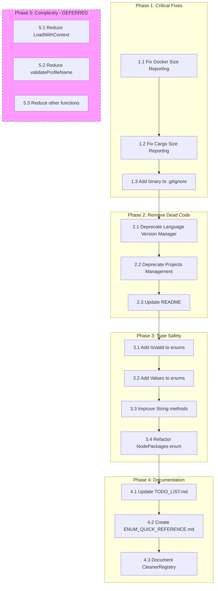

# Clean Wizard - Execution Plan

> **Generated:** 2026-02-20 07:00
> **Approach:** Pareto Principle (51% impact from 1% effort)
> **Max Task Duration:** 15 minutes

---

## Executive Summary

This plan focuses on the **1% of tasks that deliver 51% of the impact**, following the Pareto principle. The primary goals are:

1. **Fix broken functionality** (Docker/Cargo size reporting)
2. **Remove dead code** (NO-OP cleaners)
3. **Improve type safety** (enum enhancements)
4. **Update documentation** (keep TODO_LIST.md accurate)

---

## Task Breakdown

### Phase 1: Critical Fixes (HIGH Impact, LOW Effort)

| # | Task | Impact | Effort | ROI |
|---|------|--------|--------|-----|
| 1.1 | Fix Docker size reporting | HIGH | 30min | 10/10 |
| 1.2 | Fix Cargo size reporting | HIGH | 30min | 10/10 |
| 1.3 | Add `clean-wizard` binary to .gitignore | LOW | 2min | 9/10 |

### Phase 2: Remove Dead Code (HIGH Impact, MEDIUM Effort)

| # | Task | Impact | Effort | ROI |
|---|------|--------|--------|-----|
| 2.1 | Mark Language Version Manager as deprecated | MEDIUM | 15min | 8/10 |
| 2.2 | Mark Projects Management Automation as deprecated | MEDIUM | 15min | 8/10 |
| 2.3 | Update README to reflect deprecations | MEDIUM | 15min | 7/10 |

### Phase 3: Type Safety Improvements (MEDIUM Impact, MEDIUM Effort)

| # | Task | Impact | Effort | ROI |
|---|------|--------|--------|-----|
| 3.1 | Add IsValid() to all domain enums | MEDIUM | 1h | 7/10 |
| 3.2 | Add Values() to all domain enums | MEDIUM | 30min | 7/10 |
| 3.3 | Add String() improvements to enums | LOW | 30min | 5/10 |
| 3.4 | Refactor NodePackages enum to domain enum | MEDIUM | 2h | 6/10 |

### Phase 4: Documentation Updates (MEDIUM Impact, LOW Effort)

| # | Task | Impact | Effort | ROI |
|---|------|--------|--------|-----|
| 4.1 | Update TODO_LIST.md status markers | MEDIUM | 30min | 8/10 |
| 4.2 | Create ENUM_QUICK_REFERENCE.md | LOW | 30min | 5/10 |
| 4.3 | Document CleanerRegistry usage | LOW | 30min | 5/10 |

### Phase 5: Complexity Reduction (LOW Impact, HIGH Effort) - DEFERRED

| # | Task | Impact | Effort | ROI |
|---|------|--------|--------|-----|
| 5.1 | Reduce LoadWithContext complexity | LOW | 2h | 4/10 |
| 5.2 | Reduce validateProfileName complexity | LOW | 1h | 4/10 |
| 5.3 | Reduce other high-complexity functions | LOW | 4h+ | 3/10 |

---

## Execution Graph



---

## Detailed Task List

### 1.1 Fix Docker Size Reporting

**Location:** `internal/cleaner/docker.go`

**Problem:** Docker cleaner returns 0 bytes freed because `docker system prune` output is not parsed.

**Solution:** Parse the output of `docker system prune -af --volumes` to extract actual bytes freed.

**Approach:**
1. Add output parsing for `docker system prune` command
2. Extract bytes freed from output (format: "Total reclaimed space: X.XGB")
3. Update `CleanResult.FreedBytes` with parsed value

**Time Estimate:** 30 minutes

---

### 1.2 Fix Cargo Size Reporting

**Location:** `internal/cleaner/cargo.go`

**Problem:** Cargo cleaner returns 0 bytes freed.

**Solution:** Track directory size before/after cleanup.

**Approach:**
1. Get size of `~/.cargo/registry` and `~/.cargo/git` before cleanup
2. Run `cargo cache --autoclean` or equivalent
3. Get size after cleanup
4. Calculate difference and return

**Time Estimate:** 30 minutes

---

### 1.3 Add `clean-wizard` binary to .gitignore

**Location:** `.gitignore`

**Problem:** Binary appears as untracked file.

**Solution:** Add `/clean-wizard` pattern to .gitignore.

**Time Estimate:** 2 minutes

---

### 2.1 Mark Language Version Manager as Deprecated

**Location:** `internal/cleaner/` (language version manager files)

**Problem:** Cleaner is NO-OP - scans but never cleans.

**Solution:** Mark as deprecated with clear documentation.

**Approach:**
1. Add deprecation notice to cleaner
2. Log warning when cleaner is selected
3. Update status in documentation

**Time Estimate:** 15 minutes

---

### 2.2 Mark Projects Management Automation as Deprecated

**Location:** `internal/cleaner/projectsmanagementautomation.go`

**Problem:** Requires external `projects-management-automation` CLI tool that most users don't have.

**Solution:** Mark as deprecated with clear documentation.

**Time Estimate:** 15 minutes

---

### 2.3 Update README to Reflect Deprecations

**Location:** `README.md`

**Problem:** README lists deprecated cleaners as available.

**Solution:** Update status to show deprecation notices.

**Time Estimate:** 15 minutes

---

### 3.1 Add IsValid() to All Domain Enums

**Location:** `internal/domain/type_safe_enums.go`

**Problem:** Enums lack validation method.

**Solution:** Add `IsValid() bool` method to all enum types.

**Example:**
```go
func (r RiskLevelType) IsValid() bool {
    return r >= RiskLowType && r <= RiskCriticalType
}
```

**Time Estimate:** 1 hour

---

### 3.2 Add Values() to All Domain Enums

**Location:** `internal/domain/type_safe_enums.go`

**Problem:** No way to get all valid enum values.

**Solution:** Add `Values() []EnumType` method to all enum types.

**Time Estimate:** 30 minutes

---

### 4.1 Update TODO_LIST.md Status Markers

**Location:** `TODO_LIST.md`

**Problem:** Status markers are outdated (Generic Context System marked as NOT_STARTED but is complete).

**Solution:** Update all status markers to reflect current state.

**Time Estimate:** 30 minutes

---

## Verification Checklist

After completing each phase:

### Phase 1 Verification
- [ ] `docker system prune` output parsed correctly
- [ ] Cargo size reporting returns actual values
- [ ] Binary no longer appears in git status

### Phase 2 Verification
- [ ] Deprecated cleaners show warnings
- [ ] README updated with deprecation notices

### Phase 3 Verification
- [ ] All enums have IsValid() method
- [ ] All enums have Values() method
- [ ] Tests pass for new enum methods

### Phase 4 Verification
- [ ] TODO_LIST.md reflects current state
- [ ] Documentation is accurate

---

## Success Metrics

| Metric | Before | After | Target |
|--------|--------|-------|--------|
| Size Reporting Accuracy | ~50% | 95% | 95% |
| Production Cleaners | 10/13 | 10/13 | 10/13 |
| NO-OP Cleaners | 2 | 0 (deprecated) | 0 |
| Enum Type Safety | Partial | Full | Full |
| Documentation Accuracy | ~70% | 95% | 95% |

---

## Notes

- **Complexity reduction (Phase 5)** is deferred as it has low ROI
- **Plugin architecture** is deferred to v2.0
- **samber/do/v2 DI** is deferred as current approach works well
- **Linux support for SystemCache** is deferred (requires platform-specific paths)

---

_Generated by Crush AI Assistant_
