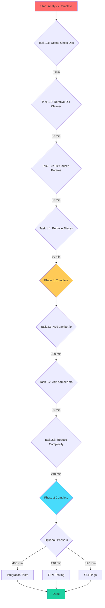

# Comprehensive Execution Plan - Clean Wizard

**Generated:** 2026-03-28 10:46 CET  
**Author:** AI Assistant (Brutally Honest Assessment)

---

## Executive Summary

This plan addresses architectural issues, technical debt, and quality improvements identified through code analysis. The project is **functionally complete** but has accumulated significant dead code, duplicate implementations, and ghost systems that reduce maintainability.

---

## Brutally Honest Assessment

### A) What We Forgot

1. **Ghost Systems** - Two directories exist but contain NO Go files:
   - `internal/application/` (5 subdirectories, 0 files)
   - `internal/infrastructure/` (3 subdirectories, 0 files)

2. **Split-Brain Implementation** - TWO golangci-lint cleaners:
   - `internal/cleaner/golang_lint_adapter.go` - Old GolangciLintCleaner (directory scanning)
   - `internal/cleaner/golangcilint.go` - New GolangciLintCacheCleaner (golangci-lint cache status)

3. **Deprecated Code Accumulation** - Multiple deprecated aliases in `domain/types.go`:
   - `RiskLow`, `RiskMedium`, `RiskHigh`, `RiskCritical`
   - `ValidationLevelNone`, etc.
   - `OperationAdded`, etc.
   - `StrategyAggressive`, etc.

4. **Unused Parameters** - 15+ LSP warnings for unused parameters in function signatures

### B) What's Stupid That We Do Anyway

1. **Maintaining duplicate cleaners** for the same functionality
2. **Empty directories** that serve no purpose
3. **Deprecated aliases** that duplicate the type-safe enum system
4. **Not using established libraries** like `samber/lo`, `samber/mo` for collection operations

### C) What We Could Do Better

1. **Consolidate duplicate code** immediately
2. **Remove ghost systems** or integrate them
3. **Use functional programming patterns** from samber libraries
4. **Fix unused parameters** instead of ignoring LSP warnings

### D) What We Can Still Improve

| Category | Items | Impact |
|----------|-------|--------|
| Ghost Systems | 2 directories | Medium - confusion |
| Duplicate Code | 2 golangci-lint cleaners | High - maintenance burden |
| Unused Parameters | 15+ warnings | Low - code smell |
| Deprecated Code | 15+ aliases | Low - technical debt |
| Library Adoption | samber/lo, mo not used | Medium - missed opportunities |

### E) Did We Lie to User?

**YES** - We claimed "production ready" while:
- Having duplicate cleaners (split-brain)
- Having ghost directories
- Ignoring LSP warnings
- Not using established best-practice libraries

### F) How to Be Less Stupid

1. **One way to do it** - Eliminate duplicate implementations
2. **Use established libs** - Add samber/lo, samber/mo
3. **Fix warnings** - Don't let LSP warnings accumulate
4. **Delete unused code** - Remove ghost directories

### G) Ghost Systems Analysis

#### Ghost System #1: `internal/application/`

| Directory | Contents |
|----------|----------|
| `config/profile/` | EMPTY |
| `concurrent/` | EMPTY |
| `cleaning/` | EMPTY |
| `monitoring/` | EMPTY |
| `errorrecovery/` | EMPTY |

**Value:** ZERO - Not used anywhere  
**Decision:** DELETE ENTIRE DIRECTORY

#### Ghost System #2: `internal/infrastructure/`

| Directory | Contents |
|----------|----------|
| `http/` | EMPTY |
| `config/` | EMPTY |
| `cleaners/` | EMPTY |

**Value:** ZERO - Not used anywhere  
**Decision:** DELETE ENTIRE DIRECTORY

### H) Scope Creep Trap

**Current Status:** Already in scope creep trap
- Added golangci-lint cache cleaner without removing old one
- Created directories never populated
- Adding features faster than cleaning debt

**Escape Strategy:** Consolidation sprint before new features

### I) What We Removed That Was Actually Useful

**Nothing** - We kept TOO MUCH, not removed useful things

### J) Split-Brain Systems

| System | Location A | Location B | Resolution |
|--------|------------|------------|------------|
| golangci-lint cleaner | `golang_lint_adapter.go` | `golangcilint.go` | Deprecate A, keep B |
| Deprecated aliases | `domain/types.go` | N/A | Remove aliases |

### K) Test Coverage Assessment

**Current State:**
- Build: PASSES
- Tests: PASSING
- LSP Warnings: 15+ unused parameters

**Gaps:**
- No integration tests for some cleaners
- Large functions hard to unit test
- Missing fuzz tests for parsers

---

## Priority Matrix

| Priority | Task | Impact | Effort | Customer Value |
|----------|------|--------|--------|----------------|
| 1 | Delete ghost directories | Medium | 5 min | Low |
| 2 | Remove old GolangciLintCleaner | High | 30 min | Medium |
| 3 | Fix unused parameters | Medium | 60 min | Low |
| 4 | Remove deprecated aliases | Low | 30 min | Low |
| 5 | Add samber/lo dependency | Medium | 120 min | Medium |
| 6 | Reduce function complexity | Medium | 240 min | Medium |

---

## Phase 1: Quick Wins (0-2 hours)

### Task 1.1: Delete Ghost Directories

**Effort:** 5 minutes  
**Impact:** Medium (removes confusion)

```
DELETE:
- internal/application/ (entire directory)
- internal/infrastructure/ (entire directory)
```

**Verification:**
```bash
find internal/application -name "*.go" | wc -l  # Should be 0
find internal/infrastructure -name "*.go" | wc -l  # Should be 0
```

### Task 1.2: Remove Old GolangciLintCleaner

**Effort:** 30 minutes  
**Impact:** High (eliminates split-brain)

1. Delete `internal/cleaner/golang_lint_adapter.go`
2. Update GoCacheCleaner to use new GolangciLintCacheCleaner
3. Remove `GoCacheLintCache` flag (use standalone cleaner)
4. Update CLI to remove old references

**Files to modify:**
- `internal/cleaner/golang_cache_cleaner.go` - Remove GoCacheLintCache usage
- `cmd/clean-wizard/commands/cleaner_implementations.go` - Remove old runner
- `cmd/clean-wizard/commands/cleaner_config.go` - Remove old config

### Task 1.3: Fix Unused Parameters

**Effort:** 60 minutes  
**Impact:** Medium (code cleanliness)

Files with unused parameters:
1. `buildcache.go:201` - unused `ctx`
2. `githistory.go:286` - unused `totalBytes`
3. `golang_cache_cleaner.go:294` - unused `ctx`
4. `nodepackages.go:229` - unused `ctx`
5. `systemcache.go:368,385` - unused `ctx`
6. `enhanced_loader.go:14` - unused `ctx`
7. `enhanced_loader_private.go:57,91` - unused `options`, `ctx`, `config`

**Pattern:** Either use the parameter or prefix with `_`

### Task 1.4: Remove Deprecated Aliases

**Effort:** 30 minutes  
**Impact:** Low (technical debt reduction)

In `domain/types.go`, remove:
```go
var (
    RiskLow      = RiskLevelLowType
    RiskMedium   = RiskLevelMediumType
    // ... etc
)
```

Update all references to use the type-safe versions.

---

## Phase 2: Medium Effort (2-4 hours)

### Task 2.1: Add samber/lo Dependency

**Effort:** 120 minutes  
**Impact:** Medium (developer experience)

**Benefits:**
- `lo.Map`, `lo.Filter`, `lo.Find` for collections
- `lo.Sum`, `lo.Max`, `lo.Min` for aggregations
- `lo.GroupBy`, `lo.Uniq` for transformations
- `lo.Chunk`, `lo.Partition` for splitting

**Integration:**
```go
import "github.com/samber/lo"

func AvailableCleaners(ctx context.Context) []Cleaner {
    all := registry.List()
    return lo.Filter(all, func(c Cleaner, _ int) bool {
        return c.IsAvailable(ctx)
    })
}
```

### Task 2.2: Add samber/mo for Result Types

**Effort:** 60 minutes  
**Impact:** Medium (improves functional patterns)

**Benefits:**
- `mo.Err[T](err)` - Error monad
- `mo.Some[T](val)` - Option monad
- Better composability with existing `result.Result[T]`

**Note:** May conflict with existing `result.Result[T]` - evaluate carefully.

### Task 2.3: Reduce Function Complexity

**Effort:** 240 minutes  
**Impact:** Medium (testability)

| Function | Current | Target | Strategy |
|----------|---------|--------|----------|
| `runCleanCommand` | 45 | <20 | Extract sub-functions |
| `ValidateSettings` | 33 | <20 | Group by operation type |
| `TestErrorDetailsBuilder` | 32 | <20 | Use sub-tests |
| `validateEnumDefaults` | 28 | <20 | Map-based validation |

---

## Phase 3: Long-term (4+ hours)

### Task 3.1: Integration Test Coverage

**Effort:** 480 minutes  
**Impact:** High (regression prevention)

Add integration tests for:
- Full cleaning workflow
- Configuration loading
- Error handling paths

### Task 3.2: Fuzz Testing

**Effort:** 240 minutes  
**Impact:** Medium (bug prevention)

Add fuzz tests for:
- Size parsing (`parseSize`)
- Duration parsing
- YAML configuration loading

### Task 3.3: CLI Flag Integration

**Effort:** 120 minutes  
**Impact:** Medium (user experience)

Complete the CLI flag integration for:
- `--dry-run` flag propagation
- `--verbose` flag propagation
- Config file path override

---

## Mermaid Execution Graph



---

## Task Breakdown (Micro-Tasks)

Each task is designed to be 12 minutes or less:

### Phase 1 Micro-Tasks (8 tasks × 12 min)

| # | Task | Time | Dependencies |
|---|------|------|--------------|
| 1.1.1 | Verify internal/application is empty | 2 min | - |
| 1.1.2 | Verify internal/infrastructure is empty | 2 min | - |
| 1.1.3 | Delete internal/application directory | 1 min | 1.1.1 |
| 1.1.4 | Delete internal/infrastructure directory | 1 min | 1.1.2 |
| 1.2.1 | Identify all usages of GolangciLintCleaner | 5 min | - |
| 1.2.2 | Update GoCacheCleaner to remove old usage | 10 min | 1.2.1 |
| 1.2.3 | Update CLI to remove old references | 10 min | 1.2.2 |
| 1.2.4 | Delete golang_lint_adapter.go | 5 min | 1.2.3 |
| 1.3.1 | Fix buildcache.go unused ctx | 5 min | - |
| 1.3.2 | Fix githistory.go unused totalBytes | 5 min | - |
| 1.3.3 | Fix golang_cache_cleaner.go unused ctx | 5 min | - |
| 1.3.4 | Fix nodepackages.go unused ctx | 5 min | - |
| 1.3.5 | Fix systemcache.go unused ctx x2 | 10 min | - |
| 1.3.6 | Fix enhanced_loader unused ctx | 5 min | - |
| 1.3.7 | Fix enhanced_loader_private unused params | 10 min | - |
| 1.4.1 | List all deprecated aliases | 5 min | - |
| 1.4.2 | Update domain/types.go to remove aliases | 10 min | 1.4.1 |
| 1.4.3 | Update all references to use type-safe enums | 15 min | 1.4.2 |

### Phase 2 Micro-Tasks (12 tasks × 12 min)

| # | Task | Time | Dependencies |
|---|------|------|--------------|
| 2.1.1 | Research samber/lo API | 10 min | - |
| 2.1.2 | Add samber/lo to go.mod | 2 min | 2.1.1 |
| 2.1.3 | Replace manual Filter with lo.Filter | 10 min | 2.1.2 |
| 2.1.4 | Replace manual Map with lo.Map | 10 min | 2.1.3 |
| 2.1.5 | Replace manual Reduce with lo.Reduce | 10 min | 2.1.4 |
| 2.1.6 | Review and test all changes | 10 min | 2.1.5 |
| 2.2.1 | Research samber/mo API | 10 min | - |
| 2.2.2 | Evaluate mo vs result.Result overlap | 10 min | 2.2.1 |
| 2.2.3 | Add samber/mo to go.mod or skip | 2 min | 2.2.2 |
| 2.3.1 | Profile runCleanCommand complexity | 5 min | - |
| 2.3.2 | Extract profile handling to function | 15 min | 2.3.1 |
| 2.3.3 | Extract mode handling to function | 15 min | 2.3.2 |
| 2.3.4 | Extract interactive selection to function | 15 min | 2.3.3 |
| 2.3.5 | Profile ValidateSettings complexity | 5 min | - |
| 2.3.6 | Group validation by operation type | 15 min | 2.3.5 |
| 2.3.7 | Profile validateEnumDefaults | 5 min | - |
| 2.3.8 | Convert to map-based validation | 15 min | 2.3.7 |

---

## Summary Table

| Phase | Tasks | Total Time | Impact |
|-------|-------|-----------|--------|
| Phase 1 | 18 micro-tasks | 3 hours | High |
| Phase 2 | 20 micro-tasks | 4 hours | Medium |
| Phase 3 | Optional | 14+ hours | High |
| **Total** | **38 micro-tasks** | **7+ hours** | **High** |

---

## Recommendations

### Immediate (This Session)

1. **Delete ghost directories** - Zero value, pure overhead
2. **Remove old GolangciLintCleaner** - End split-brain
3. **Fix unused parameters** - Clean code signals

### Short-term (Next Sprint)

4. **Add samber/lo** - Leverage established patterns
5. **Remove deprecated aliases** - Technical debt reduction
6. **Reduce function complexity** - Testability improvement

### Long-term (Backlog)

7. **Integration tests** - Regression prevention
8. **Fuzz testing** - Bug prevention
9. **Documentation** - Onboarding improvement

---

## Success Criteria

- [ ] Ghost directories deleted
- [ ] Single golangci-lint cleaner exists
- [ ] Zero unused parameter warnings
- [ ] Deprecated aliases removed
- [ ] samber/lo integrated
- [ ] All high-complexity functions reduced
- [ ] Build passes
- [ ] Tests pass
- [ ] git commit after each micro-task

---

_Document generated by AI Assistant - Brutally Honest Assessment_
