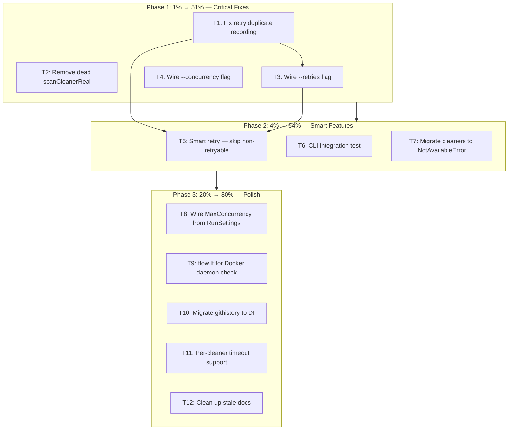

# DI + Workflow Hardening — Pareto Execution Plan

**Created:** 2026-07-06 02:22
**Status:** Planning
**Goal:** Fix bugs, wire dead infra, add tests, deliver user value — without over-engineering

---

## Pareto Breakdown

### The 1% that delivers 51% of the result

These are correctness bugs and wiring gaps where the infrastructure exists but is broken or unused:

1. **Fix retry duplicate recording** — `makeCleanStepFunc` calls `collector.record()` on every retry attempt → duplicate entries corrupt `WorkflowResult`
2. **Wire `--retries` flag** — `RetryConfig` + `retryOptions` exist but no command passes them
3. **Wire `--concurrency` flag** — `MaxConcurrency` field + `WithMaxConcurrency` exist but no command uses them
4. **Remove dead `scanCleanerReal`** — 50-line dead function, zero callers after scan migration

### The 4% that delivers 64% of the result

5. **Smart retry: skip non-retryable errors** — wire `cleaner.IsNotAvailableError` into `NextBackOff` so retries don't waste time on "cargo not installed"
6. **CLI integration test** — invoke `clean --dry-run` through the full cobra → DI → workflow → display pipeline
7. **Migrate key cleaners to `*NotAvailableError`** — at least Cargo, Docker, Homebrew, Go, Nix

### The 20% that delivers 80% of the result

8. **Wire `MaxConcurrency` from `RunSettings`** into clean/scan commands
9. **Add `flow.If` for Docker** — check daemon running before executing
10. **Migrate `githistory` command to DI** — consistency
11. **Per-cleaner timeout** via `flow.Timeout` with config-driven defaults
12. **Clean up stale documentation** — remove references to deleted types

### Explicitly NOT doing (over-engineering / Verschlimmbesserung risk)

- Register individual cleaners as separate DI providers (huge refactor, zero user value today)
- Make adapters interface-backed with `do.As` (premature abstraction)
- `do.ShutdownerWithError` on adapters (no resources to shut down)
- Consolidate `cleaner.Cleaner` vs `domain.OperationHandler` (risky, low value)
- Progress TUI (nice to have, not critical)
- Resume/checkpoint support (YAGNI)
- `do.ExplainInjector` debug output (YAGNI)
- DI audit log (YAGNI)
- Application-global DI bootstrap (per-command is fine for a CLI tool)

---

## Mermaid Execution Graph

---

## Phase 1: 1% → 51% (4 tasks, ~40min each)

| #   | Task                                                      | Impact   | Effort | File                   |
| --- | --------------------------------------------------------- | -------- | ------ | ---------------------- |
| T1  | Fix retry duplicate recording — only record final outcome | CRITICAL | 15min  | `execution/builder.go` |
| T2  | Remove dead `scanCleanerReal` function                    | HIGH     | 5min   | `scan.go`              |
| T3  | Wire `--retries` CLI flag to `RetryConfig`                | HIGH     | 15min  | `clean.go`             |
| T4  | Wire `--concurrency` CLI flag to `MaxConcurrency`         | HIGH     | 15min  | `clean.go`, `scan.go`  |

## Phase 2: 4% → 64% (3 tasks, ~40min each)

| #   | Task                                                                     | Impact | Effort | File                                        |
| --- | ------------------------------------------------------------------------ | ------ | ------ | ------------------------------------------- |
| T5  | Smart retry — `IsNotAvailableError` in `NextBackOff` stops non-retryable | HIGH   | 20min  | `execution/retry.go`                        |
| T6  | CLI integration test — `clean --dry-run` full pipeline                   | HIGH   | 30min  | `execution/integration_test.go`             |
| T7  | Migrate 5 key cleaners to return `*NotAvailableError`                    | MEDIUM | 30min  | `cleaner/{cargo,docker,homebrew,go,nix}.go` |

## Phase 3: 20% → 80% (5 tasks, ~30-60min each)

| #   | Task                                                 | Impact | Effort | File                   |
| --- | ---------------------------------------------------- | ------ | ------ | ---------------------- |
| T8  | Wire `MaxConcurrency` from `RunSettings` in commands | MEDIUM | 10min  | `clean.go`, `scan.go`  |
| T9  | `flow.If` for Docker — check daemon before executing | MEDIUM | 20min  | `execution/builder.go` |
| T10 | Migrate `githistory` command to use DI               | LOW    | 15min  | `githistory.go`        |
| T11 | Per-cleaner timeout via config-driven `flow.Timeout` | MEDIUM | 30min  | `execution/builder.go` |
| T12 | Clean up stale docs + update AGENTS.md               | LOW    | 10min  | docs                   |

---

## Sub-Task Breakdown (max 15min each)

### T1: Fix retry duplicate recording (3 sub-tasks)

| #    | Sub-task                                                                                                    | File                  | Time  |
| ---- | ----------------------------------------------------------------------------------------------------------- | --------------------- | ----- |
| T1.1 | Change `makeCleanStepFunc` to use a "last result" pattern — store result in closure, record only in `defer` | `builder.go`          | 10min |
| T1.2 | Add test: retry with 2 failures then success → verify single step entry                                     | `integration_test.go` | 10min |
| T1.3 | Run full test suite to verify no regressions                                                                | -                     | 5min  |

### T2: Remove dead scanCleanerReal (2 sub-tasks)

| #    | Sub-task                                                        | File      | Time |
| ---- | --------------------------------------------------------------- | --------- | ---- |
| T2.1 | Delete `scanCleanerReal` function + `getRegistryName` if unused | `scan.go` | 5min |
| T2.2 | Verify build + test                                             | -         | 5min |

### T3: Wire --retries flag (3 sub-tasks)

| #    | Sub-task                                                        | File       | Time  |
| ---- | --------------------------------------------------------------- | ---------- | ----- |
| T3.1 | Add `--retries` int flag to clean command                       | `clean.go` | 5min  |
| T3.2 | Build `RetryConfig` from flag, pass via `execution.WithRetry()` | `clean.go` | 10min |
| T3.3 | Verify build + run `clean --dry-run --retries 2`                | -          | 5min  |

### T4: Wire --concurrency flag (3 sub-tasks)

| #    | Sub-task                                                         | File                  | Time  |
| ---- | ---------------------------------------------------------------- | --------------------- | ----- |
| T4.1 | Add `--concurrency` int flag to clean + scan commands            | `clean.go`, `scan.go` | 10min |
| T4.2 | Pass via `execution.WithMaxConcurrency()` + set in `RunSettings` | `clean.go`, `scan.go` | 10min |
| T4.3 | Verify build                                                     | -                     | 5min  |

### T5: Smart retry — skip non-retryable (3 sub-tasks)

| #    | Sub-task                                                                                           | File                  | Time  |
| ---- | -------------------------------------------------------------------------------------------------- | --------------------- | ----- |
| T5.1 | Add `NextBackOff` hook to `retryOptions` that calls `cleaner.IsNotAvailableError` → `backoff.Stop` | `retry.go`            | 10min |
| T5.2 | Add test: NotAvailable error + retries enabled → verify 1 attempt only                             | `integration_test.go` | 10min |
| T5.3 | Run test suite                                                                                     | -                     | 5min  |

### T6: CLI integration test (4 sub-tasks)

| #    | Sub-task                                                                                  | File                                 | Time  |
| ---- | ----------------------------------------------------------------------------------------- | ------------------------------------ | ----- |
| T6.1 | Create test that calls `runCleanCommand` with `--dry-run --json` and verifies JSON output | `commands/clean_integration_test.go` | 15min |
| T6.2 | Add test for `runScanCommand` with `--json`                                               | `commands/scan_integration_test.go`  | 15min |
| T6.3 | Add test for empty selection (no cleaners available)                                      | same                                 | 10min |
| T6.4 | Run suite                                                                                 | -                                    | 5min  |

### T7: Migrate cleaners to NotAvailableError (5 sub-tasks)

| #    | Sub-task                                                                | File                          | Time  |
| ---- | ----------------------------------------------------------------------- | ----------------------------- | ----- |
| T7.1 | Migrate `cargo.go` to return `&NotAvailableError{CleanerName: "cargo"}` | `cargo.go`                    | 5min  |
| T7.2 | Migrate `docker.go`                                                     | `docker.go`                   | 5min  |
| T7.3 | Migrate `homebrew.go`                                                   | `homebrew.go`                 | 5min  |
| T7.4 | Migrate `nix.go` + `golang_cleaner.go`                                  | `nix.go`, `golang_cleaner.go` | 10min |
| T7.5 | Run cleaner tests to verify                                             | -                             | 10min |

### T8: Wire MaxConcurrency from RunSettings (2 sub-tasks)

| #    | Sub-task                                                   | File                  | Time  |
| ---- | ---------------------------------------------------------- | --------------------- | ----- |
| T8.1 | Set `RunSettings.MaxConcurrency` from `--concurrency` flag | `clean.go`, `scan.go` | 10min |
| T8.2 | Verify build                                               | -                     | 5min  |

### T9: flow.If for Docker (3 sub-tasks)

| #    | Sub-task                                                                                              | File        | Time  |
| ---- | ----------------------------------------------------------------------------------------------------- | ----------- | ----- |
| T9.1 | Add `IsDockerRunning(ctx)` helper in `cleaner/docker.go`                                              | `docker.go` | 10min |
| T9.2 | Add conditional skip in Docker cleaner's `Clean()` if daemon not running → return `NotAvailableError` | `docker.go` | 10min |
| T9.3 | Test                                                                                                  | -           | 5min  |

### T10: Migrate githistory to DI (3 sub-tasks)

| #     | Sub-task                                                        | File            | Time  |
| ----- | --------------------------------------------------------------- | --------------- | ----- |
| T10.1 | Create DI container in `runGitHistoryCommand`, resolve registry | `githistory.go` | 10min |
| T10.2 | Replace direct constructor calls with registry lookups          | `githistory.go` | 10min |
| T10.3 | Verify build + test                                             | -               | 5min  |

### T11: Per-cleaner timeout (4 sub-tasks)

| #     | Sub-task                                            | File                   | Time  |
| ----- | --------------------------------------------------- | ---------------------- | ----- |
| T11.1 | Add `TimeoutConfig` to execution options            | `execution/options.go` | 5min  |
| T11.2 | Wire `flow.Timeout` per step in builder from config | `execution/builder.go` | 10min |
| T11.3 | Add `--timeout` flag to clean command               | `clean.go`             | 10min |
| T11.4 | Test                                                | -                      | 10min |

### T12: Clean up docs (3 sub-tasks)

| #     | Sub-task                                       | File           | Time  |
| ----- | ---------------------------------------------- | -------------- | ----- |
| T12.1 | Update AGENTS.md with final architecture state | `AGENTS.md`    | 10min |
| T12.2 | Write final status report                      | `docs/status/` | 10min |
| T12.3 | Commit + push                                  | -              | 5min  |

---

## Summary: 12 tasks → 40 sub-tasks

| Phase       | Tasks  | Sub-tasks | Est. Time   |
| ----------- | ------ | --------- | ----------- |
| 1 (1%→51%)  | 4      | 11        | ~100min     |
| 2 (4%→64%)  | 3      | 17        | ~120min     |
| 3 (20%→80%) | 5      | 12        | ~120min     |
| **Total**   | **12** | **40**    | **~340min** |
