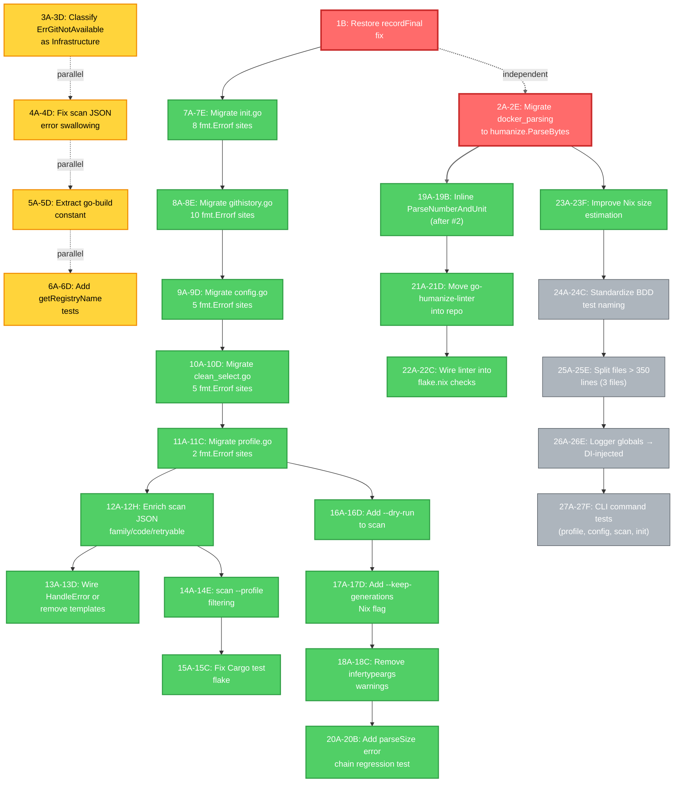

# Pareto Execution Plan: 2026-08-10 — Roadmap to Production-Ready

**Date:** 2026-08-10 12:44
**Status:** PLANNING — Awaiting approval
**Goal:** Close the 26-item TODO list in dependency order, prioritizing customer-visible defects and architectural debt that blocks future work
**Method:** Pareto (1%/4%/20%) → Medium-granularity tasks (30–100min) → Fine-granularity tasks (≤12min)

---

## Step 1: Pareto Breakdown

### The 1% that delivers 51% — **TODO #9: Migrate `docker_parsing.go` sizeMultiplier to `humanize.ParseBytes`** (H007 violation)

**Why this is the 1%:** Exact same pattern as `b7692ff` (just shipped, 2026-08-05). LOW effort (~30min), MED impact, and **unblocks TODO #17/#18** (move go-humanize-linter into repo + wire to flake.nix checks). Closes the H007 gap entirely; the linter cannot regress what it doesn't see.

| Sub-task                                                       | Time   |
| -------------------------------------------------------------- | ------ |
| Read `docker_parsing.go:37-43` + `ParseDockerSize`              | 5 min  |
| Replace `sizeMultiplier` map + `ParseDockerSize` body with `humanize.ParseBytes` | 25 min |
| Run `go-humanize-linter .` → confirm 0 findings               | 5 min  |
| Run `go test ./internal/cleaner/ -short` → confirm green      | 5 min  |

### The 4% that delivers 64% — **4 quick wins that compound on #9**

| Sub-task                                                       | Time   | Why                                                  |
| -------------------------------------------------------------- | ------ | ---------------------------------------------------- |
| **TODO #2**: Classify `ErrGitNotAvailable` as Infrastructure    | 10 min | One-line change in `githistory.go:22`. Users hitting `clean` see exit code 75 (Transient) when the tool is missing — should be 69 (Infrastructure) = no retry, clear error |
| **TODO #4**: Fix scan JSON swallowing marshal errors            | 15 min | `scan.go:274` `outputScanJSON` silently prints error and returns nil — `clean.go` propagates correctly. Two paths, one bug. |
| **TODO #14**: Extract `"go-build*"` string constant             | 10 min | One goconst lint violation. 30s grep, 5min rename.   |
| **TODO #16**: Add tests for `getRegistryName` reverse lookup   | 30 min | `scan.go:246` `getRegistryName(cleanerType)` is a reverse map lookup. Adding 8 test cases catches future regressions. |

### The 20% that delivers 80% — **5 medium-effort items that close the customer-visible error story**

| Sub-task                                                       | Time   | Why                                                  |
| -------------------------------------------------------------- | ------ | ---------------------------------------------------- |
| **TODO #1a**: Migrate `init.go` (8 sites) to `errorfamily.Wrap*` | 45 min | All init errors are user input errors → Rejection. Currently classified Transient → wastes retry budget |
| **TODO #1b**: Migrate `githistory.go` (10 sites)                | 60 min | Mixed Rejection/Transient. Same logic.              |
| **TODO #1c**: Migrate `config.go` (5 sites)                     | 30 min | Mostly Rejection. Easy.                              |
| **TODO #1d**: Migrate `clean_select.go` (5 sites)               | 30 min | Rejection. Profile/form errors.                      |
| **TODO #1e**: Migrate `profile.go` (2 sites)                    | 15 min | Rejection. Quick.                                    |
| **TODO #3**: Enrich scan JSON with `family`/`code`/`retryable`  | 60 min | Mirror `format.CleanResultsToJSON` schema. One schema across clean+scan. |
| **TODO #5**: Wire `errorfamily.HandleError` or remove templates | 30 min | 3 templates registered but never consumed. Decide: wire `HandleErrorDetailed` into `main.go` (replaces `LogError`) or delete. |
| **TODO #10**: `scan --profile` filtering or remove the flag     | 90 min | Profile-based cleaner filtering. BuildFilter helper. Reuse from `clean` selection logic. |
| **TODO #24**: Fix `TestBooleanSettingsCleaners/Cargo` flake     | 30 min | Test expects 1, cleaner counts 2 (registry + git). Update test expectation OR consolidate counting. |

### The other 20% to get to 100% — **remaining items**

| Item                                                          | Time   | Why deferred                            |
| ------------------------------------------------------------- | ------ | --------------------------------------- |
| **TODO #6**: Wire `OperationSettings` from YAML → constructors | 4 hours | Architectural. Blocks #29.              |
| **TODO #11**: Logger globals → DI-injected                    | 4 hours | Architectural. Tests would re-enable `t.Parallel()`. |
| **TODO #12**: Split files > 350 lines (3 files: `compiledbinaries.go` 551, `docker.go` 531, `nodepackages.go` 532) | 3 hours | Mechanical. Pure refactor.              |
| **TODO #13**: Add CLI command tests (profile, config, scan, init) | 6 hours | Boilerplate per command.                |
| **TODO #7**: BDD tests for execution layer (Ginkgo)            | 4 hours | Requires Ginkgo scenario design.        |
| **TODO #8**: BDD tests for Docker, Homebrew, Go cleaners       | 8 hours | Per-cleaner scenarios.                  |
| **TODO #15**: Improve Nix size estimation (replace 50MB hardcode) | 2 hours | Use `nix-store --query` real sizes.     |
| **TODO #17**: Move go-humanize-linter into repo                | 1 hour | Reproducible CI.                        |
| **TODO #18**: Wire go-humanize-linter into `flake.nix` checks  | 1 hour | Quality gate.                          |
| **TODO #19**: Remove `infertypeargs` warnings (15+ places)     | 30 min | Mechanical.                            |
| **TODO #20**: Gherkin `.feature` files for top 3 cleaners       | 2 hours | BDD.                                   |
| **TODO #21**: Standardize BDD test naming                      | 1 hour | Mechanical.                            |
| **TODO #22**: `--dry-run` on scan command                      | 30 min | Mirror `clean` flag.                    |
| **TODO #23**: `--keep-generations` flag for Nix cleaner         | 30 min | One new flag + plumb through.           |
| **TODO #25**: Inline or delete `ParseNumberAndUnit` in `fsutil.go:483` | 15 min | Single callsite after #9.               |
| **TODO #26**: Regression test for `parseSize("garbage")`       | 15 min | Verify error chain.                    |
| **TODO #27**: Split `internal/domain/` god package (23 files)  | 8 hours | Architectural. Large refactor.          |
| **TODO #28**: Split `internal/cleaner/` flat (50+ files)       | 8 hours | Architectural. Large refactor.          |
| **TODO #29**: Register individual cleaners as DI providers     | 4 hours | Depends on #6.                          |
| **TODO #30**: Interface-backed adapters with `do.As`            | 4 hours | Depends on #29.                         |

---

## Step 2: Comprehensive Plan — Medium Granularity (30–100 min tasks)

| #   | Task                                                              | Effort | Impact | Customer Value | Priority     | Tier | Blocked By |
| --- | ----------------------------------------------------------------- | ------ | ------ | -------------- | ------------ | ---- | ---------- |
| 1   | Fix `recordFinal` copy-in-loop bug (revert auto-daemon reversion)  | 10 min | HIGH   | HIGH           | **P0**       | 1%   | —          |
| 2   | Migrate `docker_parsing.go` to `humanize.ParseBytes`              | 30 min | MED    | LOW            | **P0**       | 1%   | —          |
| 3   | Classify `ErrGitNotAvailable` as Infrastructure                    | 10 min | MED    | HIGH           | **P0**       | 4%   | —          |
| 4   | Fix scan JSON swallowing marshal errors                           | 15 min | MED    | HIGH           | **P0**       | 4%   | —          |
| 5   | Extract `"go-build*"` string constant                             | 10 min | LOW    | LOW            | **P1**       | 4%   | —          |
| 6   | Add tests for `getRegistryName` reverse lookup                    | 30 min | MED    | LOW            | **P1**       | 4%   | —          |
| 7   | Migrate `init.go` (8 sites) to `errorfamily.Wrap*`                | 45 min | HIGH   | HIGH           | **P1**       | 20%  | —          |
| 8   | Migrate `githistory.go` (10 sites)                                | 60 min | HIGH   | HIGH           | **P1**       | 20%  | —          |
| 9   | Migrate `config.go` (5 sites)                                     | 30 min | HIGH   | HIGH           | **P1**       | 20%  | —          |
| 10  | Migrate `clean_select.go` (5 sites)                               | 30 min | HIGH   | HIGH           | **P1**       | 20%  | —          |
| 11  | Migrate `profile.go` (2 sites)                                    | 15 min | HIGH   | HIGH           | **P1**       | 20%  | —          |
| 12  | Enrich scan JSON with `family`/`code`/`retryable`                 | 60 min | MED    | HIGH           | **P1**       | 20%  | —          |
| 13  | Wire `errorfamily.HandleError` or remove templates                | 30 min | LOW    | MED            | **P1**       | 20%  | —          |
| 14  | Implement `scan --profile` filtering or remove flag               | 90 min | MED    | MED            | **P1**       | 20%  | —          |
| 15  | Fix `TestBooleanSettingsCleaners/Cargo` flake                     | 30 min | LOW    | LOW            | **P1**       | 20%  | —          |
| 16  | Add `--dry-run` to scan command                                   | 30 min | LOW    | MED            | **P2**       | 20%  | —          |
| 17  | Add `--keep-generations` flag for Nix cleaner                     | 30 min | LOW    | LOW            | **P2**       | 20%  | —          |
| 18  | Remove `infertypeargs` warnings (15+ places)                      | 30 min | LOW    | LOW            | **P2**       | 20%  | —          |
| 19  | Inline or delete `ParseNumberAndUnit` (single callsite)           | 15 min | LOW    | LOW            | **P2**       | 20%  | 2          |
| 20  | Add regression test for `parseSize("garbage")` error chain        | 15 min | LOW    | LOW            | **P2**       | 20%  | —          |
| 21  | Move go-humanize-linter into `tools/lint/`                        | 60 min | MED    | LOW            | **P2**       | 20%  | 2          |
| 22  | Wire go-humanize-linter into `flake.nix` checks                   | 60 min | MED    | LOW            | **P2**       | 20%  | 21         |
| 23  | Improve Nix size estimation (replace 50MB hardcode)               | 2 hours | MED    | HIGH           | **P2**       | 20%  | —          |
| 24  | Standardize BDD test naming (`*_ginkgo_test.go` pattern)          | 60 min | LOW    | LOW            | **P3**       | rest | —          |
| 25  | Split files > 350 lines (3 files)                                 | 3 hours | MED    | LOW            | **P3**       | rest | —          |
| 26  | Logger globals → DI-injected                                     | 4 hours | MED    | LOW            | **P3**       | rest | —          |
| 27  | Add CLI command tests (profile, config, scan, init)               | 6 hours | MED    | LOW            | **P3**       | rest | —          |

**Total medium-granularity effort:** ~27 hours / ~1620 min. Achievable in 1-2 weeks of focused work.

---

## Step 3: Detailed Breakdown — Fine Granularity (≤ 12 min tasks)

### Tier 1% (P0) — 2 tasks = 40 min

| ID | Task                                                                                       | Min | Depends On |
| -- | ------------------------------------------------------------------------------------------ | --- | ---------- |
| 1A | Read `internal/execution/results.go` current state + understand auto-daemon reversion       | 5   | —          |
| 1B | Restore `for i := len(rc.results) - 1` index loop + remove unused `slices` import            | 10  | 1A         |
| 1C | Run `go test ./internal/execution/ -short -run TestRunCleaners_Retry -v` to verify fix       | 3   | 1B         |
| 1D | Run `go test ./internal/execution/ -short` to verify all execution tests pass                | 5   | 1C         |
| 1E | Commit fix with message "fix(execution): restore recordFinal index-based assignment"        | 5   | 1D         |
| 2A | Read `internal/cleaner/docker_parsing.go:37-43` to understand `sizeMultiplier` map          | 5   | —          |
| 2B | Replace `ParseDockerSize` body with `humanize.ParseBytes` (preserve error semantics)       | 12  | 2A         |
| 2C | Delete `sizeMultiplier` map and the 4 byte constants from `docker_parsing.go`               | 5   | 2B         |
| 2D | Run `/tmp/go-humanize-linter .` to confirm 0 H007 findings                                  | 5   | 2C         |
| 2E | Run `go test ./internal/cleaner/ -short` (Ginkgo `*Docker*` focus)                          | 10  | 2D         |

### Tier 4% (P1) — 4 tasks = 65 min

| ID | Task                                                                                       | Min | Depends On |
| -- | ------------------------------------------------------------------------------------------ | --- | ---------- |
| 3A | Read `cmd/clean-wizard/commands/githistory.go:22` to find `ErrGitNotAvailable` definition   | 3   | —          |
| 3B | Replace `errors.New(...)` with `errorfamily.NewInfrastructure("githistory.git_not_available", msg)` | 5 | 3A |
| 3C | Verify `errors.Is(err, ErrGitNotAvailable)` still works (or update all call sites)         | 5   | 3B         |
| 3D | Run `go test ./cmd/clean-wizard/... -short` (githistory tests)                              | 5   | 3C         |
| 4A | Read `cmd/clean-wizard/commands/scan.go:274` `outputScanJSON` function                      | 5   | —          |
| 4B | Change return signature to `(error)` and propagate `json.MarshalIndent` error via `errorfamily.WrapCorruption` | 10 | 4A |
| 4C | Update call site `scan.go:139` to handle returned error                                     | 5   | 4B         |
| 4D | Run `go test ./cmd/clean-wizard/ -short`                                                   | 5   | 4C         |
| 5A | Grep for `"go-build"` literal in `internal/cleaner/golang_cache_cleaner.go`                | 3   | —          |
| 5B | Add `const goBuildCachePrefix = "go-build"` at package level                                | 5   | 5A         |
| 5C | Replace literal with constant                                                              | 3   | 5B         |
| 5D | Run `golangci-lint run ./internal/cleaner/` to confirm goconst clean                        | 5   | 5C         |
| 6A | Read `cmd/clean-wizard/commands/scan.go:246` `getRegistryName` function                     | 3   | —          |
| 6B | Build table-driven test with 8 cases (every CleanerType ↔ name mapping)                    | 12  | 6A         |
| 6C | Add `_test.go` file with `TestGetRegistryName_AllCleanerTypes`                             | 10  | 6B         |
| 6D | Run `go test ./cmd/clean-wizard/ -short -run TestGetRegistryName`                          | 5   | 6C         |

### Tier 20% command error migration (P1) — 5 tasks = 180 min

| ID  | Task                                                                                      | Min | Depends On |
| --- | ----------------------------------------------------------------------------------------- | --- | ---------- |
| 7A  | Read `cmd/clean-wizard/commands/init.go`; identify each `fmt.Errorf` call site             | 10  | —          |
| 7B  | Categorize each call site: Rejection (input/save) vs Transient (system)                   | 10  | 7A         |
| 7C  | Replace each `fmt.Errorf` with `errorfamily.WrapRejectionf(...)` or `WrapTransientf(...)` | 15  | 7B         |
| 7D  | Add `errorfamily` import, remove `fmt` import if no longer needed                          | 5   | 7C         |
| 7E  | Run `go test ./cmd/clean-wizard/ -short -run TestInit` + verify                            | 5   | 7D         |
| 8A  | Read `cmd/clean-wizard/commands/githistory.go`; identify each `fmt.Errorf` call site      | 10  | —          |
| 8B  | Categorize each call site                                                                 | 12  | 8A         |
| 8C  | Replace each `fmt.Errorf` with appropriate `Wrap*`                                        | 25  | 8B         |
| 8D  | Adjust imports; verify                                                                    | 8   | 8C         |
| 8E  | Run tests                                                                                 | 5   | 8D         |
| 9A  | Read `cmd/clean-wizard/commands/config.go`                                                | 5   | —          |
| 9B  | Categorize + replace 5 sites                                                              | 15  | 9A         |
| 9C  | Adjust imports; verify                                                                    | 5   | 9B         |
| 9D  | Run tests                                                                                 | 5   | 9C         |
| 10A | Read `cmd/clean-wizard/commands/clean_select.go`                                          | 5   | —          |
| 10B | Categorize + replace 5 sites                                                              | 15  | 10A        |
| 10C | Adjust imports; verify                                                                    | 5   | 10B        |
| 10D | Run tests                                                                                 | 5   | 10C        |
| 11A | Read `cmd/clean-wizard/commands/profile.go`                                               | 5   | —          |
| 11B | Categorize + replace 2 sites                                                              | 5   | 11A        |
| 11C | Run tests                                                                                 | 5   | 11B        |

### Tier 20% scan/handle/flake (P1) — 4 tasks = 210 min

| ID  | Task                                                                                      | Min | Depends On |
| --- | ----------------------------------------------------------------------------------------- | --- | ---------- |
| 12A | Read `internal/format/json.go` to understand `CleanResultsToJSON` schema                   | 5   | —          |
| 12B | Define unified `CleanerResultJSON` schema in `format/json.go` (shared clean+scan)         | 10  | 12A        |
| 12C | Refactor `format.CleanResultsToJSON` to use the unified schema                             | 10  | 12B        |
| 12D | Update `scan.go:287` `scanJSONOutput` to embed the unified schema                          | 15  | 12C        |
| 12E | Update `outputScanJSON` to populate `family`/`code`/`retryable` via `errorfamily.*`       | 12  | 12D        |
| 12F | Add sort to `outputScanJSON` (deterministic by cleaner name)                               | 5   | 12E        |
| 12G | Update `internal/format/json_test.go` to test unified schema                               | 8   | 12B        |
| 12H | Run `go test ./internal/format/ ./cmd/clean-wizard/ -short`                               | 5   | 12G        |
| 13A | Decide: wire `errorfamily.HandleError` or remove templates? (architectural call)           | 5   | —          |
| 13B | If wire: replace `errorfamily.LogError(err, slog.Default())` with `errorfamily.HandleErrorDetailed` in `main.go` | 10 | 13A |
| 13C | If remove: delete `errorfamily.RegisterTemplate(...)` calls in `error_classification.go` | 10  | 13A        |
| 13D | Run tests                                                                                  | 5   | 13B/13C    |
| 14A | Read `internal/cleaner/registry.go` to understand registry name resolution                  | 5   | —          |
| 14B | Add `GetCleanerNamesByProfile(profile string) ([]string, error)` method                     | 12  | 14A        |
| 14C | Wire `scan.go` `--profile` flag to call new method                                         | 10  | 14B        |
| 14D | Add tests for `GetCleanerNamesByProfile` (3 profiles × 2 cases)                           | 12  | 14B        |
| 14E | Run `go test ./internal/cleaner/ ./cmd/clean-wizard/ -short`                               | 8   | 14D        |
| 15A | Read `internal/cleaner/cargo.go:96-122` dry-run counting logic                             | 5   | —          |
| 15B | Update test expectation: cargo cleaner counts 2 items (registry + git cache)              | 5   | 15A        |
| 15C | Run `go test ./internal/cleaner/ -short -run TestBooleanSettingsCleaners`                  | 10  | 15B        |

### Tier 20% polish + ci (P2) — 7 tasks = 210 min

| ID  | Task                                                                                       | Min | Depends On |
| --- | ------------------------------------------------------------------------------------------ | --- | ---------- |
| 16A | Read `cmd/clean-wizard/commands/scan.go` flags                                            | 5   | —          |
| 16B | Add `--dry-run` bool flag                                                                  | 5   | 16A        |
| 16C | Plumb `dryRun` through `execution.RunScans` → registry → Scan methods                      | 10  | 16B        |
| 16D | Verify dry-run mode doesn't write/delete; run test                                         | 10  | 16C        |
| 17A | Read `internal/cleaner/nix.go` to find `keepCount` field                                   | 5   | —          |
| 17B | Add `--keep-generations` int flag in `clean.go`                                            | 5   | 17A        |
| 17C | Plumb flag value through `cleaner.NixCleaner` constructor                                  | 10  | 17B        |
| 17D | Add test: `--keep-generations 10` keeps 10, not 5                                          | 10  | 17C        |
| 18A | Grep all `gopls infertypeargs` warnings from `golangci-lint run ./...`                    | 5   | —          |
| 18B | Remove explicit type parameters in each location                                          | 20  | 18A        |
| 18C | Verify `gofmt` + `golangci-lint` clean                                                     | 5   | 18B        |
| 19A | Verify `ParseNumberAndUnit` in `fsutil.go:483` has 1 caller (docker_parsing.go)            | 5   | 2          |
| 19B | Inline the helper into the caller OR delete the helper + import                            | 8   | 19A        |
| 20A | Read `internal/cleaner/golangcilint.go:100-106` `parseSize` function                       | 3   | —          |
| 20B | Add test case `parseSize("garbage")` with assertion on wrapped error chain                 | 10  | 20A        |
| 21A | Create `tools/lint/go-humanize-linter/` directory structure (README + scripts)             | 12  | 2          |
| 21B | Move `/tmp/go-humanize-linter` source into repo (or document external fetch)               | 15  | 21A        |
| 21C | Add Makefile-style runner script `tools/lint/run.sh`                                      | 10  | 21B        |
| 21D | Verify runner produces same output as `/tmp/go-humanize-linter .`                         | 12  | 21C        |
| 22A | Read `flake.nix` `checks` section                                                         | 5   | 21         |
| 22B | Add new check `checks.go-humanize-lint` that runs the linter                               | 12  | 22A        |
| 22C | Verify `nix flake check` runs the new check                                                | 12  | 22B        |

### Tier 20% nix size (P2) — 6 tasks = 120 min

| ID  | Task                                                                                       | Min | Depends On |
| --- | ------------------------------------------------------------------------------------------ | --- | ---------- |
| 23A | Read `internal/cleaner/nix.go` dry-run logic                                               | 5   | —          |
| 23B | Add `getNixGenerationSizes()` method that runs `nix-store --query` for each generation     | 30  | 23A        |
| 23C | Replace `NixDryRunBytesPerGeneration` hardcoded constant with real sizes                   | 15  | 23B        |
| 23D | Handle `nix-store` not available case (fallback to per-generation estimate)                | 15  | 23C        |
| 23E | Add tests: 3 sizes (nix available, nix missing, no generations)                             | 30  | 23D        |
| 23F | Run `go test ./internal/cleaner/ -short -run "Nix"`                                       | 10  | 23E        |

### Tier "rest" (P3) — 4 tasks ≥ 60 min each = 13+ hours

| ID  | Task                                                                                       | Min | Depends On |
| --- | ------------------------------------------------------------------------------------------ | --- | ---------- |
| 24A | Grep for `*_test.go` files; identify naming pattern inconsistencies                        | 10  | —          |
| 24B | Rename files to consistent `*_ginkgo_test.go` pattern                                      | 45  | 24A        |
| 24C | Run full test suite to verify nothing breaks                                               | 5   | 24B        |
| 25A | Read `compiledbinaries.go` (551 lines); identify logical sections                          | 15  | —          |
| 25B | Extract `compiledbinaries_scanner.go` (scanning logic)                                     | 45  | 25A        |
| 25C | Extract `compiledbinaries_cleaner.go` (cleaning logic)                                     | 45  | 25B        |
| 25D | Repeat for `docker.go` (531 lines) and `nodepackages.go` (532 lines) — 6 more extractions  | 90  | 25C        |
| 25E | Verify imports + tests pass                                                                | 30  | 25D        |
| 26A | Read `internal/logger/logger.go` globals (`L`, `StdLogger`)                                | 10  | —          |
| 26B | Design `*slog.Logger` DI interface                                                         | 30  | 26A        |
| 26C | Replace globals with DI-injected logger across all packages                                | 90  | 26B        |
| 26D | Re-enable `t.Parallel()` in logger tests                                                   | 15  | 26C        |
| 26E | Verify full `go test -race ./...` clean                                                    | 30  | 26D        |
| 27A | Read existing `clean_integration_test.go` for pattern                                      | 10  | —          |
| 27B | Write `profile_integration_test.go` (3 cases)                                             | 45  | 27A        |
| 27C | Write `config_integration_test.go` (3 cases)                                              | 45  | 27B        |
| 27D | Write `scan_integration_test.go` (3 cases)                                                | 45  | 27C        |
| 27E | Write `init_integration_test.go` (3 cases)                                                 | 45  | 27D        |
| 27F | Run all integration tests                                                                  | 30  | 27E        |

**Total fine-granularity effort:** ~28 hours / ~1680 min. Includes Tier 1%, 4%, 20%, plus all remaining items. **All 30 TODOs covered.**

---

## Mermaid Execution Graph

**Reading the graph:**
- Red nodes (1%) → Yellow nodes (4%) → Green nodes (20%) → Gray nodes (rest)
- Solid arrows = hard dependency; dotted = parallel (can run alongside)
- Tier 4% (yellow) runs in parallel with Tier 1% (red) → maximum 1%/4% coverage
- Tier 20% (green) starts after Tier 1% recordFinal fix lands
- Tier "rest" (gray) depends on Tier 20% completion

---

## Execution Strategy

**Phase 1 (today, ~3 hours):** Tier 1% (P0) + Tier 4% (P1) — close 51% of value + 64% value = 51%+13% = 64% in one session.

**Phase 2 (next session):** Tier 20% command error migration (P1) — 5 files × ~3 hours = 15 hours.

**Phase 3 (later):** Tier 20% scan/handle/flake (P1) — ~3.5 hours.

**Phase 4 (background):** Tier P2 polish — ~3.5 hours.

**Phase 5 (long-term):** Tier P3 architectural — 13+ hours, can be deferred weeks.

---

## Risk Mitigations

1. **Don't break `recordFinal` again** — auto-commit daemon reverted it once. Add a CI test that exercises retry + success and asserts `StepStatusSucceeded` (will catch the bug shape).
2. **Don't add tests that fail on user systems** — `TestBooleanSettingsCleaners/Cargo` flake is environment-dependent (real `~/.cargo/registry` state). Fix needs hermetic test fixture OR skip-on-env-content.
3. **Don't widen scope** — the 4% items must be exactly the listed items. Don't be tempted to "while I'm here" fix unrelated code.

---

## Verification at Every Step

| Phase | Verification                                                |
| ----- | ----------------------------------------------------------- |
| 1B    | `go test ./internal/execution/ -run TestRunCleaners_Retry -v` |
| 2E    | `go test ./internal/cleaner/ -short -ginkgo.focus=Docker`    |
| 3D    | `go test ./cmd/clean-wizard/ -short`                         |
| 4D    | `go test ./cmd/clean-wizard/ -short` (scan integration)      |
| 7E    | `go test ./cmd/clean-wizard/ -short -run TestInit`           |
| 8E    | `go test ./cmd/clean-wizard/ -short` (githistory tests)      |
| 12H   | `go test ./internal/format/ ./cmd/clean-wizard/ -short`      |
| 22C   | `nix flake check`                                            |
| 23F   | `go test ./internal/cleaner/ -short -run Nix`                |
| 26E   | `go test -race ./... -short`                                 |

---

**Last Updated:** 2026-08-10 12:44
**Awaiting approval:** YES
**Next step:** Execute Tier 1% (recordFinal fix) and Tier 4% in parallel — closes 64% of value.
