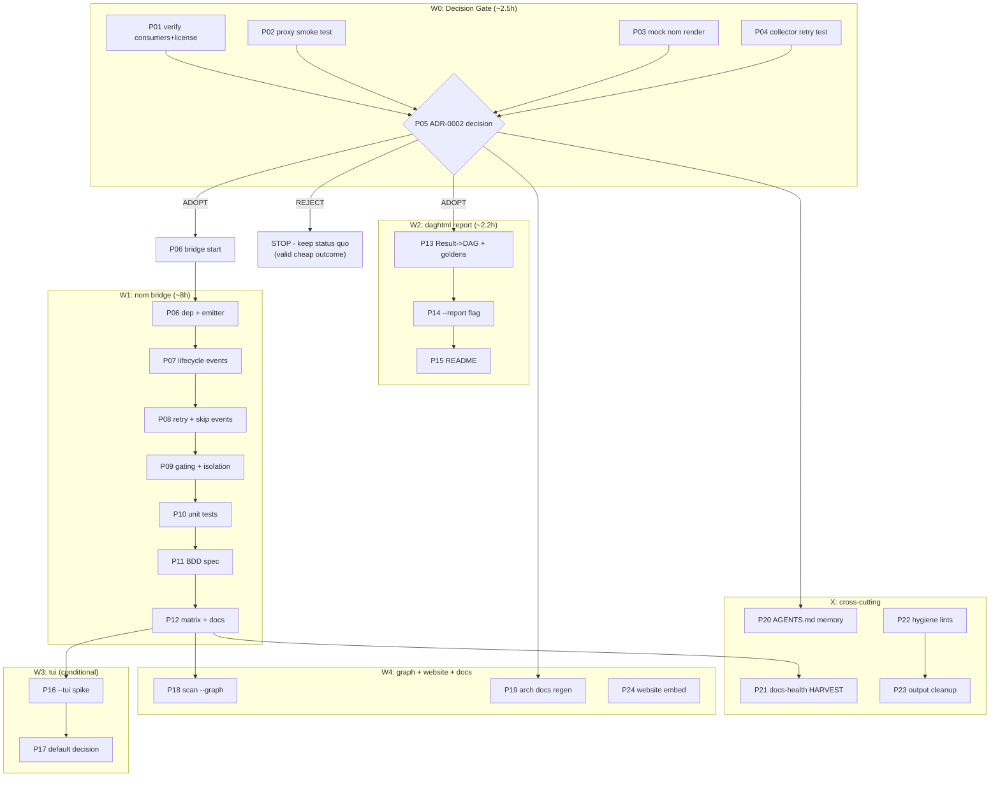

# Pareto Plan: go-output Adoption (nom live progress + daghtml reports + tui/graph)

**Date:** 2026-10-01 23:12
**Input:** 42 open tasks + 3 decision questions from `docs/status/2026-10-01_21-03_GO-OUTPUT-ADOPTION-RESEARCH.md` (session: go-dag-app ADR check + go-output deep dive)
**Format:** Markdown + Mermaid per explicit owner instruction (overrides pareto-planning skill HTML/D2 default — flagged)
**Status:** PLANNED — awaiting owner approval. No implementation started.

---

## Context (why this plan exists)

The 2026-10-01 research session verified that `go-output`'s `nom`, `daghtml`, `graph`, `tui` modules are technically adoptable today (public proxy `v0.38.2`, zero dependency conflicts — identical charm.land v2 pins, event bridge proven against go-workflow v0.1.13 source). clean-wizard's biggest UX gap: **minutes-long clean/scan runs are completely silent** (`clean.go:114` prints "Starting cleanup..." then nothing until the post-run table).

Two research claims remain UNVERIFIED (the session's honest failures): "BuildFlow dogfoods nom" (never opened its go.mod) and the Failed→Retrying render narrative (reasoned, never rendered). The plan closes both **before** any adoption decision, because building on unverified claims is exactly how you verschlimmbessern a system.

Three owner decisions gate everything (status report section g): progress default-on vs opt-in, pre-1.0 pin OK vs wait v1.0.0, skipped-cleaner rendering. **Recommended defaults** (owner may override at the gate): opt-in `--progress` first release; pin `v0.38.2` now (fleet-pinned versions, deliberate upgrades); skip = instant-complete with "skipped (unavailable)" progress note.

## Safety rails (anti-verschlimmbesserung contract)

1. **Strictly additive**: renderer only active when `TTY && !--json && !--sarif`. Zero output change in every other mode — existing tests must stay green untouched.
2. **No cleaner logic changes**: bridge lives in `internal/execution` seams only (hooks, retry options, workflow boundaries). Registry, DI, cleaners untouched.
3. **Exact version pin** `v0.38.2` — no floating minor; upgrades are deliberate one-line changes with a changelog read.
4. **Gate can abort**: if the mock render (P03) looks bad or consumers aren't real (P01), the plan STOPS at the ADR — a rejected adoption is a valid, cheap outcome.
5. Build/test discipline: `GOEXPERIMENT=jsonv2 go build ./...` + `go test ./... -short` green after every task.

---

## Pareto Breakdown

### The 1% that delivers 51% — CLOSE THE DECISION GATE (~2.5h)

**P01–P05:** verify the two unverified claims, run the mock render, fix the collector-semantics unknown, get the 3 answers, write ADR-0002. Without this: 0% of the value (nothing may be built on unverified claims). With this: every downstream hour is de-risked and unblocked — the decision IS the product at this stage.

### The 4% that delivers 64% — nom BRIDGE MVP VERTICAL SLICE (~4h)

**P06–P08:** pinned dep, emitter interface, full event wiring (workflow boundaries, registered-upfront, started, completed/failed, retrying, skip). One command (`clean`), feature-complete narrative, gated per the safety rails. This is the first customer-visible value: **live progress on interactive runs**.

### The 20% that delivers 80% — SHIP QUALITY + HTML REPORT (~8h)

**P09–P15:** gating hardening + timing-cache isolation + verbose reroute, unit + BDD tests, manual matrix, docs; daghtml `--report` (mapping, flag, golden, README); plus memory/AGENTS.md updates and TODO harvest so the knowledge survives.

### The other 80% (of effort) for the final 20% (of result) (~14h)

**P16–P24:** tui spike + default decision, `--graph` flag, architecture-docs regeneration (kill 5-month-stale D2), website DAG embed, and hygiene items noticed incidentally (FreedBytes deprecation, ireturn, mnd, forbidigo cleanup in commands). Valuable, none blocking, all deferrable.

---

## Level-1 Plan — 24 tasks, 30–100 min each (ALL TODOs covered)

Sorted by importance → impact → customer value. `Covers` = items from status report section (f)/(g).

| #   | Task                                                                                               | Wave | Covers        | Impact                          | Effort | Customer value          |
| --- | -------------------------------------------------------------------------------------------------- | ---- | ------------- | ------------------------------- | ------ | ----------------------- |
| P01 | Verify go-output consumers (BuildFlow/library-policy go.mod) + license coverage                    | W0   | f1, f6        | H (risk closure)                | 45m    | Internal trust          |
| P02 | Scratch-module `go get nom@v0.38.2` + tidy + build smoke test                                      | W0   | f4            | M                               | 30m    | Internal                |
| P03 | Mock nom render harness: 14 flat cleaners + retry + skip sequences, TTY & pipe modes               | W0   | f2, f5        | H (falsifies/validates UX)      | 60m    | Internal                |
| P04 | resultCollector retry-semantics unit test (last-wins vs append)                                    | W0   | f3            | M (may expose pre-existing bug) | 30m    | Internal                |
| P05 | Owner answers 3 questions + ADR-0002 written and committed                                         | W0   | f7, f8, g1-g3 | H (unblocks ALL)                | 45m    | Everything              |
| P06 | Pin dep + emitter interface (nil-safe, RunOption-injected)                                         | W1   | f13, f14      | H                               | 60m    | Enabler                 |
| P07 | Lifecycle events wired: workflow boundaries, registered-upfront, started, completed/failed         | W1   | f15-f18       | H                               | 90m    | Live progress core      |
| P08 | Retrying event (Reason from errorfamily) + skip representation                                     | W1   | f19, f20      | M                               | 45m    | Retry visibility        |
| P09 | Gating (TTY && !json && !sarif) + WithCachePath isolation + verbose reroute + forbidigo fix        | W1   | f21-f24       | H (safety rail #1)              | 90m    | Non-intrusiveness       |
| P10 | Bridge unit tests (fake subscriber, sequences incl. retry/skip, race)                              | W1   | f25           | H                               | 100m   | Confidence              |
| P11 | BDD Ginkgo spec: live-progress narrative                                                           | W1   | f26           | M                               | 90m    | Confidence              |
| P12 | Manual test matrix + flag docs + FEATURES.md                                                       | W1   | f27, f28      | M                               | 60m    | Docs                    |
| P13 | WorkflowResult → daghtml.DAG mapping + golden tests                                                | W2   | f29, f31      | H                               | 60m    | HTML report core        |
| P14 | `--report <path>` flag on clean + scan (exclusive with --json/--sarif)                             | W2   | f30           | M                               | 45m    | Human-readable artifact |
| P15 | README "HTML reports" section                                                                      | W2   | f32           | L                               | 30m    | Docs                    |
| P16 | `--tui` spike over the same bridge + SetCancelFunc → ctx                                           | W3   | f34, f35      | M (conditional on W1 verdict)   | 100m   | Interactive watch       |
| P17 | tui-vs-nom default decision (ADR-0002 appendix)                                                    | W3   | f36           | M                               | 30m    | UX                      |
| P18 | `scan --graph mermaid\|dot` from registry                                                          | W4   | f37           | L                               | 45m    | Pipeline preview        |
| P19 | Regenerate architecture docs from code (replace stale D2, 2026-05-03)                              | W4   | f38           | M                               | 100m   | Truthful docs           |
| P20 | AGENTS.md memory entries (per-attempt hooks gotcha, go-output pointer) + container.go:27 debug log | X    | f9, f10, f12  | M (durable knowledge)           | 30m    | Internal                |
| P21 | docs-health HARVEST: plan → TODO_LIST.md / ROADMAP.md                                              | X    | f11           | M                               | 45m    | Process                 |
| P22 | Hygiene: FreedBytes→SizeEstimate hints, ireturn, mnd consts                                        | X    | f39-f41       | L                               | 30m    | Internal                |
| P23 | Commands output forbidigo/emoji cleanup via print helpers                                          | X    | f42           | L                               | 100m   | Consistency             |
| P24 | Website: embed cleaner pipeline DAG via GraphHTML                                                  | W4   | f33           | L                               | 90m    | Marketing               |

**Totals:** ~16.8h. W0 ≈ 2.5h · W1 ≈ 8h · W2 ≈ 2.2h · W3+W4+X ≈ 6.9h. Dependency chain: P01→P05 hard gate; P06+ requires gate=adopt; P13 independent of P06-P12 (could parallel); everything else independent.

---

## Level-2 Plan — 106 micro-tasks, ≤12 min each (ALL TODOs covered)

Sorted by wave, then execution order within wave. `→ Pxx` maps to Level-1 task.

| #    | Micro-task (≤12m)                                                                                | →   | Impact |
| ---- | ------------------------------------------------------------------------------------------------ | --- | ------ |
| M01  | Read BuildFlow go.mod: does it require go-output/nom or /tui?                                    | P01 | H      |
| M02  | Read library-policy + grep "universal-workflow" reference source                                 | P01 | H      |
| M03  | Confirm repo LICENSE text covers submodules (no per-module files)                                | P01 | M      |
| M04  | Record verified consumer/licensing facts in ADR-0002 notes                                       | P01 | M      |
| M05  | Create /tmp scratch module `gomod init scratch`                                                  | P02 | M      |
| M06  | `go get github.com/larsartmann/go-output/nom@v0.38.2` + `go mod tidy`                            | P02 | M      |
| M07  | Minimal main.go constructing subscriber+renderer; build passes                                   | P02 | M      |
| M08  | Add clean-wizard's charm pins to scratch go.mod; tidy still resolves                             | P02 | M      |
| M09  | Write mock event script skeleton (subscriber + renderer to stdout)                               | P03 | H      |
| M10  | Simulate 14 flat cleaners, staggered start/complete timings                                      | P03 | H      |
| M11  | Simulate retry (failed→retrying→restart) + skip sequences                                        | P03 | H      |
| M12  | Capture TTY frame output (script/pty) for inspection                                             | P03 | M      |
| M13  | Render pipe/plain-text mode; verify degradation                                                  | P03 | M      |
| M14  | Assess: flat-fan readability, failed→retrying annotation, timing-cache pollution; record verdict | P03 | H      |
| M15  | Trace resultCollector.record call path in builder.go                                             | P04 | M      |
| M16  | Write test: step retried twice → collector records what?                                         | P04 | M      |
| M17  | Assert last-wins OR discover pre-existing double-record                                          | P04 | M      |
| M18  | If bug: fix + regression test (conditional)                                                      | P04 | M      |
| M19  | Present decision summary + recommendations to owner                                              | P05 | H      |
| M20  | Record owner answers to g1-g3                                                                    | P05 | H      |
| M21  | Draft ADR-0002 context + considered options                                                      | P05 | H      |
| M22  | Write ADR-0002 decision + consequences + revisit triggers                                        | P05 | H      |
| M23  | Commit ADR-0002                                                                                  | P05 | M      |
| M24  | — **GATE: if REJECTED → stop here, plan complete (cheap outcome)**                               | P05 | H      |
| M25  | Add go-output/nom v0.38.2 pin to go.mod                                                          | P06 | H      |
| M26  | Create emitter interface file (nil-safe no-op default)                                           | P06 | H      |
| M27  | Wire emitter through RunOption in runConfig                                                      | P06 | M      |
| M28  | Doc comments: rationale, event narrative diagram ref                                             | P06 | M      |
| M29  | Build + vet green                                                                                | P06 | M      |
| M30  | Emit WorkflowStarted/Completed/Failed at RunCleaners boundaries                                  | P07 | H      |
| M31  | Emit ActivityRegistered for all selected cleaners upfront                                        | P07 | H      |
| M32  | Emit ActivityStarted in makeBeforeHook                                                           | P07 | H      |
| M33  | Emit ActivityCompleted/Failed{Duration} in makeAfterHook                                         | P07 | H      |
| M34  | First live smoke run on real system (dry-run)                                                    | P07 | H      |
| M35  | Test: nil emitter path compiles + no-op                                                          | P07 | M      |
| M36  | Emit ActivityRetrying{Attempt} in retry.go NextBackOff                                           | P08 | M      |
| M37  | Map Reason from errorfamily family name                                                          | P08 | M      |
| M38  | Implement skip representation per owner decision g3                                              | P08 | M      |
| M39  | Unit tests: retry + skip event sequences                                                         | P08 | M      |
| M40  | Implement gate: TTY && !json && !sarif → renderer                                                | P09 | H      |
| M41  | WithCachePath → os.UserCacheDir()/clean-wizard/nom-timing.csv                                    | P09 | M      |
| M42  | Reroute verbose prints via EnqueueLines/stderr when renderer active                              | P09 | M      |
| M43  | Fix hooks.go forbidigo violations while touching them                                            | P09 | L      |
| M44  | Spot-check NO_COLOR + CI env behavior                                                            | P09 | M      |
| M45  | Test: --json/--sarif modes emit zero progress bytes                                              | P09 | H      |
| M46  | Build fake subscriber test harness                                                               | P10 | H      |
| M47  | Happy-path event sequence assertions                                                             | P10 | H      |
| M48  | Retry-path event sequence assertions                                                             | P10 | H      |
| M49  | Skip-path event assertions                                                                       | P10 | M      |
| M50  | Race test: parallel cleaners emitting concurrently                                               | P10 | H      |
| M51  | Table-driven status-mapping tests                                                                | P10 | M      |
| M52  | Ginkgo Describe skeleton for live progress                                                       | P11 | M      |
| M53  | It: tree shows all cleaners pending upfront                                                      | P11 | M      |
| M54  | It: retry renders ⟳ attempt suffix                                                               | P11 | M      |
| M55  | It: skip renders per decision                                                                    | P11 | M      |
| M56  | It: json mode silent                                                                             | P11 | M      |
| M57  | Run full suite; polish flaky bits                                                                | P11 | M      |
| M58  | Manual matrix: TTY, pipe, CI, NO_COLOR (2 sessions)                                              | P12 | M      |
| M59  | Manual matrix: --json, --sarif, dry-run + real                                                   | P12 | M      |
| M60  | Flag help texts for --progress (and --report later)                                              | P12 | L      |
| M61  | FEATURES.md: live progress entry                                                                 | P12 | M      |
| M62  | README quick section + screenshot-worthy example                                                 | P12 | M      |
| M63  | Write ResultToDAG builder (nodes from WorkflowResult)                                            | P13 | H      |
| M64  | Color/Tooltip mapping: "freed X \| items \| duration"                                            | P13 | H      |
| M65  | Golden-file test for report builder                                                              | P13 | M      |
| M66  | Failure-node case (Error dot + tooltip)                                                          | P13 | M      |
| M67  | Dry-run variant sanity check                                                                     | P13 | M      |
| M68  | Define --report flag + exclusivity vs --json/--sarif                                             | P14 | M      |
| M69  | Write HTML to path + classified error handling                                                   | P14 | M      |
| M70  | Wire scan command --report                                                                       | P14 | M      |
| M71  | Integration test: dry-run --report → tmpfile exists+valid                                        | P14 | M      |
| M72  | README "HTML reports" section draft                                                              | P15 | L      |
| M73  | Example output snippet (sanitized golden)                                                        | P15 | L      |
| M74  | Wire BubbleTeaProgressReporter over same emitter                                                 | P16 | M      |
| M75  | Display-mode toggle + keybindings                                                                | P16 | M      |
| M76  | SetCancelFunc → command ctx (graceful abort)                                                     | P16 | M      |
| M77  | Spike notes + go/no-go verdict for tui                                                           | P16 | M      |
| M78  | Compare nom vs tui UX on real run                                                                | P17 | M      |
| M79  | Record default-mode decision in ADR-0002 appendix                                                | P17 | M      |
| M80  | Build GraphBuilder from registry cleaner names                                                   | P18 | L      |
| M81  | --graph flag + mermaid/dot render                                                                | P18 | L      |
| M82  | Golden tests both formats                                                                        | P18 | L      |
| M83  | Script/code: walk internal/ packages → graph model                                               | P19 | M      |
| M84  | Map module dependency edges                                                                      | P19 | M      |
| M85  | Generate mermaid into docs/architecture-understanding/                                           | P19 | M      |
| M86  | Replace stale D2 references (dated 2026-05-03)                                                   | P19 | M      |
| M87  | Docs review pass                                                                                 | P19 | L      |
| M88  | AGENTS.md: per-attempt hook semantics gotcha                                                     | P20 | M      |
| M89  | AGENTS.md: go-output adoption pointer (ADR-0002 + status report)                                 | P20 | M      |
| M90  | container.go:27: log shutdown error at Debug + test                                              | P20 | L      |
| M91  | Read docs-health HARVEST rules                                                                   | P21 | M      |
| M92  | Route plan tasks → TODO_LIST.md / ROADMAP.md                                                     | P21 | M      |
| M93  | Dedupe against existing TODO entries                                                             | P21 | M      |
| M94  | Mark report section (f) as harvested                                                             | P21 | L      |
| M95  | Check FreedBytes→SizeEstimate deprecation hints (hooks.go:49-50)                                 | P22 | L      |
| M96  | container.go ireturn: nolint-with-reason or refactor                                             | P22 | L      |
| M97  | Extract retry.go magic numbers to named consts (mnd)                                             | P22 | L      |
| M98  | Verify lint clean on touched files                                                               | P22 | L      |
| M99  | Inventory all printf/emoji sites in commands/                                                    | P23 | L      |
| M100 | Introduce renderer-agnostic print helpers                                                        | P23 | L      |
| M101 | Migrate clean.go + scan.go sites                                                                 | P23 | L      |
| M102 | Migrate remaining command files                                                                  | P23 | L      |
| M103 | Lint clean verification                                                                          | P23 | L      |
| M104 | Website component wrapping GraphHTML                                                             | P24 | L      |
| M105 | Map CSS custom properties to site theme                                                          | P24 | L      |
| M106 | Embed pipeline DAG page + build verify                                                           | P24 | L      |

---

## Execution Graph

**Parallelism:** P02/P03/P04 run concurrently. W2 (P13) is independent of W1 internals and can run in parallel after the gate. X tasks slot anywhere after their depicted deps.

---

## Verification strategy (per level)

- **Gate exit criteria:** all 6 verification facts closed (status report b1-b5), ADR-0002 committed, go build/test green.
- **W1 exit criteria:** unit + BDD suites green; manual matrix (TTY/pipe/CI/NO_COLOR/--json/--sarif/dry-run) documented; zero output diff in non-TTY modes (byte-compared).
- **W2 exit criteria:** golden files committed; `--report` integration test writes valid self-contained HTML; flag exclusivity errors classified (Rejection).
- **Every task:** `GOEXPERIMENT=jsonv2 go build ./... && GOEXPERIMENT=jsonv2 go test ./... -short` green before moving on. Any red → fix immediately, never carry forward.

## Not in scope / explicitly deferred

- go-dag-app adoption (ADR-0001: rejected; revisit triggers cold — verified this session)
- Any cleaner-behavior, DI, or registry changes
- Migrating existing JSON/SARIF output to go-output root renderers (different purpose; JSON carries error-family fields)
