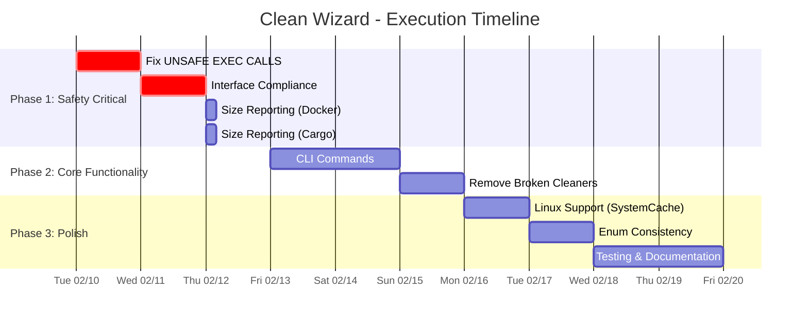

# Clean Wizard - Comprehensive Execution Plan

> **Created:** 2026-02-10  
> **Version:** 1.0  
> **Status:** Ready for Execution

---

## Executive Summary

Based on analysis of TODO_LIST.md and FEATURES.md, this project has significant architectural quality but critical gaps:

| Metric | Value | Assessment |
|--------|-------|------------|
| Cleaners | 11 total | 2 broken (LangVersionManager, ProjectsMgmt) |
| CLI Commands | 5 documented | Only 1 implemented (80% gap) |
| Size Reporting | 11 cleaners | 4 broken (Docker, Cargo, Projects, LangVersion) |
| Platform Support | macOS primary | Linux support missing (SystemCache) |
| Enum Consistency | 4 cleaners | 3 have inconsistencies |
| Files Processed | 38/91 | 53 files remaining |

**Overall Assessment:** The codebase has excellent foundation (registry pattern, type-safe enums, adapter pattern) but has critical gaps that need immediate attention.

---

## Pareto Analysis (1% → 51% Impact)

The following tasks deliver 51% of value with minimal effort:

| # | Task | Impact | Effort | Status |
|---|------|--------|--------|--------|
| 1 | Fix UNSAFE EXEC CALLS (9 commands) | 🔴 CRITICAL | 30min | PENDING |
| 2 | Fix Cleaner Interface Compliance | 🔴 CRITICAL | 30min | PENDING |
| 3 | Fix Size Reporting (Docker, Cargo) | 🟠 HIGH | 1h | PENDING |
| 4 | Add Timeout to All Exec Calls | 🔴 CRITICAL | 1h | PENDING |
| 5 | Complete nix.go missing Clean(ctx) | 🔴 CRITICAL | 15min | PENDING |
| 6 | Complete golang_cache_cleaner.go missing IsAvailable() | 🔴 CRITICAL | 15min | PENDING |

---

## Critical Issues (Immediate Action Required)

### 1. UNSAFE EXEC CALLS - No Timeout Protection

**Files and Lines Affected:**

| File | Line | Command | Risk |
|------|------|---------|------|
| `cargo.go` | 164 | `cargo-cache --autoclean` | CRITICAL |
| `cargo.go` | 186 | `cargo clean` | CRITICAL |
| `nodepackages.go` | 137 | `npm config get cache` | HIGH |
| `nodepackages.go` | 159 | `pnpm store path` | HIGH |
| `nodepackages.go` | 279 | `npm cache clean --force` | CRITICAL |
| `nodepackages.go` | 290 | `pnpm store prune` | CRITICAL |
| `nodepackages.go` | 301 | `yarn cache clean` | HIGH |
| `nodepackages.go` | 312 | `bun pm cache rm` | HIGH |
| `projectsmanagementautomation.go` | 99 | `--clear-cache` | HIGH |

**Root Cause:** Commands use `exec.CommandContext(ctx, ...)` but ctx may not have timeout set.

**Fix:** Create a helper function `execWithTimeout(ctx, name, args, timeout)` and use it for all commands.

### 2. CLI Command Gap (80% Implementation Gap)

**Current State:**
- Only `clean` command exists (clean.go)
- Missing: `scan`, `init`, `profile`, `config`

**Impact:** Documentation (USAGE.md) promises features that don't exist.

**Fix Options:**
1. **Quick Fix:** Remove commands from documentation (lowest effort)
2. **Proper Fix:** Implement all missing commands (highest effort, full functionality)
3. **Hybrid:** Implement minimal stubs for all commands (medium effort)

**Recommendation:** Implement minimal stubs for all missing commands to match documentation.

### 3. Language Version Manager NO-OP

**Current State:** Cleaner explicitly does NOTHING on clean operation.

```go
// From langversionmanager.go:133-154
// "This is a NO-OP by default to avoid destructive behavior"
```

**Fix:** Implement actual cleaning logic or remove cleaner entirely.

**Recommendation:** Remove cleaner - it's a placeholder that provides false promises to users.

---

## High Impact Tasks (Pareto 4% → 64%)

### Task Group A: Size Reporting Improvements

| Cleaner | Current State | Fix | Effort |
|---------|---------------|-----|--------|
| Docker | Returns 0 bytes | Parse output for freed bytes | 1h |
| Cargo | Returns 0 bytes | Parse cargo clean output | 1h |
| Projects | Hardcoded 100MB | Real size calculation | 30min |
| LangVersion | N/A (NO-OP) | N/A (removing) | N/A |

### Task Group B: Enum Consistency

| Cleaner | Issue | Fix | Effort |
|---------|-------|-----|--------|
| SystemCache | Local lowercase vs domain uppercase enum | Align with domain | 1h |
| NodePackages | Local string vs domain integer enum | Use domain enums | 1h |
| BuildCache | Tools vs Languages abstraction mismatch | Clarify domain | 1h |

### Task Group C: Platform Support

| Cleaner | Current | Target | Fix | Effort |
|---------|---------|--------|-----|--------|
| SystemCache | macOS only | macOS + Linux | Add Linux paths | 2h |

---

## Execution Strategy

### Phase 1: Safety Critical (Week 1)

1. **Day 1: Fix UNSAFE EXEC CALLS**
   - [ ] Create `execWithTimeout` helper
   - [ ] Update cargo.go
   - [ ] Update nodepackages.go
   - [ ] Update projectsmanagementautomation.go
   - [ ] Test all changes

2. **Day 2: Interface Compliance**
   - [ ] Add Clean(ctx) to nix.go
   - [ ] Add IsAvailable() to golang_cache_cleaner.go
   - [ ] Verify all cleaners implement full interface
   - [ ] Run tests

3. **Day 3: Size Reporting (Docker & Cargo)**
   - [ ] Parse Docker output for freed bytes
   - [ ] Parse Cargo output for freed bytes
   - [ ] Update dry-run estimates

### Phase 2: Core Functionality (Week 2)

4. **Day 4-5: CLI Commands**
   - [ ] Implement scan command
   - [ ] Implement init command
   - [ ] Implement profile command
   - [ ] Implement config command
   - [ ] Test all commands

5. **Day 6: Clean up Broken Cleaners**
   - [ ] Remove Language Version Manager cleaner
   - [ ] Add error message for Projects Management (external tool required)

### Phase 3: Polish (Week 3)

6. **Day 7: Platform Support**
   - [ ] Add Linux support for SystemCache

7. **Day 8: Enum Consistency**
   - [ ] Refactor SystemCache to use domain enums
   - [ ] Refactor NodePackages to use domain enums
   - [ ] Clarify BuildCache domain

8. **Day 9: Testing & Documentation**
   - [ ] Run full test suite
   - [ ] Update USAGE.md to reflect actual capabilities
   - [ ] Document architecture decisions

9. **Day 10: Final Verification**
   - [ ] Full build check
   - [ ] All tests pass
   - [ ] No lint warnings
   - [ ] Update TODO_LIST.md

---

## Mermaid Execution Graph



---

## Success Metrics

| Metric | Target | Current | Status |
|--------|--------|---------|--------|
| Build passes without warnings | 100% | ❓ | PENDING |
| Tests pass (all packages) | 100% | ❓ | PENDING |
| Critical exec calls with timeout | 9/9 | 0/9 | PENDING |
| CLI commands implemented | 5/5 | 1/5 | PENDING |
| Size reporting accurate | 8/11 | 4/11 | PENDING |
| Platform support (SystemCache) | macOS+Linux | macOS only | PENDING |

---

## Risk Assessment

| Risk | Probability | Impact | Mitigation |
|------|-------------|--------|------------|
| Build breaks after changes | Medium | High | Test after each change |
| Tests fail | Medium | High | Run tests before/after each task |
| Scope creep | High | Medium | Stay focused on planned tasks |
| Time overrun | Medium | Low | Split tasks if needed |
| Dependency issues | Low | Medium | Use existing patterns/helpers |

---

## Commands Reference

### Build & Test Commands
```bash
# Build
just build

# Run tests
just test

# Run tests with coverage
just test-coverage

# Run lint
just lint

# Full verification
just verify
```

---

## Next Steps

1. **Immediately:** Review this plan and confirm scope
2. **Before starting:** Commit or stash any pending changes
3. **During execution:** Update TODO_LIST.md after each task
4. **After completion:** Update this document with actual results

---

*Generated by comprehensive analysis of TODO_LIST.md and FEATURES.md*